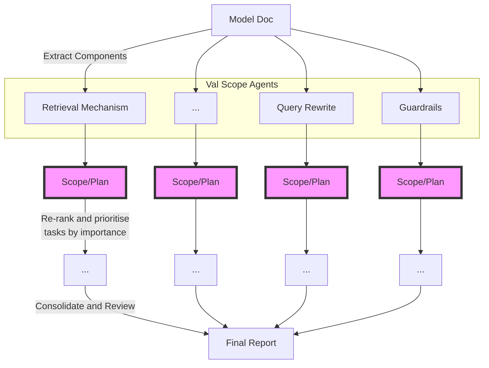

# 1 Ideas for researching a specific component
- what is the goal or purpose of the component?
- what are it's inputs and outputs?
- how do we eval/test it's effectiveness?
- what other components is it dependent on?
- what other components are dependent on it?
- what could realistically go wrong w this component?
- what other tests/inputs could we use to test this component?
	- e.g. broader scope, adversarial style 

# 2 Parallel research agents
- use async parallelisation 
	- for each search term or query 
	- agent search via arxiv tools
	- read summary of top 20 docs
	- if relevant, proceeds to read paper
	- notes key findings + practical aspects 

## 2.1 Github repo or docs ingestion
- use the gitingest package to download LLM friendly version of git repos
## 2.2 Build a prompt agent 
- help you write prompt use notes from books + GPT prompting guides

# 3 Quick summary of how Open Deep Research works
1. query 
2. init stuff e.g. timer, trace, log
3. generate observations - uses thinking agent
4. evaluate gaps - uses knowledge gap agent
5. select agents - to address gaps, uses tool selector 
6. execute tools - web search and site crawl 
7. final report - uses report agent
8. finalise 

# 4 Modularised validation agent idea

