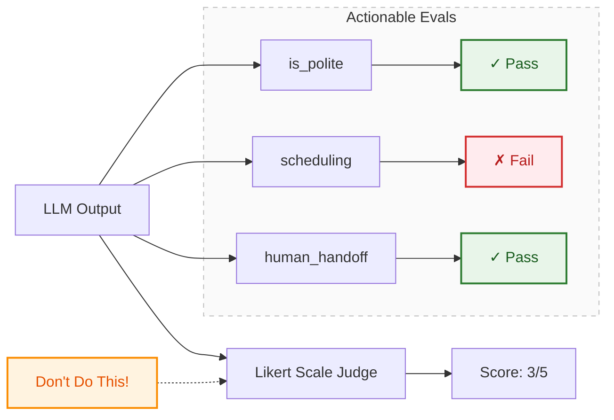

- binary (pass & fail) scores are preferable in most cases vs. likert scales (1-5 ratings)
- likert scales are expensive to align w domain experts
	- annotators often default to middle values to avoid making difficult decisions 
	- they can also encourage too much scope → e.g. overall quality score vs a targeted eval 
- binary scores comples the annotator to make a definitive decision 
	- better aligns w reality that you must decide whether or not the feature is good enough to ship for the AI application 
	- binary scores are also easier to apply during error analysis 

