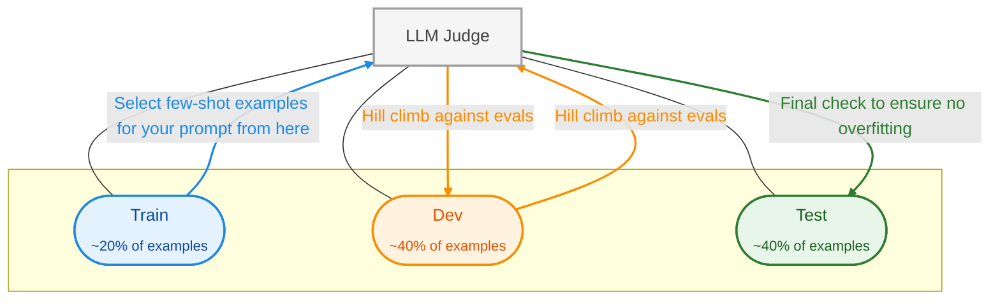

- the ***only*** way to trust an LLM Judge is to measure it against human labels 
	- commonly known as aligning or calibrating the judge 
- split your human labelled data into 3 sets 
	- train → where you draw your few shot examples from 
	- dev → where you use to optimise your judge 
	- test → a final check to ensure you haven't overfit 
- don't report accuracy 
	- it's misleading on imbalanced data 
	- use TPR & TNR → aim for a high TPR & TNR rate e.g. > 90%
		- TPR = when judge says error, what % of time is it right?
		- TNR = when judge says not an error, what % of time is it right?

