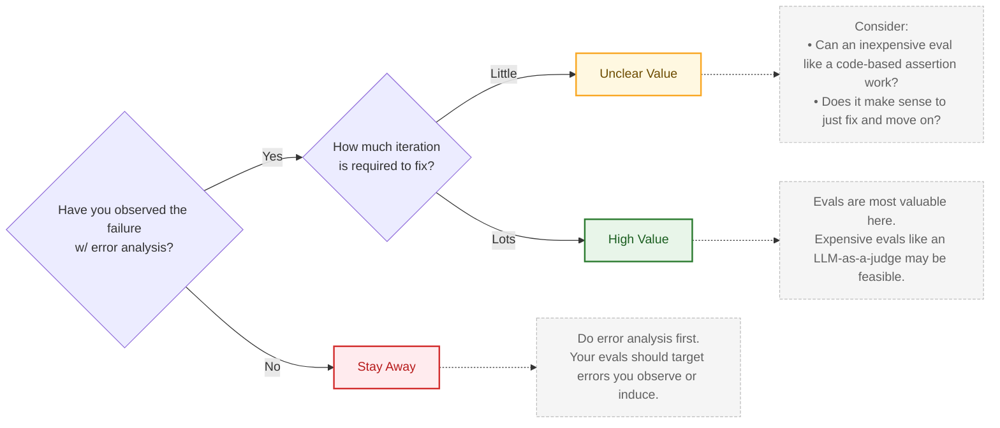

- use the following decision tree
	1. have you observed the failure mode with analysis?
		- (no to 1) → do error analysis first, your evals should target errors you observe or induce 
	2. (yes to 1) how much iteration is required to fix? 
	3. (low effort to 2) unclear value → consider inexpensive eval like deterministic assertion, or just fix and move on
	4. (high effort to 2) high value → evals are most valuable here, e.g. LLM-as-judge
- notes/tips
	- evals provide more value when you need to hill climb against an error
	- you don't always need to write an eval

