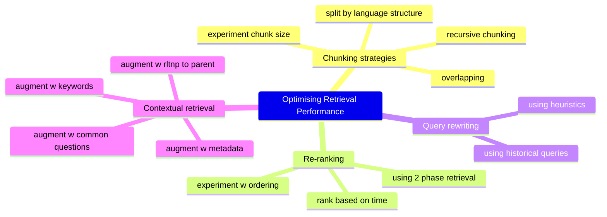
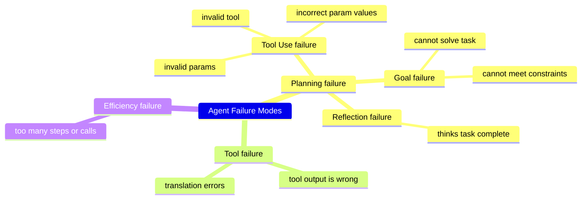

Table of Contents
- [[#1 RAG|1 RAG]]
	- [[#1 RAG#1.1 RAG Architecture|1.1 RAG Architecture]]
	- [[#1 RAG#1.2 Retrieval Algorithms|1.2 Retrieval Algorithms]]
- [[#2 Sparse vs Dense Retrieval|2 Sparse vs Dense Retrieval]]
	- [[#2 Sparse vs Dense Retrieval#2.1 Term-based Retrieval|2.1 Term-based Retrieval]]
		- [[#2.1 Term-based Retrieval#2.1.1 Term-based algorithms|2.1.1 Term-based algorithms]]
	- [[#2 Sparse vs Dense Retrieval#2.2 Embedding-based Retrieval|2.2 Embedding-based Retrieval]]
		- [[#2.2 Embedding-based Retrieval#2.2.1 Vector Search|2.2.1 Vector Search]]
	- [[#2 Sparse vs Dense Retrieval#2.3 Evaluating Retrieval Algos + Embeddings|2.3 Evaluating Retrieval Algos + Embeddings]]
	- [[#2 Sparse vs Dense Retrieval#2.4 Comparing Retrieval Algorithms|2.4 Comparing Retrieval Algorithms]]
	- [[#2 Sparse vs Dense Retrieval#2.5 Hybrid Retrieval|2.5 Hybrid Retrieval]]
- [[#3 Retrieval Optimisation|3 Retrieval Optimisation]]
	- [[#3 Retrieval Optimisation#3.1 Optimisation 1: Chunking Strategy|3.1 Optimisation 1: Chunking Strategy]]
	- [[#3 Retrieval Optimisation#3.2 Optimisation 2: Reranking|3.2 Optimisation 2: Reranking]]
	- [[#3 Retrieval Optimisation#3.3 Optimisation 3: Query Rewriting|3.3 Optimisation 3: Query Rewriting]]
	- [[#3 Retrieval Optimisation#3.4 Optimisation 4: Contextual Retrieval|3.4 Optimisation 4: Contextual Retrieval]]
- [[#4 Evaluating Retrieval Solutions|4 Evaluating Retrieval Solutions]]
- [[#5 Agents|5 Agents]]
	- [[#5 Agents#5.1 Agents Overview|5.1 Agents Overview]]
	- [[#5 Agents#5.2 Tools|5.2 Tools]]
	- [[#5 Agents#5.3 Planning|5.3 Planning]]
		- [[#5.3 Planning#5.3.1 The 3 Basic Components|5.3.1 The 3 Basic Components]]
		- [[#5.3 Planning#5.3.2 How to do Planning with Agents|5.3.2 How to do Planning with Agents]]
		- [[#5.3 Planning#5.3.3 Reflection + Error Correction|5.3.3 Reflection + Error Correction]]
		- [[#5.3 Planning#5.3.4 Tool Selection|5.3.4 Tool Selection]]
	- [[#5 Agents#5.4 Agent Failure Modes & Evaluation|5.4 Agent Failure Modes & Evaluation]]
- [[#6 Memory|6 Memory]]


# 1 RAG
- <mark style="background: #FFB8EBA6;">RAG</mark> = enhances model generation by retrieving relevant info from external memory sources 
	- can be from database, web pages, previous chats etc 
	- RAG was coined in 2020 paper by *Lewis et al "Retrieval-Augmented Generation for Knowledge Intensive NLP Tasks"*
		- proposed RAG as a solution for tasks where all available info can't be put into model directly 
		- RAG only uses most relevant info as fetched by retriever 
		- Lewis et al. found it helps model generate more detailed responses + reduces hallucinations 
- "*retrieve-then-generate*" pattern first introduced in 2017
	- system retrieves 5 wikipedia docs most relevant to question, model then answers using this info
- intuitively, RAG is like constructing context specific to each query 
	- instead of the same uniform prompt/context for all queries, allows data specific to users to be appended to queries 
	- <mark style="background: #FFB8EBA6;">context construction</mark> = **equivalent to feature engineering in classical ML modelling** 
- main purpose of RAG was to overcome model context limitations
	- RAG unlikely to die with new huge context limits, why?
		- 💡 no matter how long context, applications likely need more than that 
		- 💡 long context length != using that context well 
			- e.g. needle in haystack tests show models still focus on wrong parts of context 
			- every extra token in context too = more cost + latency 
	- today, research occurring for both longer context + more effective use of it 
		- Huyen thinks research might use retrieval/attention like mechanism to find most salient parts of context to use
## 1.1 RAG Architecture
- RAG system has 2 base components 
	- <mark style="background: #FFB8EBA6;">retriever</mark> = retrieves info from external memory sources
	- <mark style="background: #FFB8EBA6;">generator</mark> = generates response based on retrieved info 

![[Screenshot 2024-12-23 at 1.22.17 pm.png| center | 600]]

- original RAG paper, Lewis et al. trained retriever + generator together 
	- today, they are usually trained separately, many teams use off-the-shelf retrievers + generation models
	- however full finetuning can improve process significantly 
- success of RAG dependent on quality of it's retriever 
	- retriever has 2 main functions: 
		- <span style="color:rgb(255, 0, 247)">indexing</span> = processing data so it can be quickly retrieved at inference
		- <span style="color:rgb(255, 0, 247)">querying</span> = sending query to retrieve relevant data 
- example of how retriever and generator work
	1. split docs into manageable chunks (otherwise can cause context overflow)
	2. retrieve most relevant chunks for a query 
	3. post-process chunks into the final prompt 
	4. final prompt then fed into generative model 

>[!info] Terminology: Retrieval vs Search
> - **Retrieval** typically limited to single database/system 
> - **Search** involves retrieval across multiple systems 

## 1.2 Retrieval Algorithms 
- retrieval is not new, rather a century old field
	- backbone of many search engines + recommender systems 
	- so algos of traditional info retrieval systems very useful for RAG too 
- retrieval works by ranking docs based on relevance to a given query 
	- retrieval algos differ based on how relevance scores computed, 2 methods 
		- <mark style="background: #FFB8EBA6;">term based retrieval</mark> aka **sparse retrieval**
		- <mark style="background: #FFB8EBA6;">embedding based retrieval</mark> aka **dense retrieval** 
---
# 2 Sparse vs Dense Retrieval 
- **sparse retrievers** - represent data via sparse vectors
	- <mark style="background: #FFB8EBA6;">sparse vector</mark> = vector where majority of values = 0 
- term-based retrieval considered sparse since vocab encoded as one-hot vector
	- vector size = vocab size 
	- value of 1 in index = corresponds to the index of the term in the vocab 
- **dense retrievers** - represent data using dense vectors
	- <mark style="background: #FFB8EBA6;">dense vector</mark> = continuous vector, often in form of embeddings 
	- can also have sparse embeddings e.g. SPLADE - BERT with regularisation, for efficiency 
## 2.1 Term-based Retrieval
- <mark style="background: #FFB8EBA6;">lexical/keyword retrieval</mark> = simplest method, find relevant docs via keywords 
	- challenges with using keyword retrieval
		- many docs may contain the same term, and might not all fit into context 
			- can use docs that most frequently contain the term
		- prompt can be long + have many terms, some more important than others
			- need method to identify most important term 
### 2.1.1 Term-based algorithms 
- <mark style="background: #FFB8EBA6;">TF-IDF</mark> = **term-frequency inverse-document-frequency**, combines 2 metrics below for strong search 
	- addresses the challenges above using both <span style="color:rgb(255, 0, 247)">TF</span> = term frequency, <span style="color:rgb(255, 0, 247)">IDF</span> = inverse document frequency 
		- IDF intuits a term's importance is inversely proportional to number of docs it appears in 
			- since the more docs a term appears in, the less informative it is *e.g. "the", "and", "it"*
		- compute by counting all docs with that term, then divide by total number of documents in this count

$$
\begin{gather}
\text{TF-IDF score for document D with query Q} \\ \\ 
\large \text{score}(D) \;=\; \sum_{t_i \in D} \Bigl[ \mathrm{TF}(t_i, D) \;\times\; \log\!\Bigl(\tfrac{N}{\mathrm{DF}(t)}\Bigr) \Bigr]
\end{gather}
$$
- where
	- $t_{1,}t_{2,}..., t_i$ = terms within the query
	- $N$ = total number of documents in th collection 
	- $DF(t)$ = number of documents that contain the term $t$
	- $TF(t,d)$ = is typically the raw count of $t$ in $d$, can also use a smoothed version
- <mark style="background: #FFB8EBA6;">ElasticSearch</mark> = a wholistic data structure and package to optimise TF-IDF
	- uses a data structure called inverted index = dictionary that maps terms to docs containing them 
		- uses hash map for speed 
	- index also has metadata e.g. term frequency, doc count etc 
- <mark style="background: #FFB8EBA6;">BM25</mark> = 25th gen of Best Match algo developed in 80s, aka Okapi BM25
	- modified scorer of TF-IDF that normalises TF scores by doc lengths
		- since longer docs more likely to contain given term + higher frequencies
	- BM25, BM25+, BM25F all still widely used in industry
	- formidable baseline against more modern embedding based methods 

$$
\begin{gather}
\text{BM25 score for doc $d$ and query $q$} \\ \\ 
\text{score}(d, q) = \sum_{t \in q} \Bigl[ \mathrm{IDF}(t) \times \frac{\mathrm{tf}(t, d)\,\bigl(k+1\bigr)}{\mathrm{tf}(t, d) + k\Bigl(1 - b + b \,\frac{\lvert d\rvert}{\mathrm{avgdl}}\Bigr)} \\
\\
\text{where } \mathrm{IDF}(t) = \ln\!\Bigl(\tfrac{N - \mathrm{df}(t) + 0.5}{\mathrm{df}(t) + 0.5} \Bigr)
\end{gather}
$$

> [!info] Quick Note on Tokenization
> - tokenization = process of breaking query into individual terms 
> 	- simplest method = split into words or n-grams 
> - can also process the text e.g. lowercase, remove stop words, punctuation etc 
> - lexical retrieval works best when query + docs are similar lengths 
> 	- becomes harder if docs are much longer - likelihood of term being included increases

## 2.2 Embedding-based Retrieval
- pitfall of lexical retrieval is the appearance of text != meaning of the text 
	- can result in retrieval of irrelevant docs 
- <mark style="background: #FFB8EBA6;">embedding-based retrievers</mark> = **aim to rank docs based on alignment of meaning with query** 
	- aka semantic retrieval
- requires some additional steps
	- <span style="color:rgb(255, 0, 247)">indexing</span> = converting chunks into embeddings for a Vector Database
	- querying then has 2 steps 
		- **embedding model** - converts query to embedding, using same model as indexing
		- **retriever** - fetches $k$ top chunks based on semantic similarity 

![[Screenshot 2024-12-23 at 1.22.34 pm.png| center | 600]]

- above is simplified embedding retriever workflow
	- added complexity/performance can come from re-ranking + caching 
- recall embedding = vector aiming to preserve important properties of the data
	- retrieval quality will be bad if embedding model is bad 
### 2.2.1 Vector Search
- <mark style="background: #FFB8EBA6;">vector search</mark> = **process of finding closest vectors in VDB for a given query embedding**
	- vectors must be index + stored for efficiency & speed 
	- vector databases have become very popular with RAG, but really any database can support vectors in theory
- vector search **usually framed a a nearest neighbours problem** 
	- given query, find $k$ nearest vectors e.g. naive solution is KNN 
		- compute similarity scores to all chunks via cosine similarity 
		- rank all vectors by score
		- return $k$ highest similarity vectors 
	- many vector search libraries have appeared for this purpose
		- <span style="color:rgb(255, 136, 0)">FAISS</span> by Meta 
		- <span style="color:rgb(255, 136, 0)">ScaNN</span> by Google 
		- <span style="color:rgb(255, 136, 0)">Annoy</span> by Spotify 
		- <span style="color:rgb(255, 136, 0)">HNSWLib</span>
- can be poor for big datasets due to speed and compute needed 
	- <mark style="background: #FFB8EBA6;">ANN</mark> (approx. nearest neighbours) focuses on speed, minor accuracy tradeoff
	- generally, VDBs organise vectors into buckets, trees or graphs 
- ANN algorithms differ based on heuristics to find closest vectors
	- vectors may also be quantised or made sparse - less compute intensive 
- examples of ANN algos 
	- <span style="color:rgb(255, 136, 0)">LSH</span> = 1999, hashes similar vectors into buckets for speed, used in FAISS, Annoy
	- <span style="color:rgb(255, 136, 0)">HNSW</span> = 2016, constructs multi-layer graph with nodes as vectors, edges connecting similar vectors
		- allows NN search by traversal of edges, used in FAISS, Milvus
	- <span style="color:rgb(255, 136, 0)">Product Quantisation</span> = 2011, reduces vectors into lower dimensions via decomposing into multiple sub-vectors
		- distances computed in lower dimensions = faster, key component of FAISS, and most VDB libraries
	- <span style="color:rgb(255, 136, 0)">IVF</span> = 2003, uses K-Means to cluster similar vectors together
		- typically sets number of clusters such that there is roughly 100-10,000 vectors in each cluster
		- at inference, finds closest cluster centroids, IVF + PQ = backbone of FAISS
	- <span style="color:rgb(255, 136, 0)">Annoy</span> = 2013, tree based approach using multiple binary trees 
		- each tree splits vectors into clusters using random criteria 
		- at inference, traverses the trees to gather candidate neighbours 
## 2.3 Evaluating Retrieval Algos + Embeddings
- 2 common metrics used for evaluating retrievers
	- <mark style="background: #FFB8EBA6;">context precision</mark> = of all docs retrieved, what % is relevant to query?
	- <mark style="background: #FFB8EBA6;">context recall</mark> = of all docs relevant to query, what % is retrieved?
- to compute them, you need to:
	1. curate evaluation set of test queries + documents 
	2. for each test query, annotate each test document with flag = relevant or not relevant
	3. then compute precision + recall of retriever on test set 
	- context precision simpler to compute, whereas recall needs annotation of all relevant docs to each query 
- additionally, you can evaluate the ranking of retrieved documents using the below metrics 
	- note: these are useful when you want the most relevant docs ranked first 
- <mark style="background: #FFB8EBA6;">NDCG</mark> = <span style="color:rgb(255, 0, 247)">normalised discounted cumulative gain</span> 
	- useful when relevances are on graded scale e.g. 0, 1, 2, 3

$$ \mathrm{DCG}_p = \sum_{i=1}^p \frac{2^{\mathrm{rel}_i} - 1}{\log_2(i+1)}, \quad \mathrm{NDCG}_p = \frac{\mathrm{DCG}_p}{\mathrm{IDCG}_p}. $$
- where: 
	- $rel_i$ = relevance grade of result at rank $i$
	- $DCG_p$ = sums those relevance gains, discounted by the position $i$
	- $IDCG_p$ = is the ideal DCG (best possible ordering)
	- $NDCG_p$ = ratio of actual DCG to ideal DCG, always between 0-1
- <mark style="background: #FFB8EBA6;">MAP</mark> = <span style="color:rgb(255, 0, 247)">mean average precision </span>
	- useful for binary relevance e.g. doc = relevant or not, multiple queries
	- also emphasises retrieving ALL relevant docs to the query = single missing doc has higher penalty in MAP 

$$
\begin{gather}
\mathrm{AP}(q) = \frac{1}{R_q} \sum_{k=1}^{n} P(k) \times \mathrm{rel}(k), \\ \\ \mathrm{MAP} = \frac{1}{|Q|} \sum_{q \in Q} \mathrm{AP}(q)
\end{gather}
$$
- where: 
	- $R_q$ = number of relevant docs for query $q$
	- $P(k)$ = precision at rank $k$
	- $rel(k)$ = indicator (0 or 1) if doc at rank $k$ is relevant
	- $AP(q)$ = average of precisions at all ranks where relevant doc was retrieved 
	- $MAP$ = mean across all queries 
- <mark style="background: #FFB8EBA6;">MRR</mark> = <span style="color:rgb(255, 0, 247)">mean reciprocal rank</span> 
	- useful for finding the single "best" relevant doc i.e. when you only care about the 1st relevant doc 
	- common in QA tasks or tasks where finding single doc quickly is paramount
$$\mathrm{MRR} = \frac{1}{|Q|} \sum_{q=1}^{|Q|} \frac{1}{\mathrm{rank}_q}$$
- where:
	- $rank_q$ = rank position of the 1st relevant doc for query $q$
	- MRR looks at how high (early) the 1st relevant result is ranked 
- all of these metrics can be found in common libraries
```python
from torchmetrics.retrieval import RetrievalMAP, RetrievalMRR, RetrievalNormalizedDCG

from sklearn.metrics import ndcg_score 

from irmeasures import nDCG, AP, RR
```

- embeddings are also commonly evaluated independently 
	- where a good embedding should have similar docs as closer embeddings
	- also eval by how good their downstream performance is on various tasks e.g. retrieval, classification, clustering etc 
	- 🤗  <mark style="background: #FFB8EBA6;">MTEB</mark> - massive text embedding benchmark  https://huggingface.co/spaces/mteb/leaderboard
- quality of retriever should also be evaluated in context of entire RAG system 
	- good retriever should help system generate high-quality answers 
## 2.4 Comparing Retrieval Algorithms
- choosing between term-based vs embedding-based depends on prioritising cost vs latency 
	- especially at query phase - query embedding + vector search is slower, not great if data changes often

|                  | term based                | embedding based                              |
| ---------------- | ------------------------- | -------------------------------------------- |
| indexing speed   | fast                      | slow                                         |
| query speed      | fast                      | slow                                         |
| performance      | strong out of box         | good, allows for more natural queries        |
| customisation    | hard to improve           | can outperform when finetuned                |
| cost             | much cheaper              | expensive - embedding, vector storage/search |
| query weaknesses | does not consider meaning | can obscure keywords e.g. product IDs etc    |

- can also make trade-offs between querying vs indexing
	- e.g. more detailed index takes more time + memory but more accurate retrieval 
- <mark style="background: #FFB8EBA6;">ANN Benchmarks Website</mark> - compares different ANN algos on multiple datasets w/ 4 metrics
	- **recall** - % nearest neighbours found by algo 
	- **query per second** (QPS) - # queries can handle per second, crucial for high traffic apps
	- **build time** - time required to build index, crucial for frequent updates 
	- **index size** - size of index created, to assess scalability + storage needs


>[!tip]
> In summary, the quality of a RAG system should be evaluated both end-to-end and at component level
> - evaluate the retrieval quality 
> - evaluate the final RAG outputs 
> - evaluate the embeddings (if used)

## 2.5 Hybrid Retrieval
- <mark style="background: #FFB8EBA6;">hybrid retrieval</mark> = combines the strengths of both approaches - term/embedding based 
- can use different algorithms sequentially 
	1. cheap, less precise retriever to fetch candidates e.g. BM25 
	2. more precise/expensive mechanism to get best candidates via re-ranking e.g. ANN
- can also use multiple different algos in parallel as an ensemble 
	- recall - retrievers rank documents by relevance scores to query 
	- can use multiple retrievers to fetch candidates in parallel then combine rankings for a final ranking
- <mark style="background: #FFB8EBA6;">Reciprocal Rank Fusion (RRF)</mark> = 2009, algo for combining different rankings 
	- assigns each doc a score based on retriever's ranking 
		- ranked first gets score of $\frac{1}{1}=1$, ranked second gets score of $\frac{1}{2}=0.5$
		- higher rank = higher score 
	- document's final score = sum of scores w.r.t all retrievers 
		- so if document $D$ ranked 1 by retriever $A$, 2 by retriever $B$, score = $1 + 0.5 = 1.5$

$$
\begin{gather}
\textbf{Reciprocal Rank Fusion (RRF)} \\ \\ 
\text{Score(D)} = \sum_{i=1}^{n} \frac{1}{k+r_i(D)}
\end{gather}
$$

- where: 
	- $n$ = number of ranked lists i.e. produced by all the retrievers
	- $r_i(D)$ = rank of document $D$ by retriever $i$
	- $k$ = constant to avoid zero division + control influence of lower ranked docs, usually set at 60
- code below shows straightforward implementation of RRF 

```python
from collections import defaultdict

def reciprocal_rank_fusion(ranked_lists, k=60):
    """
    Perform Reciprocal Rank Fusion on multiple ranked lists.
    :param ranked_lists: A list of lists. Each sub-list is a system's ranking of documents
                         in descending relevance order, e.g.:
                         [[docA, docB, docC],   # System 1
                          [docB, docC, docA],   # System 2
                           ...]
    :param k: The damping factor (commonly 60).
    :return: A single list of doc IDs sorted by their fused RRF score, in descending order.
    """
    scores = defaultdict(float)
    
    # For each system
    for system_ranking in ranked_lists:
        # For each doc in that ranking
        for rank, doc_id in enumerate(system_ranking, start=1):
            # Add 1 / (k + rank) to that doc's fused score
            scores[doc_id] += 1.0 / (k + rank)

    # Sort docs by descending fused score
    sorted_docs = sorted(scores.items(), key=lambda x: x[1], reverse=True)

    # Return just the doc IDs in the new, fused order
    return [doc_id for doc_id, score in sorted_docs]

if __name__ == "__main__": # Example usage:
    systemA = ["doc1", "doc2", "doc3", "doc4"]
    systemB = ["doc2", "doc4", "doc1", "doc3"]
    systemC = ["doc4", "doc1", "doc3", "doc2"]

    fused_ranking = reciprocal_rank_fusion([systemA, systemB, systemC], k=60)
    print("Fused Ranking:", fused_ranking)
```

---
# 3 Retrieval Optimisation 




## 3.1 Optimisation 1: Chunking Strategy 
- simplest approach = chunk into fixed sizes e.g. 512, 2048 tokens/characters
	- or by # paragraphs, sentences etc 
- recursive chunking = chunk increasingly smaller units until each chunk fits within max chunk size
	- reduces chance of text being accidentally dropped 
- specific doc types + programming languages have natural structure too 
	- e.g. HTML div tags or markdown headers 
- ensure doc chunks have overlapping info - to avoid cutoffs that lose important info 
	- overlap ensures important boundary info captured in one of the chunks 
- ensure chunk size $<=$ LLM context length and embedding model context length
	- can chunk using LLM tokenizer as unit - easier downstream 
- consider tradeoffs of chunk size - need to experiment to find what suits you
	- ✅ upsides of small chunks = more diverse info, fit more chunks into context, provide model with wider range of info, better possible response 
	- ⛔️ downsides of small chunks = more compute overhead to index, store etc, can cause loss of info if not retrieved
## 3.2 Optimisation 2: Reranking
- reranking = involves further re-ranking docs from retriever for accuracy 
	- especially useful when too many docs retrieved 
	- common pattern is using cheaper retriever to get candidates, more precise retriever to re-rank 
- can also re-rank based on time, higher weighting for more recent data 
- note: context reranking != traditional search reranking 
	- since exact positions of items less important as LLMs can handle 
	- but might have nuances e.g. needle in haystack, position bias etc 
## 3.3 Optimisation 3: Query Rewriting
- query rewrite aka query reformulation, normalisation, expansion 
- can rewrite via heuristics or another model using the prompt 

![[Screenshot 2024-12-23 at 3.27.26 pm.webp| center | 600]]

- can become complex if you need entity resolution or to incorporate other knowledge e.g. customer background
	- e.g. "How about his wife?" - requires querying database to find wife 
## 3.4 Optimisation 4: Contextual Retrieval 
- idea = augment chunks with relevant context for better retrieval later 
- simple approach = augment chunks with metadata e.g. 
		- tags 
		- keywords
		- entities covered in document e.g. specific concepts, error codes, names 
- can also augment with questions that can be answered via that chunk 
- for docs which are separated into multiple chunks, can augment using parent chunk info 
	- e.g. title and summary of the original/parent document 
	- Anthropic popularised this using Claude to generate short context to:
		- explain the chunk 
		- and it's relationship to the original document 

>[!note] Anthropic contextual retrieval - *chunk augmentation*
```jinja2
<document>
{{WHOLE_DOCUMENT}} 
</document>

Here is the chunk we want to situate within the whole document: 
<chunk>
{{CHUNK_CONTENT}} 
</chunk>

Please give a short succinct context to situate this chunk within the overall document for the purposes of improving search retrieval of the chunk. Answer only with the succinct context and nothing else.
```

- generated context for each chunk is prepended to the chunk 
	- and augmented chunk is then indexed by retrieval algo 
	- below shows how Anthropic augment chunks with short context for situating it within the original doc 

![[Screenshot 2024-12-23 at 1.22.50 pm.png| center | 800]]

---
# 4 Evaluating Retrieval Solutions 
- key factors in evaluating retrieval solutions 
	- mechanisms supported e.g. hybrid search?
	- embedding models supported? vector search algorithms supported?
	- scalability e.g. data storage + query traffic?
	- indexing speed? bulk processing options?
	- pricing structure e.g. vector or query volume?
- RAG data sources can also be multimodal or tabular 
	- multimodal embeddings can generate embeddings for image, video, audio etc 
		- can then use image metadata for retrieval e.g. captions, tags etc 
	- tabular data can also be used within RAG e.g. relying on Text-to-SQL tool
		- or if you already have markdown tables ready
---
# 5 Agents
- AI agents are an emerging field, no established framework for developing or evaluating them 
	- so this section can be treated as experimental 

>[!tip]
> The more tools you give a model, the more capabilities the model has, enabling it to solve more challenging tasks. However, the more automated the agent becomes, the more catastrophic its failures can be.

## 5.1 Agents Overview
- <mark style="background: #FFB8EBA6;">agent</mark> = characterised by the environment it operates in + set of actions it can perform 
	- <mark style="background: #FFB8EBA6;">environment</mark> the agent can operate in is defined by use case 
	- <mark style="background: #FFB8EBA6;">actions</mark> it can perform commonly done through the **tools** it can access
	- environment determines what tools the agent can use 
- e.g. SWE agent environment is a computer with terminal + filesystem 
	- can take actions like navigate the repo, search or view files and edit lines 

![[Screenshot 2024-12-23 at 1.23.23 pm.png| center | 600]]
- common workflow when using LLMs as agents
	- receives task and inputs
	- plans a sequence of actions to achieve the task 
	- gets feedback from environment
	- determines if task has been accomplished 
- 2 key risks with agents 
	- ⛔️ compounding mistakes = accuracy decreases as number of steps increases
	- ⛔️ higher stakes = since they have write-access, can have more severe consequences

> [!NOTE] Agent's success depends it's tool inventory and strength of it's AI planner

## 5.2 Tools
- <mark style="background: #FFB8EBA6;">tools</mark> = help an agent perceive the environment and act upon it 
	- tools can allow for either **read-only** actions or **write actions**
	- finding the right tools often needs experimentation with the agent
- 3 categories of tools 
	- knowledge augmentation tools 
		- e.g. text/image retriever, SQL executor, people search, inventory API etc 
		- web APIs + web browsing one of most anticipated abilities added
	- capability extension tools 
		- tools to address limitations of LLMs e.g. calculators
		- rather than training model to become better at certain tasks, more efficient to just give tool access
		- code interpreters also very powerful example
			- can execute code, analyse results, and fix failures 
		- OCR tools to read PDFs
	- write-action tools 
		- making changes to actual data sources 
		- e.g. email API to respond, banking API to initiate bank transfer
## 5.3 Planning
- heart of agent workflow is the foundational model responsible for solving tasks
	- task = **defined by the goal + constraints** 
	- complex tasks require planning - plan = roadmap outlining steps needed to accomplish task
		- e.g. trip planning requires model to understand task, consider different options to achieve it + pick most promising
### 5.3.1 The 3 Basic Components
- planning should be decoupled from execution + validation 
	- agent first generates a plan 
	- plan must then be validated e.g. using heuristics like no more than $x$ steps
		- can also be validated by LLM-judge
		- aka reflection + error correction
	- only once validated, plan should be executed

![[Screenshot 2024-12-23 at 1.23.39 pm.png| center | 600]]

- plans don't need to be for entire task, can be at subtask level 
- can also generate plans in parallel instead of sequentially
	- then ask validator to pick the most promising 
	- note: human can be involved at any of the 3 stages to aid process + mitigate risk 
		- e.g. human can provide high level plan for agent to expand on 
		- e.g. system can ask human for explicit approval or let human execute the operations
	- **need to clearly define the level of automation an agent can have for each action**
- intent classification is also important for planning 
	- so using intent classifier can help e.g. smaller specialised classification model 
	- make sure to also have `IRRELEVANT` class so agent can properly reject bad plans 
- to summarise, here is a map of processes for solving a task 
	1. <span style="color:rgb(255, 136, 0)">plan generation</span> = come up with plan, sequence of manageable actions
	2. <span style="color:rgb(255, 136, 0)">reflection and error correction</span> = evaluate generated plan, until satisfied
	3. <span style="color:rgb(255, 136, 0)">execution</span> = take actions outlined in plan, requires calling specific functions 
	4. <span style="color:rgb(255, 136, 0)">reflection and error correction</span> = review action outcomes, determine if goal accomplished, identify + correct mistakes, if failed - generate new plan 
- planning really is just a search problem - search among paths to the goal
	- predict outcome/reward of each path + pick most promising
		- can often conclude no path exists that can take you to the goal 
	- search often requires backtracking 
		- if model determines path not optimal, can revise the path using alternate action instead 
	- necessary to know not only available actions but also potential outcome of each action 
		- LLM can incorporate this outcome prediction to generate coherent plans 
- <mark style="background: #FFB8EBA6;">function calling</mark> = calling or invoking a tool i.e. tool use
### 5.3.2 How to do Planning with Agents
- simplest way to plan is via prompt engineering
	- use a plan format - list of functions inferred by agent 
	- also explain parameters of the functions + what they do 
	- can even finetune a model for plan generation

> [!NOTE] Planning Prompt Example
> 
```markdown
SYSTEM PROMPT
Propose a plan to solve the task. You have access to 5 actions:

> - `get_today_date()`
> - `fetch_top_products(start_date, end_date, num_products)`
> - `fetch_product_info(product_name)`
> - `generate_query(task_history, tool_output)`
> - `generate_response(query)`

The plan must be a sequence of valid actions.

---

## Actions (with Descriptions)

1. **`get_today_date()`**  
   - Purpose: Returns the current date in `YYYY-MM-DD` format  
   - Parameters: *None*  
   - Returns: A string, e.g., `"2024-01-15"`

2. **`fetch_top_products(start_date, end_date, num_products)`**  
   - Purpose: Gets the top-selling products within a date range  
   - Parameters:  
     - `start_date` (str): e.g. `"2024-01-01"`  
     - `end_date` (str): e.g. `"2024-01-07"`  
     - `num_products` (int): How many top products (e.g. 3)  
   - Returns: A list or JSON of product info

3. **`fetch_product_info(product_name)`**  
   - Purpose: Retrieves detailed info about a specific product  
   - Parameters:  
     - `product_name` (str): Name or ID of the product  
   - Returns: Product details (description, price, etc.)

4. **`generate_query(task_history, tool_output)`**  
   - Purpose: Combines conversation history + new data to form a summary/query string  
   - Parameters:  
     - `task_history`: The user’s prior input or full conversation context  
     - `tool_output`: The result from a fetch function  
   - Returns: A short string, typically fed to `generate_response`

5. **`generate_response(query)`**  
   - Purpose: Produces final user-facing text from a query  
   - Parameters:  
     - `query` (str): Text from `generate_query`  
   - Returns: A natural-language answer

---

## Example Plans

### Task: "Tell me about Fruity Fedora"
**Plan**: `[fetch_product_info, generate_query, generate_response]`
1. `fetch_product_info("Fruity Fedora")`
2. `generate_query(task_history, tool_output)`
3. `generate_response(query)`

---

### Task: "What was the best-selling product last week?"
**Plan**: `[fetch_top_products, generate_query, generate_response]`
1. `fetch_top_products(start_date, end_date, 1)`  
2. `generate_query(task_history, tool_output)`  
3. `generate_response(query)`

---

### Task: "Show me the top 3 products from the first week of January, and give me details about the second one."
**Plan**: `[fetch_top_products, fetch_product_info, generate_query, generate_response]`
1. `fetch_top_products("2024-01-01", "2024-01-07", 3)`
2. Identify the second product from the result
3. `fetch_product_info(second_product_name)`
4. `generate_query(task_history, tool_output)`
5. `generate_response(query)`

```

- many model providers offer tool use/function calling abilities, some tips for tool use
	- **create a tool inventory** - all tools available, described by function name, params + documentation
	- **specify what tools agent can use** - can also add additional settings e.g.
		- `required` - model must use at least one tool 
		- `none` - model should not use any tool 
		- `auto` - model decides what tool to use

![[Screenshot 2024-12-30 at 1.25.31 pm.webp| center | 600]]

- when tools change, need to update prompts + all examples 
	- if finetuned planner used, need to re-train
	- to avoid problem of regularly updated tools + prompt maintenance, can prompt in more natural language e.g. 
		- downside of this approach = need translator to translate to executable commands 

```
1. get current date 
2. retrieve the best-selling product last week 
3. retrieve product information 
4. generate query 
5. generate response
```

- always ask system to report what parameter values have been used for each function call
	- inspect these to ensure they're correct 
- plans can also be at different granularity levels 
	- detailed plan - harder to generate, easier to execute, vice versa 
- <mark style="background: #FFB8EBA6;">control flow</mark> = order in which actions of the plan can be executed
	- types of control flow
		- <mark style="background: #FFB86CA6;">sequential</mark> = task B after task A is complete 
		- <mark style="background: #FFB86CA6;">parallel</mark> = task A + task B at the same time 
		- <mark style="background: #FFB86CA6;">if statement</mark> = task B or task C depend on output of task A
		- <mark style="background: #FFB86CA6;">for loop</mark> = repeat executing task A until specific condition met 

![[Screenshot 2024-12-23 at 1.23.57 pm.png| center | 700]]

### 5.3.3 Reflection + Error Correction 
- best plans should be constantly evaluated + adjusted to maximise chance of success
	- generates insights to uncover errors we can fix 
	- can be done with same model using self-critique prompts 
		- can also be done by specialised scorers e.g. models that output concrete scores for each outcome
	- reflection generally easier to implement + good improvement vs planning 
- reflection useful in many places during task process
	- after receiving initial query to see if feasible
	- after generating initial plan to see it makes sense
	- after each execution step to evaluate progress to goal 
	- after entire plan been executed to determine goal is met 
- Literature examples
	- <mark style="background: #D2B3FFA6;">ReAct, 2022</mark> - each step, agent asked to explain the plan, take actions then reflect until they considered task finished 
		- tested on multi-hop QA benchmark HotpotQA (2018)
	- <mark style="background: #D2B3FFA6;">Reflexion, 2023</mark> - separated reflection into 2 modules
		- evaluator to evaluate outcome + self-reflection module to analyse what went wrong 
		- at each step, after both modules, agent proposes new trajectory 
	- both papers used many examples for nudging agents to follow the format 

### 5.3.4 Tool Selection 
- no best practice on how to pick best set of tools, literature has many inventories e.g. ToolFormer, Chameleon, Gorilla
	- more tools there are = harder to efficiently use them 
- tool selection requires experimentation + analysis, some tips:
	- compare how agent performs with different tool sets 
	- ablation studies to see agent performance drops if a tool removed from inventory 
		- if no noticeable drop, remove the tool 
	- look for tools agent makes frequent mistakes on 
		- if too hard for agent to use after lots of prompting etc, change the tool
	- plot distribution of tool calls to see what tools most/least used 

![[Screenshot 2024-12-30 at 1.43.13 pm.webp| center | 600]]

- Chameleon paper by Lu et al, 2023 found 2 key points on tool use 
	- different tasks need different tools and different model have different tool preferences 
	- also proposed study of tool transition e.g. after Tool X, how likely is agent to call Tool Y
- Voyager paper by Wang et al, 2023 proposed Skill Manager to keep track of new skills (tools) 
	- when a skill/tool determined useful, skill manager adds it to tool inventory dynamically
## 5.4 Agent Failure Modes & Evaluation 
- more complex the task = more possible failure points there are 
	- evaluating agents should involve identifying failure modes + measuring how often each happens 
- most common planning failures in mindmap below


- tip to evaluate agent failures - create a planning dataset 
	- with each example as tuple (`task, tool inventory`)
	- for each task, use agent to generate $K$ number of plans 
	- compute following metrics
		- of all generated plans, how many valid?
		- for given task, how many plans does agent have to generate, on average to get valid plan?
		- of all tool calls, how many valid?
		- how often are invalid tools called?
		- how often are valid tools called with invalid parameters?
		- how often are valid tools called with incorrect parameter values? 
- analyse the agent's outputs for patterns
	- any types of tasks they more likely to fail on? 
	- then create your hypothesis + understand more granular parts e.g. what tools are most failed
- tool failures are very tool dependent 
	- can be because it does not have access to right tools for the task 
	- tools need to be tested independently
		- print out outputs and inspect them
		- create benchmarks to evaluate them 
- efficiency failures can also occur if plan + tools are correct but inefficient
	- useful to track + eval on following aspects:
		- how many steps on average needed to complete task?
		- how much on average does agent cost to complete task?
		- how long does each action typically take?
		- any actions especially time-consuming or expensive?
- can then compare your metrics with a baseline 
	- e.g. another agent or human operator 
---
# 6 Memory 
- <mark style="background: #FFB8EBA6;">memory</mark> = mechanism to allow model to retain + utilise information
	- especially useful in knowledge rich use-cases e.g. RAG + multi step agents 
	- agentic systems need more memory to store instructions, examples, context, tool inventory, plans, outputs, reflections etc 
- AI model typically have 3 memory mechanisms 
	- <mark style="background: #FFB86CA6;">internal knowledge</mark> = retained training data knowledge 
		- does not change unless new model is used or retrained
	- <mark style="background: #FFB86CA6;">short-term memory</mark> = model's context e.g. previous messages, RAG info etc 
		- fast to access, does not persist across queries and capacity is limited
		- most useful for info related to current task 
	- <mark style="background: #FFB86CA6;">long-term memory</mark> = external data model can access via retrieval
		- e.g. RAG data, can persist across tasks 
		- can be deleted/updated without model changes
- which memory to use is very dependent on frequency of use
	- info essential to all tasks should be trained into model internal memory via training/finetuning 
	- info rarely needed should be in long term memory 
- managing your memory mechanisms has multiple benefits 
	- manage info overflow within a session 
	- persist info between sessions e.g. accessing previous conversations for personalisation
	- boost a model's consistency e.g. referencing previous answers 
	- maintaining data structural integrity e.g. structuring historical data 
- memory systems for LLMs typically have 2 functions
	- <mark style="background: #FFB86CA6;">memory management</mark> = what info should be stored into long + short term memory 
		- long term storage is cheap, short term is limited to context length + prompt costs 
		- involves adding or deleting memory, some strategies
			- FIFO - first in first out, as convo gets longer, removes start of conversation 
				- OpenAI follow this method, LangChain support last N tokens
				- downside = assumes earlier messages less relevant which might be false, since first message might set very important context for rest of convo 
			- removing redundancy via summary of conversation
				- can also track named entities
				- Bae et al 2022, summarised + added missing details via reflection 
					- authors developed classifier, for each sentence in memory and summary, classifies if it should be added to new memory 
				- Liu et al 2023, after each action agent reflects on summary
					- determines if new info should be inserted to memory or 
					- merged with existing memory or 
					- replace other info currently in memory e.g. if it contradicts/outdated
	- <mark style="background: #FFB86CA6;">memory retrieval</mark> = retrieving relevant info to task from long term memory 
		- similar to RAG retrieval
