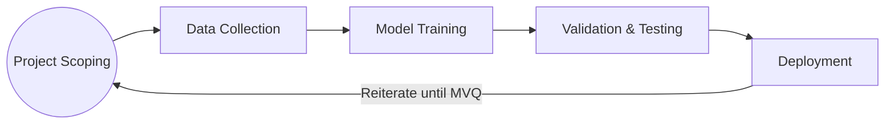
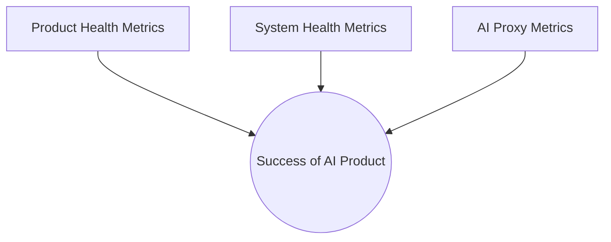

![[Screenshot 2025-03-30 at 5.44.49 pm.png| center | 300]]

---

# 1 The Role of AI Product Managers
- unique features of AI compared to other technologies
	- probabilistic nature - compared to traditional certainties in SWE
		- need to embrace + manage this uncertainty - so set right expectations w stakeholders/users
		- helps to set up feedback loops to monitor model performance + adjust
			- ensure strategies for retraining, testing, refinement 
		- also - interfaces that reflect probabilistic nature cleverly e.g. confidence scores or warnings when uncertain
	- dependency on data - more relevant, high-quality data you have, the better your model will perform
		- not all data created equal - bias, noise, irrelevance can give skewed results
	- model drift - unlike traditional SWE which remains static unless updated, AI can continuously learn + improve 
		- helps to have processes for ongoing learning e.g. retraining schedules, active learning frameworks
			- e.g. where model can query for more information if uncertain 
	- need for interpretability/explainability - invest in interpretable models where possible
		- use auxiliary methods for complex models e.g. SHAP, LIME
	- automated decision making - need to think about where line is between human vs automated decision making 
		- when do you hand over full control to AI + when is oversight needed
			- human in the loop approaches
		- always include fail-safes + escalation protocols 
	- scalability - once trained, model can make thousands of decisions per second
- superpowers of AI + GenAI 
	- learning from massive data and content 
	- personalisation at scale 
	- automating and optimising workflows 
	- generating new content 
	- prediction and forecasting
	- real-time adaptation 
	- unlocking new form factors 
- role as AI PM 
	- not to write code/train models, instead core focus = designing world-class solutions to complex user problems
	- set apart by AI expertise
		- identify where AI can add most value
		- navigate it's limitations
		- make strategic decisions based on it's tradeoffs
		- align AI capabilities w user needs
- AI PM skillset 
	- core PM craft + practices
		- understanding users’ needs, setting a vision for a product, prioritising features, and more
		- about the why and what of a product
	- engineering foundations for PMs
		- understanding its technical aspects, including software development practices and tools, is invaluable
	- essential leadership + collaboration skills 
		- effective communication, leadership, empathy, and creativity
		- instrumental in navigating challenges, fostering teamwork, and ensuring that the products you build will resonate with users
	- AI lifecycle + operational awareness
		- nuances of AI, from ML algorithms to the intricacies of model training
		- allows you to:
			- Understand what is and isn’t possible with AI
			- Identify and solve the right user problems
			- Earn respect by communicating effectively with engineers and data scientists
			- Be confident in making informed, strategic decisions, such as assessing the trade-offs of different algorithms or evaluating metrics to decide whether a product is ready to launch
			- Assess the quality of your own features, and troubleshoot to catch and resolve bugs

---

# 2 AI Product Dev Lifecycle
- types of AI products 
	- <mark style="background: #FFB8EBA6;">0-to-1</mark> AI products = applying an emerging technology or model to a new product to create an experience that did not exist before
	- <mark style="background: #FFB8EBA6;">1-to-n</mark> AI products = enhancing, expanding, or adapting an existing product
		- likely looking to scale, enhance, and diversify your org's established AI product offerings
## 2.1 AI product development lifecycle
- 1. <mark style="background: #FFB8EBA6;">Ideation</mark> = goal is to identify the AI features that would benefit your target user segment
	- adopt an innovation first mindset 
		- identify places where AI is uniquely positioned to have a significant impact
		- requires constant innovation/curiosity - inspire from other industries, user behaviours or market gaps
	-  identify potential use cases in untapped markets and address the pain points of a particular user segment
		- requires brainstorming, extensive market research, hypothesising, and collaboration with AI researchers
		- collaboration is critical
			- as hypotheses are rigorously tested through prototypes and market fit experiments
			- each experiment cycle geared towards refining AI solution 
	- for 1-to-n products - emphasis = improving on what already exists 
		- work closely w UX teams + collect customer feedback to pinpoint improvement areas
		- needs data insights on current product usage 
	- regardless of product type - ideas should always be user-centric
		- identifying the target user and understanding their use cases, needs, and pain points
	- benefits immensely from diverse perspectives during brainstorming
		- team may have different insights into data sources, model capabilities, user needs, and ethical considerations
		- bringing these viewpoints together = refine initial ideas, challenge assumptions + explore new solutions 
		- select 4-5 core members w diverse skills + tag/invite them to sessions
	- use **RICE** framework to prioritise features
		- helps objectively eval each feature based on 4 factors 
		- reach - impact - confidence - effort 

![[Screenshot 2025-03-31 at 8.26.37 am.webp| center | 500]]

- 2. <mark style="background: #FFB8EBA6;">Opportunity</mark> = assessing your idea's potential market fit + decide to move forward w your hypothesis 
	- goal is to understand how big the opportunity is 
		- by diving deep into competitor products, alternative solutions, market size, and timing for a solution like yours
		- thorough market analysis is vital to a strong product value proposition - helps avoid wasting resources for nonviable ideas
	- product market fit achieved if product meets 3 criteria 
		- **business viability** = can capture market space, profitable + healthy/responsive economic environment 
			- need to evaluate risk, ROI + ensure regulatory compliance 
			- tools like surveys, focus groups, user interviews can uncover customer pain points + expectations
			- also pay attention to competitors to see how to uniquely position your product - i.e deliver clear advantage over alternatives
		- **technical feasibility** = has the resources (DS, hardware, tech, data etc) to support the envisioned features and functionality
			- identifying necessary technical requirements helps set realistic expectations + goals - minimises GTM risks
			- share envisioned functionalities w engineers/scientists to get preliminary feedback
				- teams should focus on if existing tech infra can support delivering the proposed features
		- **user desirability** = product effectively solves target market pain points 
			- involves a mix of market research, experimentation, and direct engagement with potential users
			- using MVPs is great way to engage customers + observe direct value they get (+ test pricing strategy)
- 3. <mark style="background: #FFB8EBA6;">Concept/Prototype</mark> = MVP: version of a new product which allows a team to collect the maximum amount of validated learning about customers with the least effort
	- AI MVP integrates with real-world systems, interacts with live data, and delivers tangible solutions to user problems
	- unlike a typical MVP, which might focus solely on building the simplest version of a product, an AI MVP needs to do four things: 
		- require putting together a hardcoded experience
			- sometimes necessary to hardcode certain aspects of the product to demonstrate its potential 
			- without investing excessive time in developing a fully automated system at this stage
		- demonstrate integration compatibility
			- need to integrate seamlessly with potential existing systems, typically through an API
			- shows stakeholders that it can enhance existing processes rather than disrupt them
			- including basic API/integration layer goes far in demonstrating potential to scale within current org ecosystem
		- showcase domain-specific expertise 
			- ability to understand the specific domain in which it operates
			- often means training the model using a small but high-quality dataset specific to your domain
		- add value from day one
			- for MVPs - focus on features that can provide clear, immediate benefits
			- building a feedback loop into the MVP is a simple way to illustrate how the product can learn and improve
				- also allows to demonstrate AI capacity for growth/adaptation even at this early stage
- 4. <mark style="background: #FFB8EBA6;">Testing & Analysis</mark> 
	- undergoes rigorous evaluation to assess its performance, user acceptance, and market viability
	- starts with structured feedback sessions involving users who closely match the target personas defined earlier in the development process
		- often consists of a beta or phased release to a cohort of selected customers
	- feedback is instrumental in validating your initial hypotheses about the product’s value proposition and identifying any gaps or areas for improvement.
		- can take various forms, including surveys, interviews, focus groups, and simulations.
	- culmination of the testing and analysis phase is critical Go/No-Go decision
- 5. <mark style="background: #FFB8EBA6;">Rollout</mark> 
	- this phase is characterised by: 
		- high coordination and readiness
		- vigilant monitoring of real-time feedback
		- and maintaining the momentum of a positive launch experience

---

# 3 Essential AI PM Knowledge
- we explore the essential skills that product managers need to transition into roles focused on AI
	- you will be more than a project overseer; you will be the visionary who can discern and balance human needs with machine possibilities
	- requires an in-depth understanding of AI technology’s potential and boundaries
## 3.1 Skill 1: Core PM craft + practices
- involves identifying user segments, personas, pain points & needs
- <mark style="background: #FFB8EBA6;">writing user stories</mark>
	- user stories = fundamental tool in PM, serve as concise straightforward descriptions of a feature from the end user’s perspective
	- template
		- *Who the user is*
		- *What their use case is*
		- *What their expectation or desired outcome is*

> WHO -  *“As a Netflix viewer who often ignores specific show recommendations,*
> WHAT - *I want the system to notice that I’m not interested in that show and to stop suggesting it,*
> WHY -  *So that my recommendations are more relevant to my tastes.”*

- <mark style="background: #FFB8EBA6;">prioritising + assessing tradeoffs</mark> = key skill that has several factors
	- accuracy vs speed = for real time AI decisions, often tension between algo accuracy + time taken to process data 
	- complexity vs simplicity = need to decide if added complexity is justified by incremental improvements in UX or business outcomes
	- data quality vs quantity = AI systems are data hungry but there is tradeoff between:
		- gathering large volumes of data vs ensuring it is high quality, relevant + ethically sourced
		- AI PM needs to ensure data pipeline is robust + focuses on both volume + quality
	- user privacy vs personalisation = e.g. forgoing certain data-rich personalisation features to maintain trust 
	- ethical considerations vs business goals = balance business progress vs creating fair, unbiased + ethical products
		- even if means slowing down certain initiatives to manage risk 
	- explainability vs performance 
- <mark style="background: #FFB8EBA6;">trade-space</mark> = your area of solutions within tradeoffs, not static but evolves as project does 
	- 6 factors to defining your trade space
		- 1. identify key factors
		- 2. rank priorities
		- 3. map out interdependencies 
		- 4. visualise trade space
		- 5. test different scenarios
		- 6. iterate and adjust 
	- to create the trade space, find all relevant constraints + tradeoffs for your problem
		- then map them as boundaries to define a **solution space** - visualising where acceptable solutions lie within the limits
		- when evaluating solutions for an AI product:
			- make sure to include key factors, tradeoffs + potential outcomes
			- and after your comparison table, add your recommendation + justification 

![[Screenshot 2025-04-06 at 10.45.38 am.webp| center | 400]]

## 3.2 General PM skills 
- educational pursuits and hands-on experience
	- e.g. courses, books, hackathons 
- continuous learning = following breakthrough research, new methods + relevant industry news 
	- e.g. via blogs from major tech companies 
	- and newsletters or twitter feeds
## 3.3 Leadership + collaboration skills
- requires empathy with users and strong interpersonal skills
	- bridges the gap between complex AI technologies and practical, user-centric applications
- <mark style="background: #FFB8EBA6;">Creativity</mark> 
	- empowers PMs to:
		- ideate unique solutions
		- envision novel product features
		- think outside the box to meet user needs
	- innovative problem-solving and design thinking 
		- creativity in AI PM work often appears through problem solving 
		- solutions are rarely clear and often need outside-the-box ideas
		- design thinking = empathising w users, defining pain points + testing solutions
	- product differentiation 
		- allows PMs to differentiate via integrating unrelated data sources to provide unique insights
	- storytelling 
		- aligns teams + stakeholders - secures buy-in, fosters cohesion, enhances communication 
- <mark style="background: #FFB8EBA6;">Communication</mark> 
	- essential to translate complex AI concepts into understandable narratives
		- helps secure support from non-technical stakeholders e.g. explaining new algo to ELT
	- improve this skill via regular interaction w diverse audiences 
- <mark style="background: #FFB8EBA6;">Leadership</mark> 
	- unifies diverse teams around a shared vision 
	- demands = domain expertise + deep understanding of product trajectory + goals 
	- develop through = mentorship from experienced professionals
- <mark style="background: #FFB8EBA6;">Analytical thinking</mark>
	- enables data driven decision making - more reliable than gut instincts
		- use data from market research or pilot experiments 
	- steps to apply 
		- identify key product metrics
		- use analytics tools + custom dashboard
		- regularly review trends + anomalies 
		- use AB testing for decision validation 
		- question assumptions + back decisions w data 
- <mark style="background: #FFB8EBA6;">Empathy</mark>
	- core to AI product dev - ensures needs, emotions, challenges are considered
	- ways to build empathy 
		- direct user engagement 
		- interviews + user feedback analysis 
		- perspective taking exercises 
## 3.4 Engineering foundations for PMs
- working w code 
	- version control = critical in collaborative, code-heavy projects
	- build process = understand tools + systems used to build the product 
	- testing = knowledge of frameworks e.g. `pytest`
		- allows simulation of scenarios to test AI models robustness + accuracy before prod
	- resource management = managing resources, load and usage
- key technical concepts
	- APIs = enable integration of models with existing systems or 3rd party apps
	- algorithms = the major ones
	- system architecture = structured design showing interaction between software, hardware, external systems
	- software development methodologies = aware of the main approaches
		- **waterfall** = sequential traditional process, phases, little flexibility to revisit
		- **agile** = dynamic + collaborative, broken into sprints, continuous planning + testing + iteration
	- estimation frameworks = used to forecast project time + resources
		- **top-down estimation** = start w overall scope, estimate effort based on similar past projects
		- **bottom-up estimation** = break project into smaller tasks, estimate each → more accurate but time-intensive
		- **parametric estimation** = uses math models + historic data → effective for repeatable, scalable projects
		- **expert judgement estimation** = relies on experienced SME inputs → based on prior work w similar projects
## 3.5 AI product lifecycle + operational awareness
- key phases

- Project Scoping = at this phase, should have finalised PRD (defines objectives, user needs, success metrics + constraints)
	- all about engineering team translating product requirements into technical boundaries + expectations
- Data Collection = where you gather data from various sources e.g. behaviour logs, content metadata, user generated info 
	- also involves cleaning, labelling + structuring data to make it suitable for model training
- Model Training = core phase where the product is forged
	- embrace an experimental mindset - try different algos, hyperparameters → evaluate initial performance to find best approach
	- example: training a transformer model (like GPT) to handle customer queries
		- may require multiple iterations for improvement
- Validation and Testing = using seperate dataset to test model's accuracy/reliability/performance
	- iterative process: refine model when issues or biases are found
	- continue cycle until meeting **minimum viable quality** (<mark style="background: #FFB8EBA6;">MVQ</mark>)
- Deployment = where prod goes live - important to have monitoring setup 
- note: human in the loop often needed
	- for data labelling (especially for complex domains) + model evaluation (detect subtle errors + biases)

---

# 4 AI PM's Day-to-Day
## 4.1 AI PM Responsibilities + Progression
- AI PM career ladder - as you progress, role evolves from tactical execution to strategic leadership 
	- early stages = execution & project delivery
	- later stages = shaping how AI aligns w business goals 
- levels
	- execution level (4-6) = focus on daily development + deployment of AI features
		- work closely with AI/ML engineers + data scientists
		- track progress + remove roadblocks
		- set + manage OKRs
		- identify product-market fit + drive full product dev lifecycle 
	- AI/ML PM (5-7) = lead AI product development from ideation to deployment 
		- translate business goals into actionable AI strategies
		- go beyond building to ensure alignment w broader business impact 
	- strategic leadership (8+) = oversee AI product portfolio + align efforts w business strategy 
		- cross-functional alignment
		- governance, ethics, compliance
		- long-term strategic planning
## 4.2 Tips from Big Tech PMs
- anecdotes from well-known AI PMs in big tech 
	- 💡 daily activities:
	    - consume content (podcasts, papers, articles)
	    - strategic thinking and writing (PRDs, strategy docs, thought pieces)
	- 💡 guiding principles:
	    - relentless curiosity
	    - continuous learning
	    - deep problem understanding
	- 💡 weekly planning:
	    - structured deep work Mon–Wed with flexible meeting time
	    - reads 2–5 AI papers weekly to stay current
	- 💡 success defined as:
	    - progress on 3–5 top priorities
	    - usefulness across many areas through strategic connections
	- 💡 notes on the role:
	    - high cognitive load and complexity
	    - AI PM likened to neurosurgery due to specialised knowledge and high stakes
## 4.3 Cross-functional Collaboration
- success of AI products = **relies on a shared understanding and seamless coordination between teams**
- example: you are developing Amazon Alexa, dealing w the following stakeholders
	- AI/ML teams - build and refine the models powering your product
	- Operations teams - ensure infrastructure, performance, and deployment pipelines are efficient and reliable
	- Engineering teams - implement AI features, integrate with back-end systems, and scale solutions
	- UX teams
		- User researchers - provide insights on user interaction, pain points, and opportunities, guide product priorities + updates
		- UX developers/designers - translate AI functionality into intuitive, user-friendly interfaces, wireframes + prototyping
		- content specialists - craft clear, brand-aligned messaging, simplify complex AI functions for users
	- Business teams - connect product direction with revenue, market strategy, and customer value
	- 3rd parties - include vendors or partners critical to the AI product ecosystem
	- Governance, risk, compliance experts - ensure products meet ethical standards, regulatory requirements, and internal policies
	- Leadership teams - provide vision, resource allocation, and alignment with company-wide goals
## 4.4 Conclusion 
- AI PMs act as the connective tissue across all stakeholders and teams
- success depends on:    
    - technical insight        
    - user focus        
    - cross-functional coordination
    - attention to both big picture and fine details
- it is a high-impact and demanding role, blending strategy with execution

---

# 5 Strategic Thinking in AI 
## 5.1 Business Strategy: Evaluating AI as a solution
- AI might not always be the answer
	- AI decisions are complex + need to balance short-term business goals vs long-term strategic goals
	- key strategic questions
		- should you build in-house AI for control and customization (but slower)?
		- or buy third-party solutions for speed (but with trade-offs in flexibility)?
	- factors to evaluate:
		- internal: talent, infrastructure, expertise
		- external: market trends, competitive landscape
	- align AI initiatives with both short-term and long-term strategic objectives
		- don’t adopt AI if your org isn’t ready for the challenges of production deployment
- Disrupting vs Sustaining
	- **sustaining innovation**:
		- improves existing products incrementally
		- enhances performance, usability, or reduces defects
		- aligns with the current business strategy and meets existing customer needs
	- **disruptive innovation**:
		- targets niche or unmet needs
		- starts off appearing inferior (less refined, less powerful)
		- eventually redefines the market or creates a new one
		- serves future customer needs
		- may lack polish, reliability, or features at first compared to mature products
## 5.2 Build or Buy
- see table below
- hybrid approaches are also good idea
	- build core or differentiating AI capabilities in house
	- buy 3rd party tools for nonessential or supplementary complements

| **Factor**                  | **Build in-house**                                 | **Buy pretrained**                                      |
| --------------------------- | -------------------------------------------------- | ------------------------------------------------------- |
| **Core competency**         | Best when AI is central and requires customization | Ideal if AI is a secondary feature needing quick setup  |
| **Resources and expertise** | Needs strong internal AI team and infrastructure   | Suitable for teams lacking in-house AI capabilities     |
| **Time to market**          | Slower to build and launch                         | Faster deployment, good for pilots                      |
| **Flexibility**             | High flexibility and long-term control             | Limited flexibility and control                         |
| **Cost assessment**         | High initial costs, lower long-term expenses       | Lower upfront cost, possible high long-term fees        |
| **Risk and uncertainty**    | Higher internal risk, depends on internal skills   | Reduces risk, but relies on external vendors            |
| **Data privacy and ethics** | Full control over data handling                    | Potential data privacy concerns with third-party access |
| **Competitive landscape**   | Slower, but enables stronger differentiation       | Quick market response, less room for uniqueness         |

## 5.3 Data Strategy: Populating + Adapting a model
- data 
	- synthetic data = artificially generated to simulate real scenarios
		- for: sensitive, rare, critical events, or early development, or collecting real data too expensive/risky
		- examples: pilot flight simulators, Waymo SimulationCity
		- limitations = cannot capture subtle behaviours or cultural nuances + lacks complexity of real world user behaviour/communication
		- best practices
			- ensure synthetic data matches statistical properties of real data 
			- validate w real world samples to avoid bias 
	- real-world data 
		- essential when:
			- user behaviour + preferences are central 
			- product decisions are high stakes 
			- capturing cultural + contextual details matter
	- hybrid approach 
		- start with synthetic data to kick off development
		- gradually incorporate real-world data as it becomes available
		- example: Tesla combines synthetic scenarios with real-world driving data
- fine-tuning vs RAG 
	- fine-tuning = retrain model on task-specific data 
		- helps adapt general models to domain specific needs
	- RAG = combines model generation with real-time retrieval from knowledge bases
		- ideal when up-to-date or factual accuracy is required 
	- decision making framework
		- task complexity
		- data availability 
		- frequency of updates
		- need for explainability + traceability 
## 5.4 Product Reviews: Buy-in from Leadership
- reviews are essential checkpoints for:
	- stakeholder alignment
	- strategic progress evaluation 
	- surfacing tradeoffs + feedback

| **Review type**       | **Objective**                                           | **Key elements**                                                                | **Outcome**                                                          |
|-----------------------|---------------------------------------------------------|---------------------------------------------------------------------------------|----------------------------------------------------------------------|
| Decision review       | Go/no-go decision, strategic direction                  | Present clear options with pros and cons, trade-offs, justifications            | Clear decision with action items/next steps                          |
| Exploratory review    | Open-ended brainstorming, early-stage feedback          | Encourage diverse opinions, focus on research and early insights                | Gather feedback, refine product direction                            |
| Alignment review      | Cross-functional alignment on vision, goals, timeline   | Present vision and key milestones, surface any misalignments                    | Alignment with clear next steps                                      |
| Status update         | Progress review: People, milestones, changes            | Present KPIs, highlight roadblocks, offer transparency on risks                 | Keep stakeholders informed and aligned on progress                   |

- product review checklist 
	- 1. <mark style="background: #FFB8EBA6;">before the review</mark>
		- ⌧ compile relevant info: KPIs, milestones, user research, market data
		- ⌧ invite the right cross-functional stakeholders
		- ⌧ share PRD or slide deck in advance
	- 2. <mark style="background: #FFB8EBA6;">during the review</mark> 
		- ⌧ clarify the review's goal - e.g. go/no-go, resourcing, strategy alignment
		- ⌧ promote collaborative discussion
		- ⌧ highlight trade-offs = risks, benefits, costs, impact 
	- 3. <mark style="background: #FFB8EBA6;">after the review</mark>
		- ⌧ send summary w decisions, next steps + owners
		- ⌧ set plan for tracking progress e.g. follow-ups, PRD updates, more research

---

# 6 Setting Goals + Measuring Success
- no single metric can capture the full impact of an AI product
- success emerges from a combination of diverse metrics that together reflect product health, system performance, and AI model integrity
- a successful AI product includes three core metric categories:
	- product health metrics
	- system health metrics
	- AI proxy metrics

## 6.1 Product Health metrics
- <mark style="background: #FFB8EBA6;">product health metrics</mark> = **measure how users interact with and perceive the AI product**
	- engagement = how actively users use AI features (e.g., recommendations, insights)
		- indicators: frequency of use, session length, number of interactions
	- user satisfaction = reflects how happy users are with the product
		- measured via surveys, feedback, NPS
		- influenced by relevance of AI outputs + alignment w user expectations
	- adoption = tracks how quickly new users begin using the product
		- insights gained from sign-up rates + trend analysis
	- conversion = measures achievement of specific end goals (e.g., signing up, purchasing, upgrading)
	- retention = indicates long-term value through user return rate over time
	- financial metrics = assess economic impact via revenue or ROI 
## 6.2 System Health metrics
- <mark style="background: #FFB8EBA6;">system health metrics</mark> = **assess the technical performance and reliability of the AI system**
	- uptime & latency = system availability + response time
		- high uptime + low latency - essential for user trust
	- scalability = ability to handle growing user demand
		- ensure via load testing + monitoring usage during peak traffic 
	- error rate = measures how frequently system encounters failures
		- high error rates lower user satisfaction
		- best practices - regular audits, automated alerts, ongoing stress testing
## 6.3 AI Proxy metrics
- <mark style="background: #FFB8EBA6;">ai proxy metrics</mark> = **evaluate the integrity and effectiveness of the AI models themselves**
	- help guide trade-offs and strategic decisions
	- model quality metrics = measure how well a model performs on unseen data (e.g., prediction accuracy)
	- objective functions = mathematical functions used to train models by optimising for specific goals
	- confusion matrices = visualise model performance
		- show true positives, false positives, true negatives, and false negatives
		- useful for classification models
## 6.4 OKRs for AI Products
- <mark style="background: #FFB8EBA6;">OKR</mark> = objective + key results
	- **objective** = overarching, strategic goal (ambitious and inspirational)
	- **key results** = measurable KPIs tied to that goal
- tying metrics to goals
	- combine various metrics to form a holistic view of product performance
		- align OKRs w user needs, technical excellence, business outcomes
	- each OKR may contain multiple KPIs but only 1 north star metric
		- characteristics of good KPIs = SMART - specific, measurable, achievable, relevant, time-bound 
	- <mark style="background: #FFB8EBA6;">north star metric</mark> = **primary KPI reflecting core value delivered by the product**
		- supported by additional metrics that track progress across dimensions
- **structure of an AI OKR**
	- objective = clearly stated, user focused goal for the next quarter
	- key results (KPIs) should include
		- north-star metric
		- product health metric
		- system health metric 
		- AI proxy metrics
		- guardrail metrics to monitor unintended consequences
	- example below 

| **Component**               | **Example**                                                                                                           |
|-----------------------------|------------------------------------------------------------------------------------------------------------------------|
| **Objective**              | Enhance the user experience by providing more personalized music recommendations.                                      |
| **Specific feature**       | Introduce three new personalization algorithms based on user behavior, mood, and music trends.                         |
| **North Star metric (KPI)**| Increase user engagement with recommended playlists by 25%.                                                            |
| **Problem metric (KPI)**   | Reduce the number of users skipping songs within AI-generated playlists by 20%.                                        |
| **Guardrail metric (KPI)** | Ensure that the overall time spent listening to the music does not decrease by more than 5%.                           |
| **System health metric**    | Maintain 99% system uptime, and reduce playlist loading times to under one second.                                    |
| **AI proxy metric (KPI)**  | Increase the precision of the recommendation algorithm by 15%.                                                         |

---

# 7 Building AI Agents
## 7.1 What is an Agent
- <mark style="background: #FFB8EBA6;">AI agents</mark> = autonomous systems that adapt and improve through user interactions    
- characteristics of an intelligent agent:    
    - actions align with goals and context        
    - flexible in changing environments        
    - learns from experience        
    - makes appropriate decisions despite perceptual or computational limits        
- early AI agents were **rule-based systems**, following predefined logic    
	- limited to rigid, predefined behaviours within narrow environments
	- over time, agents evolved to become more dynamic and adaptive
- modern agents:    
    - act without constant input        
    - learn from feedback        
    - adapt to context
- components of an AI agent
	- **abilities** = tasks the agent can perform (e.g. speech recognition, decision making)
	- **goals or preferences** = objectives the agent aims to achieve (usually preprogrammed)    
	- **prior knowledge** = data the agent already has about its environment    
	- **stimuli** = input from the environment, including sensor data or user feedback    
	    - in basic systems, stimuli trigger hardcoded responses        
	    - in modern agents, stimuli are processed dynamically, enabling learning and adaptation        
	- **past experiences** = historical interactions that inform future behaviour
## 7.2 Agentive Products
- 3 major advancements in AI agents
	- refined behaviour over time through learning    
	- decision-making based on constraints, goals, and user needs
	- proactive actions that reflect deeper understanding of user intent

| **Feature**           | **Chatbot**                                | **AI agent**                                      | **Multiple AI agents**                                         |
|-----------------------|--------------------------------------------|--------------------------------------------------|----------------------------------------------------------------|
| **Purpose**           | Simple conversations and automation        | Makes autonomous decisions                       | Collaboratively solve tasks                                    |
| **Scope**             | Narrow, rule-based                         | Handles adaptable, complex tasks                 | Manages multitask scenarios with coordination                  |
| **Conversation**      | Scripted responses                         | Responds autonomously based on input             | Collaborates through multi-agent dialogue                      |
| **Learning ability**  | Minimal learning, static logic             | Learns via data and reinforcement                | Learns individually and as a group                             |
| **Interactivity**     | User-focused                               | Engages users and systems                        | Engages users, systems, and subsystems                         |
| **Complexity**        | Simple NLP                                 | Advanced models with multiple capabilities       | High orchestration across specialized agents                   |
| **Decision making**   | Follows fixed logic                        | Makes informed decisions autonomously            | Coordinates and negotiates decisions                           |
| **Adaptability**      | Predefined responses                       | Adjusts to new info and conditions               | Scales adaptability across agents                              |
| **Example use cases** | FAQs, basic bookings                       | Assistants, customer support                     | Complex coordination like swarm intelligence                   |

- task specific vs general-purpose agents
	- <mark style="background: #FFB8EBA6;">task specific agent</mark> = designed for specific domains or tasks (e.g. booking, email, content generation)
		- includes:
			- simple reflex agents = rule-based, no memory or learning
			- goal-based agents = choose actions based on achieving a goal
			- utility-based agents = choose actions that maximise a utility (e.g. energy efficiency)
	- <mark style="background: #FFB8EBA6;">general-purpose agent</mark> = - “all-in-one” systems that operate across multiple domains
		- maintain an internal model of the world
		- capable of adapting to various tasks and dynamic environments
- agent activation 
	- proactive agents = initiate actions based on observed user behaviour or context
	- reactive agents = respond only when explicitly invoked by the user
- feedback and learning
	- feedback loops can be:
	    - **explicit** = user ratings, thumbs up/down, corrections        
	    - **implicit** = analysing user behaviour or outcomes        
	- design considerations:    
	    - allow users to guide improvements        
	    - enable system-driven learning from its own successes and failures
## 7.3 Evaluation of Agents
- task completion rate = measures agent effectiveness (e.g. meetings scheduled, messages sent)        
- accuracy and quality = assesses if agent can handle complex queries        
    - user feedback (thumbs, ratings) helps track this        
- intervention = how often human help is needed        
    - goal is to reduce dependency on manual escalation over time        
- user satisfaction = measured through surveys and direct feedback
    - indicators: ease of use, usefulness, positive sentiment
## 7.4 AI Agent questionnaire
- what user need will the agent fulfil?    
- will the agent be:    
    - task specific (reflex, goal-based, or utility-based)?        
    - or general purpose?        
- will it be proactive or reactive?    
    - if reactive, how will it be invoked?        
- does the agent need to:    
    - learn and adapt over time?        
    - use reinforcement learning or feedback loops?        
- will users be able to “train” the agent?    
    - what tools will be provided for this?        
- what should the experience look like?    
    - which design patterns will be used?        
- how will the agent scale?    
    - what infrastructure is required?        
- how will data be accessed and secured?    
- how will the agent personalize the user experience?    
- how will it integrate with other tools or platforms?    
- what metrics will define success?

---

