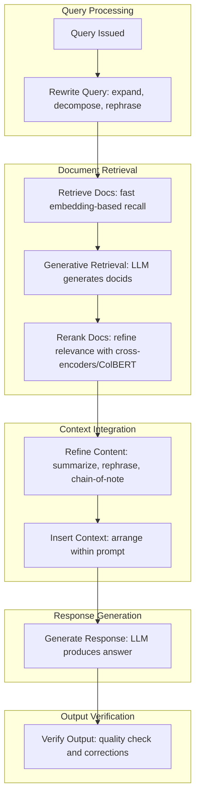
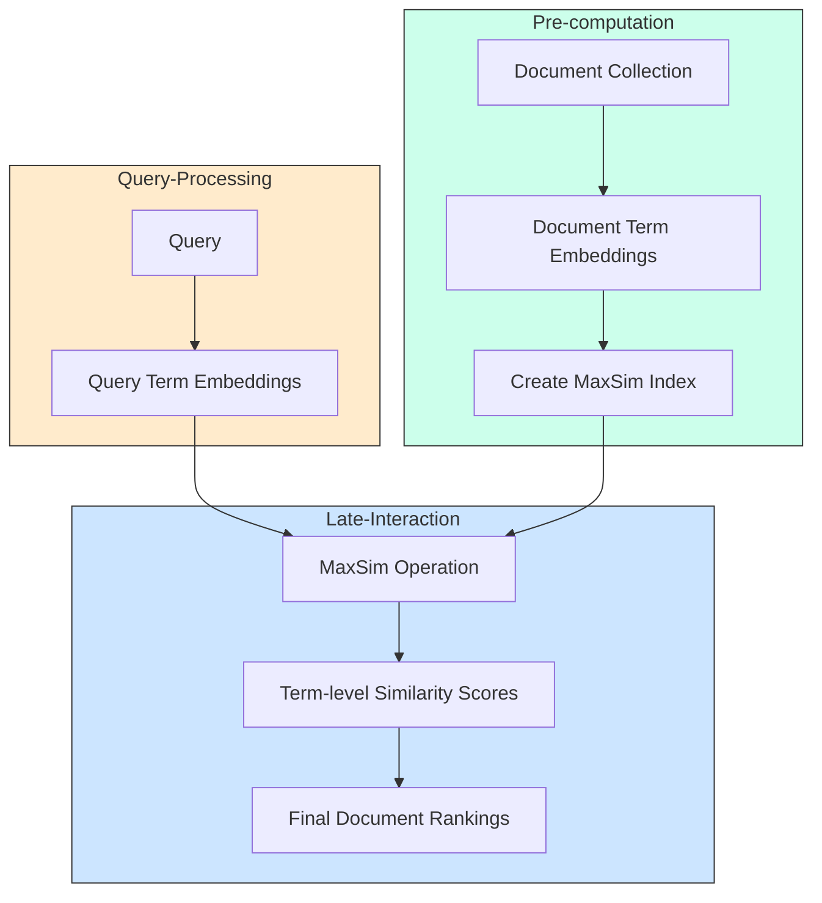
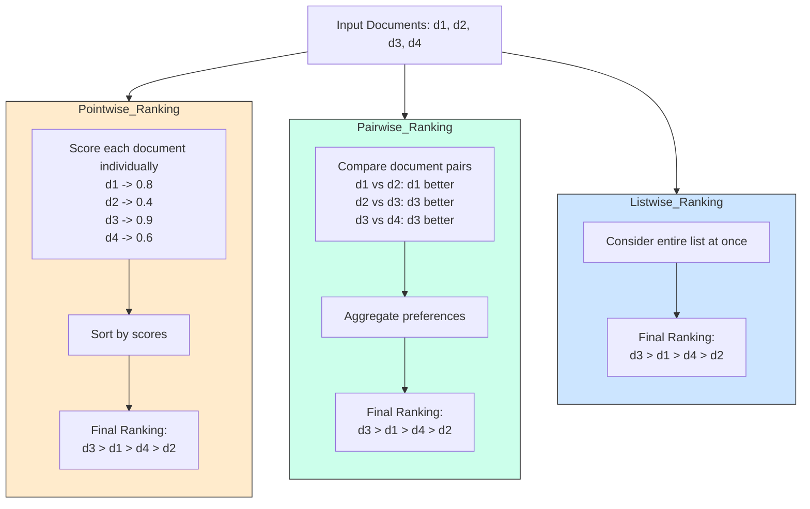
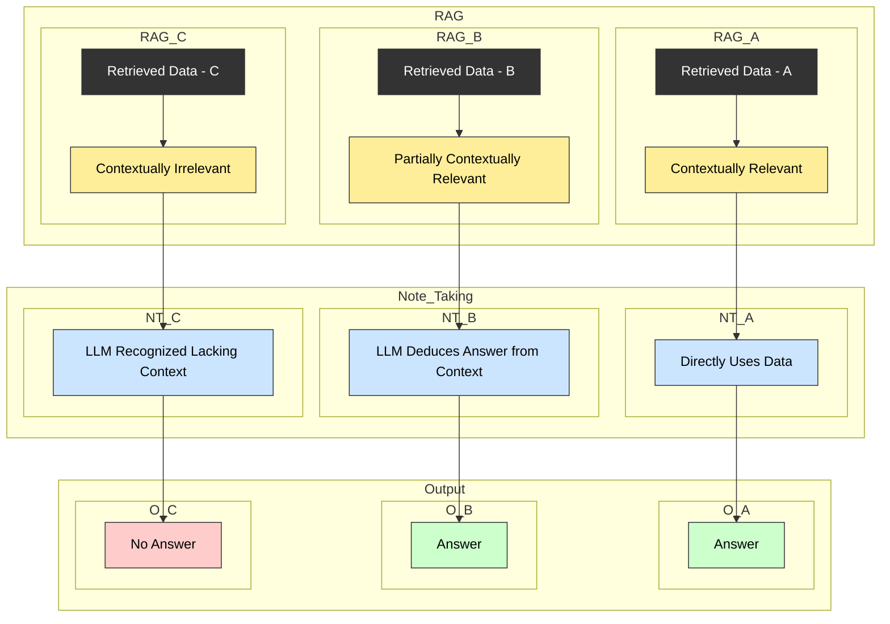

- [[#2 LLM Struggles with Long-Tails|2 LLM Struggles with Long-Tails]]
- [[#3 RAG Pipeline|3 RAG Pipeline]]
	- [[#3 RAG Pipeline#3.1 Rewrite|3.1 Rewrite]]
	- [[#3 RAG Pipeline#3.2 Retrieve|3.2 Retrieve]]
		- [[#3.2 Retrieve#3.2.1 Generative Retrieval|3.2.1 Generative Retrieval]]
	- [[#3 RAG Pipeline#3.3 Rerank|3.3 Rerank]]
		- [[#3.3 Rerank#3.3.1 Cross-Encoders|3.3.1 Cross-Encoders]]
		- [[#3.3 Rerank#3.3.2 Late Interaction (ColBERT)|3.3.2 Late Interaction (ColBERT)]]
		- [[#3.3 Rerank#3.3.3 LLM Distillation for Ranking|3.3.3 LLM Distillation for Ranking]]
	- [[#3 RAG Pipeline#3.4 Refine|3.4 Refine]]
		- [[#3.4 Refine#3.4.1 Summarisation|3.4.1 Summarisation]]
		- [[#3.4 Refine#3.4.2 Chain-of-Note|3.4.2 Chain-of-Note]]
	- [[#3 RAG Pipeline#3.5 Insert|3.5 Insert]]
	- [[#3 RAG Pipeline#3.6 Generate|3.6 Generate]]
- [[#4 RAG + Memory Management|4 RAG + Memory Management]]

# 1 Why RAG
- reasons for using RAG 
	- access private or proprietary data without full retraining
	- reduce hallucinations by grounding answers in real data and enabling data citations
	- answer queries on recent events or emerging concepts not in training data
	- handle long-tail entities rarely seen in pretraining

# 2 LLM Struggles with Long-Tails
- LLMs require many samples to memorise facts; memorisation is probabilistic
	- rare entities or concepts lead to lower accuracy (eg bloom-176b accuracy drops from 55% to 25%)
	- memorisation scales log-linearly with model size; enormous models needed for long-tail
- strategies to improve memorisation:
    - train for more epochs or upsample important data
    - modify loss to upweight factual tokens
    - modify the learning objective to upweight the training loss for tokens representing facts
    - use curriculum learning to reinforce early samples
	    - modify the order in which we show the samples during training to ensure a higher likelihood of memorisation for the data we want memorised
    - use RAG to supplement llm’s internal knowledge
# 3 RAG Pipeline
- overall framework = retrieve-read with multiple stages to augment query answering
	- response to a query, a retrieval model identifies documents that are relevant to answering the query
	- documents are then passed along to the LLM as context
	- LLM can rely on in addition to its internal capabilities to generate a response



- retrieval can happen over very large document space
	- hence advanced retrieval methods often infeasible 
		- retrieval usually carried out over several steps
	- 1. fast methods via embeddings to get candidate docs 
	- 2. re-ranking retrieved list based on relevance so best docs passed to LLM 
	- 3. docs may not fit into context, can shorten/rephrase = refine 
	- 4. provide refined output to LLM via concatenating docs, or passing them sequentially + ensembling results
	- 5. order may also make an impact - insert stage 
	- 6. generate stage where LLM reads prompt + begins answering 
	- 7. verify stage to asses quality of outputs or even take corrective measures
## 3.1 Rewrite
- after a query is issued, it might need to be rewritten to make it more amenable to retrieval
	- typically performed using <mark style="background: #FFB8EBA6;">query expansion</mark> techniques, where the query is augmented with similar keywords
	- e.g. adding synonyms of keywords and other topic information in your query
- another approach = Pseudo Relevance Feedback (PRF)
	- original query retrieves docs, salient terms from the docs then extracted + added to original query 
- more recent approaches to query expansion 
	- <span style="color:rgb(255, 0, 247)">Query2Doc</span>
	- <span style="color:rgb(255, 0, 247)">HyDE</span> (Hypothetical Document Embeddings)
- <mark style="background: #FFB8EBA6;">query decomposition</mark> = another form of rewriting, breaking down into multiple queries
	- either sequentially or parallel, potentially with agentic workflow 
## 3.2 Retrieve
- retrieve step should focus on increasing recall, i.e. getting all possible correct docs 
	- BM25 here can be unreasonably effective - especially when paired with query/doc rewrite 
		- other traditional methods = TF-IDF, DFI, DFR, IB etc 
- metadata filters can also improve retrieval 
	- more metadata gathered in data representation + storage phase == the better retrieval possible 
	- e.g. topic modelling - can use topic subsets to apply filter before retrieving 
### 3.2.1 Generative Retrieval 
- <mark style="background: #FFB8EBA6;">Generative Retrieval</mark> = LLM identifies docs to retrieve for a query 
	- implemented via assigning document ids + teaching model association between documents + `docids`
	- typical `docids` can be:
		- single tokens 
		- prefix/subset tokens
		- cluster tokens
		- salient keyword tokens 
- <mark style="background: #FFB8EBA6;">tightly coupled retrievers</mark> = trained to learn from LLM feedback
	- model learns to retrieve text to best position LLM to generate right output for given query 
	- can be trained together with LLM or separately 
		- e.g. LLM-Embedder - unified embedding model trained on contrastive learning + LLM feedback 
- <mark style="background: #FFB8EBA6;">GraphRAG</mark> = able to draw connections between different parts of corpus + themes across dataset
	- Microsoft first launched - creates knowledge graph from underlying data via extracting entities + relationships 
	- graph then used to perform hierarchical semantic clustering + summaries of each cluster 
		- summaries enable answering of thematic questions 
	- however requires lots of compute to prepare initial graph
		- prohibitive for large datasets - especially for extracting good relationships 
## 3.3 Rerank
- retrieval can be broken into 2 steps or several steps 
	- typical 2-step process: fast embedding-based retrieval followed by rerank for precision
	- can increase to more reranking stages to sort by relevance
### 3.3.1 Cross-Encoders
- rerankers generally more complex model than retriever
	- hence only run on retrieved results 
	- usually fine-tuned LLM for that use-case 
		- e.g. BERT as relevance classifier = outputs probabilities of relevance to query 
		- known as cross encoders - query + document encoded together
		- vs bi-encoders (for embedding retrieval) which encode query + doc as seperate vectors

```python
# BERT Cross-Encoder Format
[CLS] query_text [SEP] document_text [SEP]

# usage in sentence-transformers 
from sentence_transformers import CrossEncoder
model = CrossEncoder("cross-encoder/ms-marco-MiniLM-L-12-v2", num_labels=1)

query = "When was the Apple iPhone 15 launched?"
documents = [
	"Apple iPhone 15 launched with great fanfare in New York",
	"He was foolish enough to believe that gifting an iPhone would save the relationship",
	"On September 22, 2023, I lined up at the Central Park store for the launch of the iPhone 15"
]

ranks = model.rank(query, documents)

for rank in ranks:
	print(rank[‘score’], documents[rank[‘corpus_id’]])
```

- the above uses `num_labels = 1` which makes it regression task using sigmoid for 0 to 1 score 
### 3.3.2 Late Interaction (ColBERT)
- <span style="color:rgb(255, 0, 247)">ColBERT</span> = more advanced model for re-ranking
	- unlike cross-encoder, ColBERT style models allow pre-computation of document representations = faster inference
	- query + docs encoded separately via BERT 
		- generates token-level embedding vectors for each token in query + doc 
	- for each token in query
		- corresponding embedding compared to doc embedding tokens 
	- max similarity scores for each query token summed
		- giving final relevance score - known as late interaction architecture
		- since query + doc not encoded together, but only interact later in process 
		- saves time vs traditional cross encoders since you compute doc embedding in advance



### 3.3.3 LLM Distillation for Ranking
- LLMs can also be trained to directly rank candidate docs, 3 types 
	- <span style="color:rgb(255, 0, 247)">pointwise ranking</span> = each doc fed to LLM, outputs boolean relevance score
	- <span style="color:rgb(255, 0, 247)">pairwise ranking</span> = for each doc pair, LLM indicates most relevant 
		- to get complete list of pairs, needs $N^2$ comparisons, usually most effective
	- <span style="color:rgb(255, 0, 247)">list-wise ranking</span> = all candidate docs tagged with IDs + fed to LLM
		- LLM generates ranked list of IDs in decreasing order of relevance 



## 3.4 Refine
- why refine?
	- context length problem - might need to reduce length of retrieved text
	- might also want to rephrase to make text more amenable for LLM processing 
	- can also filter out some text based on rules 
### 3.4.1 Summarisation 
- useful for large chunk sizes 
	- can be done via abstractive (draw on ideas in text, can hallucinate) or extractive (find key parts verbatim) summarisation 
	- can also act as quality filter at same time, but adds complexity  
### 3.4.2 Chain-of-Note
- LLMs not great at distinguishing between relevant vs irrelevant context
	- if retrieved docs don't have answer but valuable context, LLM can combine w internal knowledge to respond 
	- or retrieved docs might be useless and hence ignored 
- can be addressed via generating notes for each retrieved doc, notes contain summary of retrieved doc + indication of:
	- if it contains answer to query
	- only has relevant context but not answer itself
	- or is completely irrelevant 
- can train tightly coupled chain-of-note models for this 
	- generate candidate notes via prompting an LLM for example queries
	- use human evaluation to filter out poor quality notes
	- final dataset: chain-of-note prompt + input query + retrieved docs as input and corresponding note + query answer as output
- authors also used weighted loss during training 
	- note tokens can be much longer than answer tokens - so equal weighting would overemphasise notes 
	- calculate loss on answer tokens only 50% of time to balance training 
- CoN especially useful for noisy retrieval results or lack of relevant docs
	- but harder for small models, so need sufficiently large model 



## 3.5 Insert
- simplest naive approach = stuff all content into context window 
	- another approach = feed each retrieved doc/summary/note prefixed to input separately into LLM
	- then combine outputs 
## 3.6 Generate 
- simplest approach = generate output all at once 
	- <mark style="background: #FFB8EBA6;">active retrieval</mark> = can also interleave generation + retrieval - useful for long-form generation 
- FLARE by Google is another approach (forward-looking active retrieval-augmented generation)
	- FLARE-instruct: llm outputs queries in a defined syntax to request extra context
	- FLARE-direct:
	    - llm generates a candidate sentence
	    - if any token in the sentence has low probability, retrieval is activated
	    - low-probability tokens can be masked or rephrased as a query for retrieval
	    - if no tokens fall below threshold, candidate sentence is accepted and generation continues
# 4 RAG + Memory Management 
- LLM prompt typically has following types of content 
	- <span style="color:rgb(255, 0, 247)">system prompt</span> = overarching instructions, can be quite long  
	- <span style="color:rgb(255, 0, 247)">input prompt</span> = current input + instruction, few-shot examples + additional context from retrieval 
	- <span style="color:rgb(255, 0, 247)">conversational history</span> = history of interactions from past 
	- <span style="color:rgb(255, 0, 247)">scratchpad</span> = intermediate LLM outputs, can be referred back to for next outputs 
		- usually artefact from CoT techniques 
- LLM context length often can't fit all this 
	- hence might need to be able to store this for later access + personalisation 
	- can use RAG to facilitate memory management, swapping in/out relevant content into prompt when needed 
- RAG can also be used to dynamically select few-shot examples for training
	- for given input, retrieve few-shot examples to maximise success of getting right answer 
	- RAG can also be used in model pre-training + fine-tuning more egenrally 