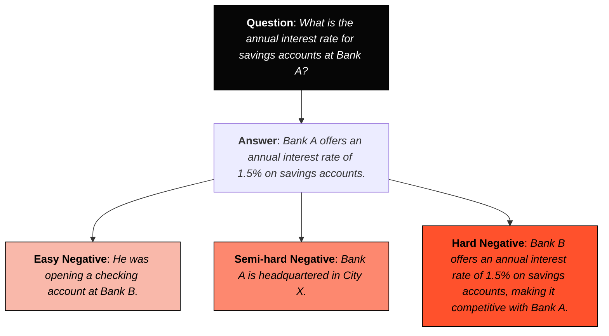

- [[#1 Creating Text Embedding Models|1 Creating Text Embedding Models]]
	- [[#1 Creating Text Embedding Models#1.1 `SentenceTransformers` Library, SBERT|1.1 `SentenceTransformers` Library, SBERT]]
		- [[#1.1 `SentenceTransformers` Library, SBERT#1.1.1 Dataset|1.1.1 Dataset]]
		- [[#1.1 `SentenceTransformers` Library, SBERT#1.1.2 Loss Function|1.1.2 Loss Function]]
		- [[#1.1 `SentenceTransformers` Library, SBERT#1.1.3 Evaluator|1.1.3 Evaluator]]
		- [[#1.1 `SentenceTransformers` Library, SBERT#1.1.4 Training Arguments & Trainer|1.1.4 Training Arguments & Trainer]]
	- [[#1 Creating Text Embedding Models#1.2 Training a model from scratch|1.2 Training a model from scratch]]
		- [[#1.2 Training a model from scratch#1.2.1 Extending our evaluation|1.2.1 Extending our evaluation]]
	- [[#1 Creating Text Embedding Models#1.3 Better Loss Function|1.3 Better Loss Function]]
		- [[#1.3 Better Loss Function#1.3.1 Hard-Negatives|1.3.1 Hard-Negatives]]
	- [[#1 Creating Text Embedding Models#1.4 Fine-tuning an Embedding Model|1.4 Fine-tuning an Embedding Model]]
		- [[#1.4 Fine-tuning an Embedding Model#1.4.1 Supervised|1.4.1 Supervised]]
		- [[#1.4 Fine-tuning an Embedding Model#1.4.2 Augmented SBERT|1.4.2 Augmented SBERT]]
	- [[#1 Creating Text Embedding Models#1.5 Unsupervised Learning|1.5 Unsupervised Learning]]
		- [[#1.5 Unsupervised Learning#1.5.1 TSDAE Example|1.5.1 TSDAE Example]]
		- [[#1.5 Unsupervised Learning#1.5.2 TSDAE for Domain Adaptation|1.5.2 TSDAE for Domain Adaptation]]
- [[#2 Finetuning Classification Models|2 Finetuning Classification Models]]
	- [[#2 Finetuning Classification Models#2.1 Supervised Classification|2.1 Supervised Classification]]
		- [[#2.1 Supervised Classification#2.1.1 Freezing Layers|2.1.1 Freezing Layers]]
	- [[#2 Finetuning Classification Models#2.2 Few-shot Classification w SetFit|2.2 Few-shot Classification w SetFit]]
		- [[#2.2 Few-shot Classification w SetFit#2.2.1 Classifier Heads|2.2.1 Classifier Heads]]
	- [[#2 Finetuning Classification Models#2.3 Continued Pre-training with MLM|2.3 Continued Pre-training with MLM]]
	- [[#2 Finetuning Classification Models#2.4 NER|2.4 NER]]
- [[#3 Finetuning Language Models|3 Finetuning Language Models]]
	- [[#3 Finetuning Language Models#3.1 Supervised Finetuning|3.1 Supervised Finetuning]]
		- [[#3.1 Supervised Finetuning#3.1.1 PEFT|3.1.1 PEFT]]
	- [[#3 Finetuning Language Models#3.2 Instruction Tuning w QLoRa|3.2 Instruction Tuning w QLoRa]]
	- [[#3 Finetuning Language Models#3.3 Evaluating Generative Models|3.3 Evaluating Generative Models]]
	- [[#3 Finetuning Language Models#3.4 Preference Tuning/Alignment/RLHF|3.4 Preference Tuning/Alignment/RLHF]]
		- [[#3.4 Preference Tuning/Alignment/RLHF#3.4.1 PPO, DPO, Training a RLHF Model|3.4.1 PPO, DPO, Training a RLHF Model]]


# 1 Creating Text Embedding Models
- embeddings are very important - driver behind many search + other applications 
	- embedding model purpose = accurately represent the textual data i.e. semantic nature/meaning of text
- <mark style="background: #FFB8EBA6;">contrastive learning</mark> = major technique for training and fine-tuning text embedding models
    - aims to position similar documents closer in vector space
    - while keeping dissimilar documents further apart
    - similar to the word2vec method
- underlying idea of contrastive learning
    - best way to learn and model similarity/dissimilarity is by feeding examples of similar and dissimilar pairs
    - to accurately capture the semantic nature of a document, it needs to be contrasted with another document
        - helps the model learn what makes documents different or similar
- <span style="color:rgb(255, 0, 247)">contrastive explanation</span> = understanding a particular case, “Why P?” in contrast to alternatives, “Why P and not Q?”
    - importance of alternatives applies to how an embedding learns through contrastive learning
        - showing similar and dissimilar pairs helps the model learn defining features of concepts
    - feeding an embedding model different contrasts (degrees of similarity) helps it learn distinctive characteristics of concepts
- <span style="color:rgb(255, 0, 247)">word2vec</span> = one of the earliest and most popular examples of contrastive learning in NLP
    - learns word representations by training on individual words in a sentence
    - neighbouring words become positive pairs
    - randomly sampled words constitute dissimilar pairs
    - positive examples are contrasted with randomly selected non-neighbouring words

![[Screenshot 2025-03-08 at 12.33.52 pm.webp| center | 500]]

## 1.1 `SentenceTransformers` Library, SBERT
- `{python}SentenceTransformers` is the main module used to use/train embedding models 
	- also to compute embeddings via sentence transformer models + calculate similarity scores 
- before sentence-transformers, <mark style="background: #FFB8EBA6;">cross-encoders</mark> were commonly used
    - cross-encoder allows simultaneous input of two sentences to predict similarity
	    - adds a classification head to output a similarity score
	    - does not generate embeddings, only outputs similarity score
	- limitations of cross-encoders
	    - generating embeddings from BERT by averaging output layer or 
	    - using `[CLS]` token is less effective than averaging word vectors like GloVe

![[Screenshot 2025-03-08 at 12.47.49 pm.webp| center | 500]]

- <mark style="background: #FFB8EBA6;">bi-encoder</mark> i.e. `sentence-transformers` approach 
    - **architecture changes:**
	    - drops the classification head
	    - uses mean pooling on the final output layer to generate embeddings
        - averages word embeddings to produce a fixed-dimensional output vector
        - then can measure similarity via metrics e.g. cosine similarity 
	- **training architecture** = Siamese architecture used in sentence-transformers
	    - consists of 2 identical BERT models sharing weights and architecture
	        - both models generate embeddings from input sentences through pooling of token embeddings
	        - optimised based on similarity of sentence embeddings
	    - during training
	        - embeddings for each sentence are concatenated with the difference between them
	        - optimised using a softmax classifier
	        - loss function has big impact on final performance for these models 

![[Screenshot 2025-03-08 at 12.46.58 pm.webp| center | 500]]

- <mark style="background: #FFB8EBA6;">bi-encoder</mark> = alternative term for the architecture used in sentence-transformers
    - offers speed and accuracy in creating sentence representations
	    - while cross-encoders achieve better performance, they do not generate embeddings
	    - ideal for semantic search + retrieval 
    - both bi-encoders and cross-encoders leverage contrastive learning
        - optimise (dis)similarity between sentence pairs to enhance model learning

![[Screenshot 2025-03-08 at 12.41.15 pm.webp| center | 500]]

- to perform contrastive learning, need 2 key components
	- **data that constitutes similar/dissimilar pairs**
	- **define how model defines + optimises similarity**
### 1.1.1 Dataset
- commonly see NLI datasets used for this 
	- <span style="color:rgb(255, 0, 247)">NLI</span> = investigate for a given premise, it entails hypothesis, contradicts it or is neutral 
	- idea of entailment/contradiction very close to our similarity/dissimilarity objective

![[Screenshot 2025-03-08 at 12.51.08 pm.webp| center | 400]]

- sentence-transformers uses `{python}datasets.Dataset` under the hood
- important that your dataset format matches your loss function - can verify this via:
	- some loss functions require a label, others just inputs 
	- be careful to order your columns correctly - loss functions are sensitive to this - `Dataset.select_columns`
	- and remove extraneous columns via `Dataset.remove_columns`
- dataset formats can also be converted to different ones easily 
### 1.1.2 Loss Function
- <mark style="background: #FFB8EBA6;">loss functions</mark> quantify how well model performs on given batch of data - core to training process
	- allows optimiser to update model weights to produce lower loss values 
	- unfortunately no single best loss function for all tasks 
		- mainly depends on what format data you have available 
- below covers the main loss functions + required input format 
	- also see the Loss API reference page for more info on chosen loss func 
	- not all loss functions used commonly, most common include:
		- (`anchor`, `positive`) pairs w no labels using `MultipleNegativesRankingLoss`
		- (`sentence_A`, `sentence_B`) pairs w float similarity score using `CosineSimilarityLoss`

| **Inputs**                                                | **Labels**                   | **Appropriate Loss Functions**                                                                                            |
| --------------------------------------------------------- | ---------------------------- | ------------------------------------------------------------------------------------------------------------------------- |
| single sentences                                          | class                        | `BatchAllTripletLoss`, <br>`BatchHardSoftMarginTripletLoss`, <br>`ContrastiveTensionLoss`, <br>`DenoisingAutoEncoderLoss` |
| single sentences                                          | none                         | `BatchAllTripletLoss`, <br>`BatchHardSoftMarginTripletLoss`, <br>`ContrastiveTensionLoss`, <br>`DenoisingAutoEncoderLoss` |
| (`damaged_sentence`, `original_sentence`) pairs           | none                         | `ContrastiveTensionLossWithBatchNegatives`, <br>`DenoisingAutoEncoderLoss`                                                |
| (`anchor_A`, `sentence_B`) pairs                          | none                         | `MultipleNegativesRankingLoss`, <br>`CosineSimilarityLoss`, <br>`CosineLoss`                                              |
| (`anchor`, `positive`) pairs                              | 1 if positive, 0 if negative | `CosineSimilarityLoss`, <br>`CosineLoss`                                                                                  |
| (`anchor_A`, `sentence_B`) pairs                          | float similarity score       | `CosineSimilarityLoss`, <br>`CosineLoss`                                                                                  |
| (`anchor`, `positive`, `negative`) triplets               | none                         | `TripletMarginLoss`, <br>`BatchAllTripletLoss`, <br>`BatchHardSoftMarginTripletLoss`                                      |
| (`anchor`, `positive_i`, `negative_i`..., `negative_i_n`) | none                         | `MultipleNegativesRankingLoss`, <br>`BatchAllTripletLoss`, <br>`CacheNLLTripletLoss`, <br>`NTXentLoss`                    |

### 1.1.3 Evaluator
- can provide the Trainer with an `eval_dataset` to get eval loss in training
	- but Evaluator allows you track other metrics too in training, before + after also 
	- can use eval_dataset, Evaluator or both 
- Evaluator needs `eval_strategy` and `eval_steps`

```python
from sentence_transformers.evaluation import EmbeddingSimilarityEvaluator, SimilarityFunction

# Initialize the evaluator
dev_evaluator = EmbeddingSimilarityEvaluator(
    sentences1=eval_dataset["sentence1"],
    sentences2=eval_dataset["sentence2"],
    scores=eval_dataset["score"],
    main_similarity=SimilarityFunction.COSINE,
    name="sts-dev",
)

# You can run evaluation like so:
# dev_evaluator(model)
```

### 1.1.4 Training Arguments & Trainer
- similar to huggingface's `transformers`, SentenceTransformers has the classes:
	- `{python}SentenceTransformerTrainingArguments` - specifies parameters to influence training + tracking/debug params 
	- `{python}SentenceTransformerTrainer` - where all components come together
- key performance-related training arguments
	- `learning_rate` = how quickly or slowly the model weights are updated each step
	- `lr_scheduler_type` = how learning rate changes through training (e.g. linear, cosine etc)
	- `warmup_ratio` = % of total steps to gradually increase learning rate from 0 
	- `num_train_epochs` = how many full passes over training set 
	- `max_steps` = max number of training steps to execute 
		- overrides number of epochs if specified 
	- `per_device_train_batch_size` = how many samples per batch on each device (GPU)
	- `per_device_eval_batch_size` = how many sample per batch on each device in eval
	- `fp16` = enables half precision (faster + less memory)
		- `bf16` = same but for Nvidia hardware
	- `gradient_accumulation_steps` = accumulates grads over multiple steps before updating weights
		- useful to simulate bigger batches if you have small memory
	- `gradient_checkpointing` = saves intermediate activations 
		- reduces memory at cost of extra compute
	- `eval_accumulation_steps` = accumulates eval batches before computing metrics
		- manages memory usage
	- `optim` = chooses the optimiser for weight updates 
		- AdamW is default
	- `batch_sampler` = custom sampler to define how training batches formed from dataset 
- key observability training arguments
	- `eval_strategy` = when + how often to run evals e.g. each epoch or every few steps
	- `eval_steps` = interval (in steps) for running evals if `eval_strategy = "steps"`
	- `save_strategy` = when to save model checkpoints e.g. each epoch or every few steps
	- `save_steps` = interval (in steps) for saving checkpoints if `save_strategy = "steps"`
	- `save_total_limit` = limits total number checkpoints retained (old ones deleted)
	- `load_best_model_at_end` = loads best-scoring eval model at end of training
	- `log_level` = verbosity of logging ("info", "warn", "debug")
	- `logging_steps` = how frequently (in steps) to record logs
	- `push_to_hub` = auto upload to huggingface hub 

```python
from datasets import load_dataset
from sentence_transformers import (
    SentenceTransformer,
    SentenceTransformerTrainer,
    SentenceTransformerTrainingArguments,
    SentenceTransformerModelCardData,
)
from sentence_transformers.losses import MultipleNegativesRankingLoss
from sentence_transformers.training_args import BatchSamplers
from sentence_transformers.evaluation import TripletEvaluator

# 1. Load a model to finetune with 2. (Optional) model card data
model = SentenceTransformer(
    "microsoft/mpnet-base",
    model_card_data=SentenceTransformerModelCardData(
        language="en",
        license="apache-2.0",
        model_name="MPNet base trained on AllNLI triplets",
    )
)

# 3. Load a dataset to finetune on
dataset = load_dataset("sentence-transformers/all-nli", "triplet")
train_dataset = dataset["train"].select(range(100_000))
eval_dataset = dataset["dev"]
test_dataset = dataset["test"]

# 4. Define a loss function
loss = MultipleNegativesRankingLoss(model)

# 5. (Optional) Specify training arguments
args = SentenceTransformerTrainingArguments(
    # Required parameter:
    output_dir="models/mpnet-base-all-nli-triplet",
    # Optional training parameters:
    num_train_epochs=1,
    per_device_train_batch_size=16,
    per_device_eval_batch_size=16,
    learning_rate=2e-5,
    warmup_ratio=0.1,
    fp16=True,  # Set to False if you get an error that your GPU can't run on FP16
    bf16=False,  # Set to True if you have a GPU that supports BF16
    # MultipleNegativesRankingLoss benefits from no duplicate samples in a batch
    batch_sampler=BatchSamplers.NO_DUPLICATES,  
    
    # Optional tracking/debugging parameters:
    eval_strategy="steps",
    eval_steps=100,
    save_strategy="steps",
    save_steps=100,
    save_total_limit=2,
    logging_steps=100,
    run_name="mpnet-base-all-nli-triplet",  # Will be used in W&B if `wandb` is installed
)

# 6. (Optional) Create an evaluator & evaluate the base model
dev_evaluator = TripletEvaluator(
    anchors=eval_dataset["anchor"],
    positives=eval_dataset["positive"],
    negatives=eval_dataset["negative"],
    name="all-nli-dev",
)
dev_evaluator(model)

# 7. Create a trainer & train
trainer = SentenceTransformerTrainer(
    model=model,
    args=args,
    train_dataset=train_dataset,
    eval_dataset=eval_dataset,
    loss=loss,
    evaluator=dev_evaluator,
)
trainer.train()

# (Optional) Evaluate the trained model on the test set
test_evaluator = TripletEvaluator(
    anchors=test_dataset["anchor"],
    positives=test_dataset["positive"],
    negatives=test_dataset["negative"],
    name="all-nli-test",
)
test_evaluator(model)

# 8. Save the trained model
model.save_pretrained("models/mpnet-base-all-nli-triplet/final")
```

## 1.2 Training a model from scratch 
- first need existing model to fine-tune or can train from scratch 
	- 1st need to define pre-trained model to embed words e.g. BERT, but many others are good 

```python
from sentence_transformers import SentenceTransformer

# Use a base model
embedding_model = SentenceTransformer('bert-base-uncased')
```

- then define loss function to optimise model 
	- one of first losses to be used was SoftmaxLoss but we will use better ones later 
	- note: larger batch sizes tend to work better for MNR loss as a larger batch makes the task more difficult

```python
from sentence_transformers import losses
# Define the loss function. In softmax loss, we will also need to explicitly set the number of labels.

train_loss = losses.SoftmaxLoss(
	model=embedding_model,
	sentence_embedding_dimension=embedding_model.get_sentence_embedding_dimension(),
	num_labels=3
)
```

- then define evaluator to eval model performance in training
	- and also determine best model to save 
	- can use benchmark dataset e.g. Semantic Textual Similarity Benchmark (STSB)
		- collection of human labelled sentence pairs w similarity scores from 1-5
		- we scale this to 0-1

```python
from sentence_transformers.evaluation import EmbeddingSimilarityEvaluator

# Create an embedding similarity evaluator for STSB
val_sts = load_dataset("glue", "stsb", split="validation")

evaluator = EmbeddingSimilarityEvaluator(
	sentences1=val_sts["sentence1"],
	sentences2=val_sts["sentence2"],
	scores=[score/5 for score in val_sts["label"]],
	main_similarity="cosine",
)
```

- next, create training arguments, in particular:
	- `{python}num_train_epochs` = number of training rounds
		- we keep at 1 for faster training, but generally advised to increase this value
	- `{python}per_device_train_batch_size` = number of samples to process simultaneously on each device (GPU or CPU) 
		- higher usually means faster training
	- `{python}per_device_eval_batch_size` = number of samples to process simultaneously on each device (GPU or CPU)
		- higher usually means faster training
	- `{python}warmup_steps` = # steps during which learning rate will be linearly increase from 0 to specified learning rate 
	- `{python}fp16` = allows for mixed precision training - reduces memory + increases training speed

```python
from sentence_transformers.training_args import SentenceTransformerTrainingArguments

args = SentenceTransformerTrainingArguments(
	output_dir="base_embedding_model",
	num_train_epochs=1,
	per_device_train_batch_size=32,
	per_device_eval_batch_size=32,
	warmup_steps=100,
	fp16=True,
	eval_steps=100,
	logging_steps=100,
)
```

- can start training our model using Trainer
	- then evaluate to get performance on this single task 
	- notice it outputs several different distance measures - most interested in `'pearson_cosine'` - cosine similarity between centred vectors

```python
from sentence_transformers.trainer import SentenceTransformerTrainer

# Train embedding model
trainer = SentenceTransformerTrainer(
	model=embedding_model,
	args=args,
	train_dataset=train_dataset,
	loss=train_loss,
	evaluator=evaluator
)

trainer.train()

# Evaluate our trained model 
evaluator(embedding_model)

 # {'pearson_cosine': 0.5982288436666162,
 #  'spearman_cosine': 0.6026682018489217,
 #  'pearson_manhattan': 0.6100690915500567,
 #  'spearman_manhattan': 0.617732600131989,
 #  'pearson_euclidean': 0.6079280934202278,
 #  'spearman_euclidean': 0.6158926913905742,
 #  'pearson_dot': 0.38364924527804595,
 #  'spearman_dot': 0.37008497926991796,
 #  'pearson_max': 0.6100690915500567,
 #  'spearman_max': 0.617732600131989}
```

### 1.2.1 Extending our evaluation
- can unify our evaluation procedure by testing multiple tasks 
	- similar to <span style="color:rgb(255, 0, 247)">Massive Text Embedding Benchmark</span> (<mark style="background: #FFB8EBA6;">MTEB</mark>) - leaderboard w 8 embedding tasks on 58 datasets
	- can take couple hours if you do this for all tasks 

```python
from mteb import MTEB

# Choose evaluation task
evaluation = MTEB(tasks=["Banking77Classification"])

# Calculate results 
results = evaluation.run(model)
```

## 1.3 Better Loss Function
- above model was trained using softmax loss - generally not advised since there are more performant losses
	- there are many loss functions however - see table above
	- 2 key loss functions that generally do well 
- <mark style="background: #FFB8EBA6;">cosine similarity</mark> = intuitive and easy to use - typically for semantic text similarity 
	- calculates cosine sim. between 2 embeddings + compares to labelled similarity score
		- aims to minimize the cosine distance between semantically similar sentences + maximise distance between semantically dissimilar sentences
		- model learns to recognise degree of similarity between sentences 
	- intuitively works best with data of pairs of sentences + labels indicating similarity (between 0 and 1)
		- can use NLI dataset then convert entailment/contradiction labels to 0/1

$$
\Large \text{CosineLoss} = 1 - \frac{u \cdot v}{\|u\| \, \|v\|} 
$$

- where:
	- $\textcolor{magenta}{u}$ and $\textcolor{magenta}{v}$ = embedding vectors for 2 inputs/texts
	- $\textcolor{magenta}{u \cdot v}$ = dot product between them = measures degree 2 vectors point in same direction 
	- $\textcolor{magenta}{||u|| \ ||v||}$ = euclidean norms (lengths) of each vector - used to normalise the dot product 
	- $\textcolor{magenta}{\frac{u \cdot v}{|u| , |v|}}$ = this fraction is the cosine similarity - ranges from -1 (*opposite*) to +1 (*identical*)
		- if cosine sim = 1, **loss is 0**
		- if cosine sim = 0 (i.e. orthogonal), **loss is 1**
		- if cosine sim = -1 (i.e. opposite), **loss is 2**
- <mark style="background: #FFB8EBA6;">multiple negative ranking (MNR) loss</mark> = uses either positive pairs of sentences or triplets (pair of positives + additional unrelated sentence)
	- sometimes called *NTXentLoss* or *InfoNCE*
	- unrelated sentence also called a <span style="color:rgb(255, 0, 247)">negative</span> = represents dissimilarity between the positive sentences
		- pairs can be question-answer, image-image caption, paper title-paper abstract etc 
		- great since we can be confident they are <span style="color:rgb(255, 0, 247)">hard positive pairs</span>
		- negative pairs constructed by mixing positive pair with another positive pair e.g. random sampling
	- process for `question`-`answer` example
		- generate positive pairs
		- generate negative pair by combining a `question` with a completely different `answer`
			- these negatives = <span style="color:rgb(255, 0, 247)">in-batch negatives</span> and can also be used to generate the triplets
		- calculate their embeddings + apply cosine similarity 
			- similarity scores used to answer the question - "are these pairs negative or positive"
			- i.e. becomes classification task we can use cross-entropy loss to optimise 
	- MNR loss tends to work better with bigger batch sizes - makes task more difficult

$$
\Large \text{MNRLoss} = -\log \frac{\exp\left(\frac{\text{sim}(u, v)}{\tau}\right)}{\sum_{w \in \{v\} \cup \mathcal{N}} \exp\left(\frac{\text{sim}(u, w)}{\tau}\right)} 
$$

- where:
	- $\textcolor{magenta}{u}$ = embedding for the query/input  
	- $\textcolor{magenta}{v}$ = embedding for the positive sample = correct match  
	- $\textcolor{magenta}{\mathcal{N}}$ = set of negative samples = incorrect matches  
	- $\textcolor{magenta}{\text{sim}(u,v)}$ = similarity between $u$ and $v$ (often cosine similarity)  
	- $\textcolor{magenta}{\tau}$ = temperature parameter = controls the sharpness of the softmax distribution  
	- $\textcolor{magenta}{\exp\left(\frac{\text{sim}(u,v)}{\tau}\right)}$ = exponentiated, scaled similarity for the positive pair  
	- $\textcolor{magenta}{\sum_{w \in \{v\} \cup \mathcal{N}} \exp\left(\frac{\text{sim}(u,w)}{\tau}\right)}$ = sum over exponentiated similarities for the positive and all negative samples  
	- $\textcolor{magenta}{-\log(\cdot)}$ = negative log likelihood = converts the softmax probability into a loss value (lower loss when the positive pair stands out)


<div style="display: flex; justify-content: space-between;">
  
  
</div>

- additionally, <mark style="background: #FFB8EBA6;">triplet loss</mark> is another option - calculates distances between 3 embeddings
    - triplets consisting of an **anchor**, a **positive** (similar to the anchor), and a **negative** (dissimilar to the anchor)
    - objective = minimise distance between anchor-positive, maximise distance between anchor-negative by at least a specified margin
	    - learns an embedding space in which similar items are grouped together and dissimilar items are pushed apart
	- works best when constructed w clear triplets 
		- <span style="color:rgb(255, 0, 247)">anchor-positive pairs</span> = items should be close in embedding space
		- <span style="color:rgb(255, 0, 247)">negative samples</span> = items distinct from anchor, often hard-negatives to challenge the model on similar but not optimal concepts
	- process:
		- generate triplets, select anchor + positive example
		- then pair them with a negative example
		- compute embeddings for each triplet member
		- apply triplet loss to encourage desired distance relationships
	- works best when you want to capture fine-grained similarity
		- and relative distances between examples more important than absolute values 

$$
\Large \text{TripletLoss} = \max\left(0, \, d(u, v) - d(u, w) + m \right)
$$

- where:
	- $\textcolor{magenta}{u}$ = anchor embedding  
	- $\textcolor{magenta}{v}$ = positive embedding = similar to the anchor  
	- $\textcolor{magenta}{w}$ = negative embedding = dissimilar to the anchor  
	- $\textcolor{magenta}{d(u,v)}$ = distance between the anchor and the positive (e.g., Euclidean distance)  
	- $\textcolor{magenta}{d(u,w)}$ = distance between the anchor and the negative  
	- $\textcolor{magenta}{m}$ = **margin** = minimum required difference between $d(u,w)$ and $d(u,v)$  
	- $\textcolor{magenta}{\max(0,\, \ldots)}$ = ensures the loss is non-negative = loss is 0 if $d(u,w) \ge d(u,v) + m$
- using cosine sim loss improves performance from 0.59 to 0.72
	- using MNR loss further improves this to 0.80

```python
from sentence_transformers.evaluation import EmbeddingSimilarityEvaluator

# 1. COSINE SIMILARITY VERSION
# Create an embedding similarity evaluator for stsb
val_sts = load_dataset("glue", "stsb", split="validation")
evaluator = EmbeddingSimilarityEvaluator(
	sentences1=val_sts["sentence1"], sentences2=val_sts["sentence2"], 
	scores=[score/5 for score in val_sts["label"]], main_similarity="cosine"
)
########################################################################

# 2. MNR LOSS VERSION
import random 
from tqdm import tqdm 
from datasets import Dataset, load_dataset
# # Load MNLI dataset from GLUE
mnli = load_dataset("glue", "mnli", split="train").select(range(50_000))
mnli = mnli.remove_columns("idx")
mnli = mnli.filter(lambda x: True if x["label"] == 0 else False)
# Prepare data and add a soft negative
train_dataset = {"anchor": [], "positive": [], "negative": []}
soft_negatives = mnli["hypothesis"]
random.shuffle(soft_negatives)
for row, soft_negative in tqdm(zip(mnli, soft_negatives)):
	train_dataset["anchor"].append(row["premise"])
	train_dataset["positive"].append(row["hypothesis"])
	train_dataset["negative"].append(soft_negative)
train_dataset = Dataset.from_dict(train_dataset)
########################################################################

# Define model
embedding_model = SentenceTransformer("bert-base-uncased")

# 3. USING EITHER LOSS FUNC
train_loss = losses.CosineSimilarityLoss(model=embedding_model)
train_loss = losses.MultipleNegativesRankingLoss(model=embedding_model)

args = SentenceTransformerTrainingArguments( 
	output_dir="cosineloss_embedding_model",
	...
)

# Train model
trainer = SentenceTransformerTrainer(
	model=embedding_model,
	args=args,
	train_dataset=train_dataset,
	loss=train_loss,               # new loss function
	evaluator=evaluator
)
trainer.train()
evaluator(embedding_model)
# COSINE SIM RESULTS
# {'pearson_cosine': 0.7222322163831805,
#  'spearman_cosine': 0.7250508271229599
#   ...
# }

# MNR LOSS RESULTS
# {'pearson_cosine': 0.8093892326162132,
#  'spearman_cosine': 0.8121064796503025,
#  ...
# }
```

### 1.3.1 Hard-Negatives
- to make the model perform better, you can use hard-negatives
	- <mark style="background: #FFB8EBA6;">hard-negatives</mark> = negatives very related to question but not the answer
	- make it more difficult for embedding model, since has to learn nuanced representations 
- a good example re banking docs



- 3 ways to gather negatives
	- <span style="color:rgb(255, 136, 0)">easy negatives</span> = randomly sampled documents
	- <span style="color:rgb(255, 136, 0)">semi-hard negatives</span> = use pretrained embed model, apply cosine sim, find all that are highly related
		- merely finds similar sentences not QA pairs 
	- <span style="color:rgb(255, 136, 0)">hard-negatives</span> = often needs to be manually labelled, or use LLM judge to generate 
## 1.4 Fine-tuning an Embedding Model 
- `sentence-transformers` framework = allows nearly all embedding models to be used as base for fine-tuning
	- enables flexible use of pretrained models for additional training
- fine-tuning = process of further training a model on domain-specific or additional data
	- methods vary based on data availability and domain
- 2 main methods:
	- <span style="color:rgb(255, 136, 0)">supervised</span>
	- <span style="color:rgb(255, 136, 0)">augmented SBERT</span>
### 1.4.1 Supervised
- easiest fine-tuning approach = repeat training process but replace `'bert-base-uncased'` with a pretrained sentence-transformers model
	- many models available
	- `all-miniLM-L6-v2` performs well across many use cases and is fast due to its small size
- **data quality** = key factor for successful training or fine-tuning
	- requires very large, high-quality datasets
	- developing positive pairs is generally straightforward
	- adding hard negative pairs significantly increases the difficulty of creating quality data
- most steps are the same e.g. 
	- 1. load data
	- 2. create evaluator
	- 3. **instead of BERT, use pretrained embedding model instead**
	- 4. specify loss func
	- 5. training args, trainer
	- 6. train and evaluate

```python
# Define model
embedding_model = SentenceTransformer('sentence-transformers/all-MiniLM-L6-v2')
```

- <span style="color:rgb(255, 136, 0)">one other approach</span> - **adapt a base model via MLM to your domain first!**
	- instead of pre-trained BERT or out-of-domain embedding model (MPNet)
	- can then use this finetuned model as your base for supervised training 
### 1.4.2 Augmented SBERT
- <mark style="background: #FFB8EBA6;">augmented SBERT</mark> = procedure to fine-tune embedding models with limited labeled data
    - traditional fine-tuning requires substantial training data (often over a billion sentence pairs) which is not feasible for many use cases
    - augmented SBERT helps augment a small amount of labeled data for regular training
    - uses a cross-encoder (BERT) to create and label additional input pairs
    - newly labeled pairs are then used to fine-tune a bi-encoder (SBERT)
- steps in augmented SBERT:
    1. fine-tune a cross-encoder (BERT) using a small, fully annotated gold dataset
    2. create new sentence pairs
    3. label the new sentence pairs using the fine-tuned cross-encoder, resulting in a silver dataset
    4. train a bi-encoder (SBERT) on the combined gold and silver datasets

![[Screenshot 2025-03-08 at 3.52.26 pm.webp| center | 600]]

- dataset terminology:
    - 🥇 **gold dataset** = small, fully annotated dataset containing the ground truth
	    - `sentence_1, sentence_2, label`
    - 🥈 **silver dataset** = newly labeled dataset created by the cross-encoder
	    - `premise, hypothesis`
- generating additional sentence pairs:
    - if no additional unlabelled sentence pairs are available, you can randomly sample from the original gold dataset
        - <span style="color:rgb(255, 136, 0)">example method</span>: create new sentence pairs by combining the premise from one row with the hypothesis from another
        - this approach can generate up to 10 times more sentence pairs for labelling with the cross-encoder
	- drawback: random sampling often produces more dissimilar pairs than similar ones
	- <span style="color:rgb(255, 136, 0)">alternative approach</span>: semantic search with a pretrained embedding model:
	    - embed all candidate sentence pairs using a pretrained model
	    - use semantic search to retrieve the top-k most similar sentences for each input sentence
	    - this reranking process helps focus on likely similar pairs
	    - while still an approximation, it provides better results than random sampling, even if the pretrained model was not trained on the specific dataset
- example scoring method:
    - subset of 10,000 documents used to simulate limited annotated data (from an original 50,000)
    - entailment scored as 1, while neutral and contradiction are scored as 0

```python
import pandas as pd
from tqdm import tqdm
from datasets import load_dataset, Dataset
from sentence_transformers import InputExample
from sentence_transformers.datasets import NoDuplicatesDataLoader
# Prepare a small set of 10000 documents for the cross-encoder
dataset = load_dataset("glue", "mnli", split="train").select(range(10_000))
mapping = {2: 0, 1: 0, 0:1}

# STEP 1: gold dataset with ground truth labels - to train cross encoder
# Data loader
gold_examples = [
	InputExample(texts=[row["premise"], row["hypothesis"]], label=mapping[row["label"]])
	for row in tqdm(dataset)
]
gold_dataloader = NoDuplicatesDataLoader(gold_examples, batch_size=32)

# Pandas DataFrame for easier data handling
gold = pd.DataFrame(
	{
		"sentence1": dataset["premise"],
		"sentence2": dataset["hypothesis"],
		"label": [mapping[label] for label in dataset["label"]]
	}
)

# Train a cross-encoder on the gold dataset
from sentence_transformers.cross_encoder import CrossEncoder

cross_encoder = CrossEncoder("bert-base-uncased", num_labels=2)
cross_encoder.fit(
	train_dataloader=gold_dataloader,
	epochs=1,
	show_progress_bar=True,
	warmup_steps=100,
	use_amp=False
)

# STEP 2: use remaining sentence pairs as silver dataset
# Prepare the silver dataset by predicting labels with the cross-encoder
silver = load_dataset("glue", "mnli", split="train").select(range(10_000, 50_000))
pairs = list(zip(silver["premise"], silver["hypothesis"]))

# STEP 3: use finetuned cross-encoder to label these sentence pairs
import numpy as np

# Label the sentence pairs using our fine-tuned cross-encoder
output = cross_encoder.predict(
	pairs, apply_softmax=True, show_progress_bar=True
)

silver = pd.DataFrame(
	{
		"sentence1": silver["premise"],
		"sentence2": silver["hypothesis"],
		"label": np.argmax(output, axis=1)
	}
)

# STEP 4: combine silver and gold to train embedding model like before
# Combine gold + silver
data = pd.concat([gold, silver], ignore_index=True, axis=0)
data = data.drop_duplicates(subset=["sentence1", "sentence2"], keep="first")
train_dataset = Dataset.from_pandas(data, preserve_index=False)

from sentence_transformers.evaluation import EmbeddingSimilarityEvaluator
# Create an embedding similarity evaluator for stsb
val_sts = load_dataset("glue", "stsb", split="validation")
evaluator = EmbeddingSimilarityEvaluator(
	sentences1=val_sts["sentence1"],
	sentences2=val_sts["sentence2"],
	scores=[score/5 for score in val_sts["label"]],
	main_similarity="cosine"
)

# train the model the same as before except now we use the augmented dataset
from sentence_transformers import losses, SentenceTransformer
from sentence_transformers.trainer import SentenceTransformerTrainer
from sentence_transformers.training_args import SentenceTransformerTrainingArguments
# Define model
embedding_model = SentenceTransformer("bert-base-uncased")
# Loss function
train_loss = losses.CosineSimilarityLoss(model=embedding_model)
# Define the training arguments
args = SentenceTransformerTrainingArguments(
	output_dir="augmented_embedding_model",
	num_train_epochs=1,
	per_device_train_batch_size=32,
	per_device_eval_batch_size=32,
	warmup_steps=100,
	fp16=True,
	eval_steps=100,
	logging_steps=100,
)

# Train model
trainer = SentenceTransformerTrainer(
	model=embedding_model,
	args=args,
	train_dataset=train_dataset,
	loss=train_loss,
	evaluator=evaluator
)
trainer.train()

# finally, we evaluate the model
evaluator(embedding_model)

# {'pearson_cosine': 0.7101597020018693,
#  'spearman_cosine': 0.7210536464320728,
#  ...
# }
```

- original cosine similarity loss was 0.72 using full dataset
	- using just 20% of the data, we get 0.71
	- Augmented SBERT method allows us to increase size of datasets we already have w/o manually labelling 100k+ sentence pairs
## 1.5 Unsupervised Learning 
- creating an embedding model requires lots of labelled data
	- can use unsupervised learning for embedding models if we lack this labelled data
	- allows training w/o predetermined labels
	- common approaches:
		- <span style="color:rgb(255, 136, 0)">simple contrastive learning of sentence embeddings</span> (SimCSE)
		- <span style="color:rgb(255, 136, 0)">contrastive tension</span> (CT)
		- <span style="color:rgb(255, 136, 0)">transformer-based sequential denoising auto-encoder</span> (TSDAE)
		- <span style="color:rgb(255, 136, 0)">generative pseudo-labeling</span> (GPL)
- <mark style="background: #FFB8EBA6;">transformer-based sequential denoising auto-encoder</mark> (<mark style="background: #FFB8EBA6;">TSDAE</mark>) = elegant unsupervised method for embedding models
    - assumes we have no labelled data + does not need us to create artificial labels
	- how TSDAE works:
	    - add noise to the input sentence by removing a certain % of words ("damaged" sentence)
	    - pass the damaged sentence through an encoder with a pooling layer to generate a sentence embedding
	    - use a decoder to reconstruct the original sentence from the embedding, without the noise
- key concept:
    - the quality of the embedding is measured by how accurately the decoder can reconstruct the original sentence
    - more accurate embeddings lead to better reconstructions
- comparison to masked language modelling:
    - masked language modelling reconstructs masked words - TSDAE reconstructs the entire sentence, not just individual words
- final use:
    - once trained, only the encoder is used to generate sentence embeddings
    - the decoder is solely for evaluating embedding accuracy during training

![[Screenshot 2025-03-08 at 6.42.28 pm.webp| center | 600]]

### 1.5.1 TSDAE Example
- training is simpler since no labels needed
	- start by downloading external tokenizer - used for denoising part 
	- then create flat sentences from the data, removing any labels to mimic unsupervised setting

```python
# Download additional tokenizer
import nltk
nltk.download("punkt")

from tqdm import tqdm
from datasets import Dataset, load_dataset
from sentence_transformers.datasets import DenoisingAutoEncoderDataset

# Create a flat list of sentences
mnli = load_dataset("glue", "mnli", split="train").select(range(25_000))
flat_sentences = mnli["premise"] + mnli["hypothesis"]

# Add noise to our input data
damaged_data = DenoisingAutoEncoderDataset(list(set(flat_sentences)))

# Create dataset
train_dataset = {"damaged_sentence": [], "original_sentence": []}
for data in tqdm(damaged_data):
	train_dataset["damaged_sentence"].append(data.texts[0])
	train_dataset["original_sentence"].append(data.texts[1])
train_dataset = Dataset.from_dict(train_dataset)
```

- creates 50k sentences
	- where first sentence = damaged/noisy, second sentence = original e.g. 

```
{
	'damaged_sentence': 'Grim jaws are.',
	'original_sentence': 'Grim faces and hardened jaws are not people-friendly.'
}
```

- next define our evaluator like before
	- and run training but with `[CLS]` token as pooling strategy
		- instead of mean pooling the token embeddings - TSDAE shown this is more effective
		- as mean pooling loses position information, not the case with `[CLS]`

```python
from sentence_transformers.evaluation import EmbeddingSimilarityEvaluator
# Create an embedding similarity evaluator for stsb
val_sts = load_dataset("glue", "stsb", split="validation")
evaluator = EmbeddingSimilarityEvaluator(
	sentences1=val_sts["sentence1"],
	sentences2=val_sts["sentence2"],
	scores=[score/5 for score in val_sts["label"]],
	main_similarity="cosine"
)

from sentence_transformers import models, SentenceTransformer
# Create your embedding model
word_embedding_model = models.Transformer("bert-base-uncased")
pooling_model = models.Pooling(word_embedding_model.get_word_embedding_dimension(), "cls")
embedding_model = SentenceTransformer(modules=[word_embedding_model, pooling_model])
```

- then need to use a loss function to attempt to reconstruct original sentence using the noisy/damaged version
	- name `{python}DenoisingAutoEncoderLoss`
	- similar to masking but without knowing where the actual masks are 
- we also tie parameters of both models
	- encoder embedding layer + decoder output layer share weights
	- so updates to weights in one layer, also get reflected in the other layer
- and finally we train with lower batch size (since memory increase from this loss function)
	- result is 0.70 - impressive since this is purely unsupervised 

```python
from sentence_transformers import losses

# Use the denoising auto-encoder loss
train_loss = losses.DenoisingAutoEncoderLoss(embedding_model, tie_encoder_decoder=True)
train_loss.decoder = train_loss.decoder.to("cuda")

from sentence_transformers.trainer import SentenceTransformerTrainer
from sentence_transformers.training_args import SentenceTransformerTrainingArguments

# Define the training arguments
args = SentenceTransformerTrainingArguments(
	output_dir="tsdae_embedding_model",
	num_train_epochs=1,
	per_device_train_batch_size=16,
	per_device_eval_batch_size=16,
	warmup_steps=100,
	fp16=True,
	eval_steps=100,
	logging_steps=100,
)
# Train model
trainer = SentenceTransformerTrainer(
	model=embedding_model,
	args=args,
	train_dataset=train_dataset,
	loss=train_loss,
	evaluator=evaluator
)
trainer.train()

# Evaluate our trained model 
evaluator(embedding_model)

# {'pearson_cosine': 0.6991809700971775, 'spearman_cosine': 0.713693213167873,
```

### 1.5.2 TSDAE for Domain Adaptation 
- ⛔️ limitations of unsupervised techniques:
    - generally underperform compared to supervised techniques
    - struggle to learn domain-specific concepts
- <mark style="background: #FFB8EBA6;">domain adaptation</mark> = technique to adjust embedding models to specific textual domains with different subjects than the source domain
	- <mark style="background: #FFB8EBA6;">adaptive pretraining</mark> = method for domain adaptation involving two stages:
        1. pre-train on the domain-specific corpus using an unsupervised technique (e.g., TSDAE or masked language modelling)
        2. fine-tune the model with a supervised training dataset, ideally from the target domain, but out-of-domain data can also work

![[Screenshot 2025-03-08 at 6.45.14 pm.webp| center | 500]]

- example approach:
    - use TSDAE to train an embedding model on the target domain
    - then fine-tune using general supervised training or augmented SBERT (for limited labelled data)

![[Screenshot 2025-03-08 at 6.45.31 pm.webp| center | 500]]


---
# 2 Finetuning Classification Models
- fine-tuning leads to high-performing models when sufficient data is available
    - involves updating both the representation model and the classification head during training
- <mark style="background: #FFB8EBA6;">SetFit</mark> = method for efficiently fine-tuning a model with a small number of training examples

![[Screenshot 2025-03-09 at 11.15.05 am.webp| center | 500]]

## 2.1 Supervised Classification
- supervised classification:
    - uses an embedding model with a separate trainable classification head (classifier)
    - classifier predicts outcomes (e.g., sentiment of movie reviews)
- fine-tuning process:
    - instead of using a standalone embedding model, fine-tune a pretrained BERT model
    - both the representation model and the classification head are trained together as a unified architecture

![[Screenshot 2025-03-09 at 11.15.27 am.webp| center | 600]]

- to do this, we need to specify number of labels to predict before hand
	- then tokenize data
	- and prepare `DataCollator` = class to help us build batches of data + apply data augmentation
		- we add padding to the inputs to create equally sized representations

```python
from transformers import AutoTokenizer, AutoModelForSequenceClassification
# Load model and tokenizer
model_id = "bert-base-cased"
model = AutoModelForSequenceClassification.from_pretrained(model_id, num_labels=2)
tokenizer = AutoTokenizer.from_pretrained(model_id)

from transformers import DataCollatorWithPadding
# Pad to the longest sequence in the batch
data_collator = DataCollatorWithPadding(tokenizer=tokenizer)

def preprocess_function(examples):
	 """Tokenize input data"""
	 return tokenizer(examples["text"], truncation=True)

# Tokenize train/test data
tokenized_train = train_data.map(preprocess_function, batched=True)
tokenized_test = test_data.map(preprocess_function, batched=True)
```

- we can create and use a custom `compute_metrics` function to define what metrics we want printed/logged in training

```python
import numpy as np
from datasets import load_metric
def compute_metrics(eval_pred):
	"""Calculate F1 score"""
	logits, labels = eval_pred
	predictions = np.argmax(logits, axis=-1)
	load_f1 = load_metric("f1")
	f1 = load_f1.compute(predictions=predictions, references=labels)["f1"]
	return {"f1": f1}
```

- then train and eval the model 

```python
from transformers import TrainingArguments, Trainer
# Training arguments for parameter tuning
training_args = TrainingArguments(
	 "model",
	 learning_rate=2e-5,
	 per_device_train_batch_size=16,
	 per_device_eval_batch_size=16,
	 num_train_epochs=1,
	 weight_decay=0.01,
	 save_strategy="epoch",
	 report_to="none"
)
# Trainer which executes the training process
trainer = Trainer(
	 model=model,
	 args=training_args,
	 train_dataset=tokenized_train,
	 eval_dataset=tokenized_test,
	 tokenizer=tokenizer,
	 data_collator=data_collator,
	 compute_metrics=compute_metrics,
)

trainer.evaluate()
# {
#	'eval_loss': 0.3663691282272339, 
#	'eval_f1': 0.8492366412213741, 
#	'eval_runtime': 4.5792, 
#	'eval_samples_per_second': 232.791, 
#	'eval_steps_per_second': 14.631, 
#	'epoch': 1.0
# }
```

### 2.1.1 Freezing Layers
- we can also freeze certain layers if we want 
	- first can inspect structure of the model - notice 12 layers (`layer.0` to `layer.11`)
	- each with an attention module, FFNN module, layernorm module

```python
# Print layer names
for name, param in model.named_parameters():
	 print(name)
# bert.embeddings.word_embeddings.weight
# bert.embeddings.position_embeddings.weight
# bert.embeddings.token_type_embeddings.weight
# bert.embeddings.LayerNorm.weight
# bert.embeddings.LayerNorm.bias
# bert.encoder.layer.0.attention.self.query.weight
# bert.encoder.layer.0.attention.self.query.bias
...
# bert.encoder.layer.11.output.LayerNorm.weight
# bert.encoder.layer.11.output.LayerNorm.bias
# bert.pooler.dense.weight
# bert.pooler.dense.bias
# classifier.weight
# classifier.bias
```

- generally, we want trainable layers after the frozen layers
	- example below freezes everything except classification head
	- this does worse than full finetune (0.63) as opposed to 0.85
		- not shown here - but we also trained 2 top layers - improved to 0.80
	- **so we generally should try to train as many layers as possible**

```python
for name, param in model.named_parameters():
	# Trainable classification head
	if name.startswith("classifier"):
		param.requires_grad = True
		
	# Freeze everything else
	else:
		param.requires_grad = False
```

![[Screenshot 2025-03-09 at 11.24.15 am.webp| center | 500]]

## 2.2 Few-shot Classification w SetFit
- few-shot classifier = classifier learns target labels based on only a few labelled examples 
	- very useful when you don't have much labelled data available 
- <mark style="background: #FFB8EBA6;">SetFit</mark> = efficient framework built on sentence-transformers 
	- needs only few labelled examples to be competitive w BERT models using large labelled data 
- SetFit steps:
	- 1. <span style="color:rgb(255, 136, 0)">sample training data</span> = based on in-class + out-class selection of labelled data
		- generates positive/similar pairs, and negative/dissimilar pairs
	- 2. <span style="color:rgb(255, 136, 0)">fine-tuning embeddings</span> = fine-tuning pretrained embedding model based on previously generated data
	- 3. <span style="color:rgb(255, 136, 0)">training a classifier</span> = create classification head on top of embedding model, trained using previously generated data 

![[Screenshot 2025-03-09 at 11.40.50 am.webp| center | 500]]

- model assumes training data to samples of positive + negative pairs of sentences 
	- i.e. collects mismatches pairs by collecting from different classes 

![[Screenshot 2025-03-09 at 11.38.17 am.webp| center | 500]]

- using contrastive learning, we use generated sentence pairs to finetune the embedding model 
	- goal = create embeddings tuned to the classification task 
	- relevance of classes + their relative meaning are distilled into the embeddings via fine-tuning the embedding model

![[Screenshot 2025-03-09 at 11.39.38 am.webp| center | 500]]

- any classification model can be used for step 3
	- classifier learns to predict new sentences using the fine-tuned embeddings
	- allows for an efficient + elegant pipeline for classification, w only few labels per class

![[Screenshot 2025-03-09 at 11.41.15 am.webp| center | 500]]

- recall, process is
	- first generate sentence pairs based on in-class + out-class selection
	- second use these finetune pretrained `SentenceTransformer`
	- third embed the sentences and use classifier to predict 
- to show how effective this can be, we train on only 16 examples per class
	- by default, in `{python}SetFitTrainer` uses a logistic regression model as chosen classifier to train

```python
from setfit import SetFitModel, sample_dataset 

# We simulate a few-shot setting by sampling 16 examples per class
sampled_train_data = sample_dataset(tomatoes["train"], num_samples=16)

# Load a pretrained SentenceTransformer model
model = SetFitModel.from_pretrained("sentence-transformers/all-mpnet-base-v2")
```

- we use the trainer and set `num_epochs` to 3, for contrastive learning to be performed longer

```python
from setfit import TrainingArguments as SetFitTrainingArguments
from setfit import Trainer as SetFitTrainer

# Define training arguments
args = SetFitTrainingArguments(
	num_epochs=3, # The number of epochs to use for contrastive learning
	num_iterations=20 # The number of text pairs to generate
)
args.eval_strategy = args.evaluation_strategy

# Create trainer
trainer = SetFitTrainer(
	model=model,
	args=args,
	train_dataset=sampled_train_data,
	eval_dataset=test_data,
	metric="f1"
)
```

- the output of the `{python}SetFitTrainer` looks slightly different 
	- notice 1,280 sentences pairs generated for finetuning the sentence-transformer embedding model
	- as default, 20 sentence pair combinations generated for each sample in the data
		- hence $20 \times 32 = 680$
		- multiply this by 2 for each positive and negative pair $680 \times 2 = 1,280$ 
	- **quite impressive given we only had $16 \times 2 = 32$ labelled sentences to begin with**

```python
# Training loop
trainer.train()

# ***** Running training *****
#  Num unique pairs = 1280
#  Batch size = 16
#  Num epochs = 3
#  Total optimization steps = 240
# {'embedding_loss': 0.2204, 'learning_rate': 1.0000000000000002e-06, 'epoch': 0.02}
# {'embedding_loss': 0.0058, 'learning_rate': 1.662921348314607e-05, 'epoch': 0.76}
# {'embedding_loss': 0.0026, 'learning_rate': 1.101123595505618e-05, 'epoch': 1.52}
# {'embedding_loss': 0.0022, 'learning_rate': 5.393258426966292e-06, 'epoch': 2.27}
# {'train_runtime': 36.6756, 'train_samples_per_second': 172.758, 'train_steps_per_second': 5.399, 'epoch': 3.0}
...

# Evaluate the model on our test data
trainer.evaluate()
# {'f1': 0.8363988383349468}
```

- this gives a F1 Score of 0.84 with just 32 labelled documents
### 2.2.1 Classifier Heads
- notice the example above used default classifier, but we can also specify our own (and add additional params)
	- the default `LogisticRegression` classifier is non-differentiable using scikit-learn under the hood 
	- no gradient based finetuning of the embedding model happens 

```python
from setfit import SetFitModel

# DEFAULT OPTION
model = SetFitModel.from_pretrained("BAAI/bge-small-en-v1.5")
model.model_head
# LogisticRegression()

# ADDING HYPERPARAMETERS
model = SetFitModel.from_pretrained(
	"BAAI/bge-small-en-v1.5", 
	head_params={"solver": "liblinear", "max_iter": 300}   # logistic regression hyperparams
)

# CUSTOM NON DIFFERENTIABLE HEAD
from xgboost import XGBClassifier
model_body = SentenceTransformer("BAAI/bge-small-en-v1.5")
# Use XGBoost as the classification head
model_head = XGBClassifier()
# Create the SetFit model with your custom head
model = SetFitModel(model_body, model_head)
```

- you can also add a custom differentiable head using PyTorch `nn.Module` which means:
	- end-to-end training - trains alongside embedding model w gradient descent
	- requires custom implementation for methods like `{python}.predict()`, `{python}.predict_proba()`, `{python}.get_loss_fn()`, `{python}.forward()`

```python
model = SetFitModel.from_pretrained(
	"BAAI/bge-small-en-v1.5", 
	use_differentiable_head=True, 
	head_params={"out_features": 5}
)
```


> [!NOTE] Logistic Regression vs Linear `nn.Module`
> - Logistic Regression performs linear transformation w fixed activation (sigmoid or softmax) along w specific loss func e.g. cross-entropy
> - Linear `nn.Module` also performs linear transformation 
> 	- but added flexibility of what activation and loss function to use if desired
> 	- also compatible to be used in differentiable pipelines w transformers and torch modules

## 2.3 Continued Pre-training with MLM 
- the regular finetuning approach: take pretrained model, finetune on target task - has some limitations
	- the pretrained model often trained on very general data, lacks understanding of domain-specific words
- we can expand this 2 step approach with another step 
	- **i.e. continue pretraining an already pretrained BERT model**
	- simply continue training BERT model w masked language modelling (MLM) but instead use data from the domain 
		- this allows for even more specialisation
	- **and updates subword representations to be more tuned towards words it hasn't seen before** 
- continued pretraining on pretrained models have shown to improve performance in classification tasks

<div style="display: flex; justify-content: space-between;">
  
  
</div>

- start by loading BERT and prepare it for MLM 
	- need to tokenize raw sentences + remove the labels (since it's not a supervised task)
	- we also use a `{python}DataCollator` **to perform masking of tokens** 
- token masking usually randomly masks 15% of tokens in a sentence
	- might sometimes mask part of a word - can modify this to mask whole-word
		- predicted whole words generally more complicated than tokens - can take longer to converge 
	- here we use `{python}DataCollatorForLanguageModelling`
		- but can replace it with `{python}DataCollatorForWholeWordMask`
	- we use probability to mask a token by 15% using `mlm_probability`

```python
from transformers import AutoTokenizer, AutoModelForMaskedLM, DataCollatorForLanguageModeling

# Load model for masked language modeling (MLM)
model = AutoModelForMaskedLM.from_pretrained("bert-base-cased")
tokenizer = AutoTokenizer.from_pretrained("bert-base-cased")

def preprocess_function(examples):
	return tokenizer(examples["text"], truncation=True)
# Tokenize data
tokenized_train = train_data.map(preprocess_function, batched=True)
tokenized_train = tokenized_train.remove_columns("label")
tokenized_test = test_data.map(preprocess_function, batched=True)
tokenized_test = tokenized_test.remove_columns("label")

# Masking Tokens
data_collator = DataCollatorForLanguageModeling(
	tokenizer=tokenizer,
	mlm=True,
mlm_probability=0.15
)
```

- next we train for 20 epochs, keeping the task short
	- should ideally also experiment with learning rate + weight decay 
	- before starting training loop, we save the pretrained tokenizer - no updates happen in training 

```python
# Training arguments for parameter tuning
training_args = TrainingArguments(
	"model",
	learning_rate=2e-5,
	per_device_train_batch_size=16,
	per_device_eval_batch_size=16,
	num_train_epochs=10,
	weight_decay=0.01,
	save_strategy="epoch",
	report_to="none"
)

# Initialize Trainer
trainer = Trainer(
	model=model,
	args=training_args,
	train_dataset=tokenized_train,
	eval_dataset=tokenized_test,
	tokenizer=tokenizer,
	data_collator=data_collator
)

# Save pre-trained tokenizer
tokenizer.save_pretrained("mlm")
# Train model
trainer.train()
# Save updated model
model.save_pretrained("mlm")
```

- we can see what our continually pretrained model now predicts in masked settings vs the original model

```python
from transformers import pipeline

mask_filler = pipeline("fill-mask", model="bert-base-cased")     # original model
FT_mask_filler = pipeline("fill-mask", model="mlm")              # finetuned model 

preds = mask_filler("What a horrible [MASK]!")
FT_preds = FT_mask_filler("What a horrible [MASK]!")

for pred in zip(preds, FT_preds):
	 print(f">>> {pred[0]["sequence"]} -- {pred[1]["sequence"]}")
# >>> What a horrible idea! -- movie!
# >>> What a horrible dream! -- film!
# >>> What a horrible thing! -- mess!
# >>> What a horrible day! -- comedy!
# >>> What a horrible thought! -- story!
```

- remember, after this we would finetune on the classification task

```python
from transformers import AutoModelForSequenceClassification
# Fine-tune for classification
model = AutoModelForSequenceClassification.from_pretrained("mlm", num_labels=2)
tokenizer = AutoTokenizer.from_pretrained("mlm")
```

## 2.4 NER
- <mark style="background: #FFB8EBA6;">Named Entity Recognition</mark> = instead of sentence/sequence classification, classifies at individual token level 
	- where classes could be people, locations, organisations etc 
		- very useful for de-identification, PII etc 
	- data needs some formatting for this, no longer relies on aggregation or pooling of embeddings tokens
		- **importantly: it classifies tokens that constitute words, not the actual words themselves**

![[Screenshot 2025-03-09 at 12.37.01 pm.webp| center | 500]]

- here is what the dataset looks like for NER tasks 
	- where labels are `ner_tags` - which refer to possible entities 
	- note these are prefixed with either `B` or `I` - beginning or inside

```python
example = dataset["train"][848]
example
# {'id': '848',
#  'tokens': ['Dean',
#  'Palmer',
#  'hit',
#  'his',
#  '30th',
#  'homer',
#  'for',
#  'the',
#  'Rangers',
#  '.'],
#  'pos_tags': [22, 22, 38, 29, 16, 21, 15, 12, 23, 7],
#  'chunk_tags': [11, 12, 21, 11, 12, 12, 13, 11, 12, 0],
# 'ner_tags': [1, 2, 0, 0, 0, 0, 0, 0, 3, 0]}

label2id = {
 "O": 0, "B-PER": 1, "I-PER": 2, "B-ORG": 3, "I-ORG": 4,
 "B-LOC": 5, "I-LOC": 6, "B-MISC": 7, "I-MISC": 8
}
id2label = {index: label for label, index in label2id.items()}
label2id
# {'O': 0, 'B-PER': 1, 'I-PER': 2, 'B-ORG': 3, 'I-ORG': 4, 'B-LOC': 5, 'I-LOC': 6, 'B-MISC': 7, 'I-MISC': 8}
```

![[Screenshot 2025-03-09 at 12.39.33 pm.webp| center | 400]]

- tokenizing normal sentences adds some special tokens - `[CLS]` and `[SEP]`
	- additionally, some words are split up e.g. `'home'` and `'##r'` 
	- problematic since labelled data is at word level, not token level 
		- so we align the labels with their subtokens during tokenization 
	- this also adds additional label (`-100`) for the `[CLS]` and `[SEP]` tokens 

```python
def align_labels(examples):
	token_ids = tokenizer(
		examples["tokens"],
		truncation=True,
		is_split_into_words=True
	)
	labels = examples["ner_tags"]
	updated_labels = []
	
	for index, label in enumerate(labels):
		# Map tokens to their respective word
		word_ids = token_ids.word_ids(batch_index=index)
		previous_word_idx = None
		label_ids = []
		
		for word_idx in word_ids:
			
			# The start of a new word
			if word_idx != previous_word_idx:
				previous_word_idx = word_idx
				updated_label = -100 if word_idx is None else label[word_idx]
				label_ids.append(updated_label)
			
			# Special token is -100
			elif word_idx is None:
				label_ids.append(-100)
			
			# If the label is B-XXX we change it to I-XXX
			else:
				updated_label = label[word_idx]
				if updated_label % 2 == 1:
				updated_label += 1
				label_ids.append(updated_label)
			updated_labels.append(label_ids)
	token_ids["labels"] = updated_labels
	return token_ids
tokenized = dataset.map(align_labels, batched=True)
```

- NER is also very common example of multi-label classification
	- i.e. each document can have multiple predictions for each named entity
- we use the huggingface `{python}evaluate` package for a custom `compute_metrics` function

```python
import evaluate
# Load sequential evaluation
seqeval = evaluate.load("seqeval")

def compute_metrics(eval_pred):
	# Create predictions
	logits, labels = eval_pred
	predictions = np.argmax(logits, axis=2)
	
	true_predictions = []
	true_labels = []
	
	# Document-level iteration
	for prediction, label in zip(predictions, labels):
		
		# Token-level iteration
		for token_prediction, token_label in zip(prediction, label):
			
			# We ignore special tokens
			if token_label != -100:
				true_predictions.append([id2label[token_prediction]])
				true_labels.append([id2label[token_label]])
	
	results = seqeval.compute(
		predictions=true_predictions, references=true_labels
	)
	return {"f1": results["overall_f1"]}
```

- next we use a different data collator, `DataCollatorForTokenClassification`
	- and can begin to train

```python
from transformers import DataCollatorForTokenClassification

# Token-classification DataCollator
data_collator = DataCollatorForTokenClassification(tokenizer=tokenizer)

# Training arguments for parameter tuning
training_args = TrainingArguments(
	"model", learning_rate=2e-5, per_device_train_batch_size=16, per_device_eval_batch_size=16,
	num_train_epochs=1, weight_decay=0.01, save_strategy="epoch", report_to="none"
)
# Initialize Trainer
trainer = Trainer(
	model=model, args=training_args, 
	train_dataset=tokenized["train"], eval_dataset=tokenized["test"],
	tokenizer=tokenizer, data_collator=data_collator, compute_metrics=compute_metrics,
)
trainer.train()
# Evaluate the model on our test data 
trainer.evaluate()
trainer.save_model("ner_model")
```

```python
from transformers import pipeline

# Run inference on the fine-tuned model
token_classifier = pipeline(
	"token-classification", model="ner_model",
)
token_classifier("My name is Maarten.")
[{'entity': 'B-PER',
 'score': 0.99534035,
 'index': 4,
 'word': 'Ma',
 'start': 11,
 'end': 13},
 {'entity': 'I-PER',
 'score': 0.9928328,
 'index': 5,
 'word': '##arte',
```

---
# 3 Finetuning Language Models
- 2 most common methods for finetuning generation models include:
	- <span style="color:rgb(255, 136, 0)">supervised finetuning</span>
	- <span style="color:rgb(255, 136, 0)">preference tuning</span> 
- recall the 3 stages of LLM training
	- language modelling (<span style="color:rgb(255, 136, 0)">pre-training</span>)
		- massive datasets using language modelling (next token prediction)
		- attempts to predict next token accurately learning linguistic + semantic representations found in text 
		- self-supervised method
	- finetuning 1 (<span style="color:rgb(255, 136, 0)">supervised finetuning</span>)
		- adapts base model to follow instruction also using language modelling 
		- except, next token is based on labelled user inputs 
			- can also be used for other tasks e.g. classification but usually to become a chat model 
	- finetuning 2 (<span style="color:rgb(255, 136, 0)">preference tuning</span>)
		- further improve quality to align with expected behaviour of AI safety/human preferences 

![[Screenshot 2025-03-11 at 9.03.22 am.webp| center | 500]]

## 3.1 Supervised Finetuning
- SFT = attempts to answer questions in dialogue/chat format
	- whereas pretrained models will just autocomplete the input phrases
	- SFT models also require smaller labelled datasets - in the form of `question-response` 
		- but pretrained models use very large unlabelled data 
- examples of instruction data 

```json
TASK = Question Answering
Instruction: "what are language models?"
Output: "LLMs are models that can generate human-like text..."
------------------------------------
TASK = Sentiment Analysis
Instruction: "Rate this review"
Input: "What a horrible place to eat"
Output: "Negative review"
```

### 3.1.1 PEFT
- <mark style="background: #FFB8EBA6;">PEFT</mark> = parameter efficient finetuning - ft on just subset of parameters for efficiency 
	- there are many different types of PEFT methods (*see AI Eng Notes*)
- <mark style="background: #FFB8EBA6;">adapters</mark> = core component of many PEFT techniques
	- usually a set of additional modular components within transformer that are fine-tunable
		- allow model to improve task specific performance w/o having to finetune all the model weights
		- saving lots of time and compute 
	- e.g. 2019 paper introducing PEFT showed finetuning just 3.6% of parameters for BERT can give comparable to full FT performance
- adapters are usually placed within the transformer block
	- often after attention layer + after FFNN
	- usually done for many transformer blocks within the model 

![[Screenshot 2025-03-11 at 9.16.43 am.webp| center | 300]]

- **each adapter can be specialised in specific tasks**
	- so you can swap adapters within the same architecture relatively easily 
	- e.g. see the AdapterHub
- <mark style="background: #FFB8EBA6;">Low-Rank Adaptation</mark> (<mark style="background: #FFB8EBA6;">LoRA</mark>) = alternative to adapter approachers 
	- probably most widely used PEFT technique, only updates subset of parameters but using low-rank matrix approximation
		- these new smaller set of params can also be kept separate from the base LLM
	- major bottleneck in LLMs is their massive weight matrices
		- recall each matrix is calculated by $\text{seq len }\times\text{ emb dim}$ 
			- e.g. GPT-3 175B has 150 million params in a single weight matrix
	- LoRA assumes large weight matrices have redundancy, useful info might lie in lower dimensional space
		- instead of using full matrix $m \times n$
		- we can approximate it w/ 2 smaller matrices i.e. $W \approx A \times B$ 
			- where $A = m \times r$ 
			- $B = n \times r$
			- $r$ = rank which is much smaller than $m$ or $n$ 
		- using the elegant matrix multiplication rules 

![[Screenshot 2025-03-11 at 9.37.44 am.webp| center | 500]]


> [!NOTE] GPT-3 175B parameter calculation
> - each transformer block roughly consists of 
> 	- self attention - 3 projection matrices ($Q, K, V$) which map from `hidden_size` to `hidden_size`
> 		- and output projection matrix - maps from concatenated attention outputs back to `hidden_size`
> 	- FFNN - first linear layer projects from `hidden_size` to typically 4x `hidden_size`
> 		- and second linear layer projecting back from intermediate 4x to `hidden_size`
> - GPT-3 uses a hidden size of $12,288$ with $96$ layers in total
> - hence the weight matrix sizes in a single transformer block would be:
> 	- **Query, Key, Value Matrices** = each has shape $12,288 \times 12,288$
> 		- so just one of these has $12,288^2$ = $150,994,944$ params!
> 		- for all three it would become $3 \times (12,288)^2$
> 	- **Attention Output projection matrix** = single matrix with shape $12,288 \times 12,288$
> - and so on...

- in training, we only need update the smaller matrices instead of full weight changes
	- these updated change (smaller) matrices then combined with full frozen weights 
- using GPT-3 example above, if we adapt that matrix into rank 8 
	- we only need two $12,288 \times 8$ matrices, giving $197$k params per block 
	- the smaller representation is quite flexible w what you can select to finetune
		- e.g. can only tune the Query + Key weight matrices in each transformer layer

![[Screenshot 2025-03-11 at 9.39.08 am.webp| center | 500]]

- can make LoRA even more efficient - via reducing memory requirements through precision 
	- this is before we project the original matrices into the smaller matrices

![[Screenshot 2025-03-11 at 9.58.17 am.webp| center | 400]]

- <mark style="background: #FFB8EBA6;">quantisation</mark> = lowering number of bits to represent number, trying to still accurately represent the original value
	- this was introduced in QLoRA = quantised version of LoRA
		- authors found a way to go from higher number of bits to lower value (+ vice versa) w/o deviating much from original weights
	- using blockwise quantisation to reduce precision of certain blocks
		- instead of directly mapping them to lower precision, additional blocks created to allow for quantising similar weights

<div style="display: flex; justify-content: space-between;">
  
  
</div>

- nice property of neural nets = values generally normally distributed between -1 and +1 
	- allows us to bin original weights to lower bits based on their relative density 
	- also reduces issues w outliers 
- normalisation + blockwise quantisation allows for accurate representation of high precision values by low precision
	- only small decrease in LLM performance - allows for 16bit to 4bit normalised float representation

![[Screenshot 2025-03-11 at 10.25.55 am.webp| center | 600]]

## 3.2 Instruction Tuning w QLoRa
- need to first prepare instruction data to follow a <mark style="background: #FFB8EBA6;">chat template</mark> e.g. see below
	- chat templates are often required for finetuning instruct/chat models e.g. ChatGPT use ChatML format
	- each model is trained with their own template, using the wrong one can lead to silently poor results

![[Screenshot 2025-03-11 at 10.26.57 am.webp| center | 400]]

- create a `format_prompt` function to facilitate this format

```python
from transformers import AutoTokenizer
from datasets import load_dataset

# Load a tokenizer to use its chat template
template_tokenizer = AutoTokenizer.from_pretrained("TinyLlama/TinyLlama-1.1BChat-v1.0")

def format_prompt(example):
	"""Format the prompt to using the <|user|> template TinyLLama is using"""
	# Format answers
	chat = example["messages"]
	prompt = template_tokenizer.apply_chat_template(chat, tokenize=False)
	return {"text": prompt}

# Load and format the data using the template TinyLLama is using
dataset = (
	load_dataset("HuggingFaceH4/ultrachat_200k", split="test_sft")
		.shuffle(seed=42)
		.select(range(3_000))
)

dataset = dataset.map(format_prompt)

print(dataset["text"][2576])
# <|user|>
# Given the text: Knock, knock. Who's there? Hike.
# Can you continue the joke based on the given text material "Knock, knock.
# Who's there? Hike"?</s>
# <|assistant|>
# Sure! Knock, knock. Who's there? Hike. Hike who? Hike up your pants, it's cold
# outside!</s>
```

- given we're using QLoRA, we use `{python}bitsandbytes` package to compress pretrained model to 4bit representation 

```python
import torch
from transformers import AutoModelForCausalLM, AutoTokenizer, BitsAndBytesConfig
model_name = "TinyLlama/TinyLlama-1.1B-intermediate-step-1431k-3T"

# 4-bit quantization configuration - Q in QLoRA
bnb_config = BitsAndBytesConfig(
	load_in_4bit=True,                   # Use 4-bit precision model loading
	bnb_4bit_quant_type="nf4",           # Quantization type
	bnb_4bit_compute_dtype="float16",    # Compute dtype
	bnb_4bit_use_double_quant=True,      # Apply nested quantization
)
# Load the model to train on the GPU
model = AutoModelForCausalLM.from_pretrained(
	model_name,
	device_map="auto",
	quantization_config=bnb_config,      # Leave this out for regular SFT
)
model.config.use_cache = False
model.config.pretraining_tp = 1

# Load LLaMA tokenizer
tokenizer = AutoTokenizer.from_pretrained(model_name, trust_remote_code=True)
tokenizer.pad_token = "<PAD>"
tokenizer.padding_side = "left"
```

- next we define LoRA config using `{python}peft` library, defines hyperparams for finetuning process
	- `r` = rank of compressed matrices, increasing this = increase compressed matrix size
		- typical values between 4 and 64
	- `lora_alpha` = controls amount of change added to original weights 
		- rule of thumb = choose a value twice the size of `r`
	- `target_modules` = controls which layers to target
- lastly, configure the training parameters 
	- `num_train_epochs` = total number of training rounds, higher usually degrades performance, so try to keep low
	- `learning_rate` = step size at each iter of weight updates
		- higher LR work better for larger models e.g. >33B
	- `lr_scheduler_type` = cosine-based scheduler to adjust LR dynamically
		- linearly increases the LR, from 0 until it reaches the set value 
		- then LR gets decayed following values of a cosine function 
	- `optim` = paged optimisers used in original QLoRA paper

```python
from peft import LoraConfig, prepare_model_for_kbit_training, get_peft_model

# Prepare LoRA Configuration
peft_config = LoraConfig(
	lora_alpha=32,             # LoRA Scaling
	lora_dropout=0.1,          # Dropout for LoRA Layers
	r=64,                      # Rank
	bias="none",
	task_type="CAUSAL_LM",
	# Layers to target
	target_modules= ["k_proj", "gate_proj", "v_proj", "up_proj", "q_proj", "o_proj", "down_proj"]
)
# Prepare model for training
model = prepare_model_for_kbit_training(model)
model = get_peft_model(model, peft_config)

from transformers import TrainingArguments

output_dir = "./results"
training_arguments = TrainingArguments(       # Training arguments
	output_dir=output_dir,
	per_device_train_batch_size=2,
	gradient_accumulation_steps=4,
	optim="paged_adamw_32bit",
	learning_rate=2e-4,
	lr_scheduler_type="cosine",
	num_train_epochs=1,
	logging_steps=10,
	fp16=True,
	gradient_checkpointing=True
)
```

- now we can load `{python}SFTTrainer` and train 
	- after this we still need to combine the QLoRA weights w the original weights to use them
	- and then test it with our prompt template from before

```python
from trl import SFTTrainer

# Set supervised fine-tuning parameters
trainer = SFTTrainer(
	model=model,
	train_dataset=dataset,
	dataset_text_field="text",
	tokenizer=tokenizer,
	args=training_arguments,
	max_seq_length=512,
	peft_config=peft_config,       	# Leave this out for regular SFT
)

trainer.train()                                            # Train model
trainer.model.save_pretrained("TinyLlama-1.1B-qlora")      # Save QLoRA weights
```

```python
from peft import AutoPeftModelForCausalLM

model = AutoPeftModelForCausalLM.from_pretrained(
	"TinyLlama-1.1B-qlora", low_cpu_mem_usage=True, device_map="auto",
)

merged_model = model.merge_and_unload()     # Merge LoRA and base model

from transformers import pipeline
# Use our predefined prompt template
prompt = """<|user|>
Tell me something about Large Language Models.</s>
<|assistant|>
"""
# Run our instruction-tuned model
pipe = pipeline(task="text-generation", model=merged_model, tokenizer=tokenizer)
```

## 3.3 Evaluating Generative Models
- many types of evaluation methods we can use, each w strength + weaknesses
- <span style="color:rgb(255, 136, 0)">word-level metrics</span> = compares reference dataset with generated tokens at the token(set) level
	- e.g. perplexity, ROUGE, BLEU, BERTScore
- <span style="color:rgb(255, 136, 0)">benchmarks</span> = well known public benchmarks for evaluating knowledge on some types of problems
	- great way to get basic understanding how well model does on wide variety of tasks
	- however most are very broad + might not cover very specific use cases
- <span style="color:rgb(255, 136, 0)">leaderboards</span> = developed containing multiple benchmarks, often showing aggregated performance
- <span style="color:rgb(255, 136, 0)">automated evals</span> = e.g. LLM as a judge 
	- can happen several ways e.g. pairwise, scoring, etc 
- <span style="color:rgb(255, 136, 0)">human evals</span> = gold standard of evals e.g. Chatbot Arena uses Elo Rating
	- remains the gold standard because it is up to you to decide whether the LLM works for your intended use case
## 3.4 Preference Tuning/Alignment/RLHF
- 3rd step of training involves further improving behaviour via alignment 
	- **using a preference evaluator (human or AI) to evaluate + score quality of generations**
		- if score is high, model updated to encourage + generate similar
		- if score is low, model updated to discourage such generations
- can automate the preference evaluation via <mark style="background: #FFB8EBA6;">reward model</mark> (<mark style="background: #FFB8EBA6;">RM</mark>)
	- need to train this reward model before we do the preference tuning step 
	- <span style="color:rgb(255, 0, 247)">reward model</span> = copy of SFT/chat model, **change head from language modelling head** to **classification score head**
		- inputs = prompt + generation
		- output = single scalar value indicating preference/quality of generation w.r.t. prompt 

![[Screenshot 2025-03-11 at 11.01.37 am.webp| center | 500]]

- reward models need to be trained first i.e. to properly score prompt-generation pairs
	- this needs a <span style="color:rgb(255, 0, 247)">preference dataset</span> to learn from 
	- common format is (`prompt, accepted_generation, rejected_generation`)
		- can be both generations are good, just one is better than the other 
	- one approach to generate preference data 
		- prompt LLM to generate 2 responses, human labellers then pick preferred response 
- training the RM simply means scoring both accepted + rejected generations 
	- objective such that accepted score should be greater than rejected score 

![[Screenshot 2025-03-11 at 11.04.54 am.webp| center | 500]]

- summary of steps 
	- 1. collect preference data 
	- 2. train reward model 
	- 3. use RM to finetune LLM as preference evaluator
- reward models are a great idea, can even extend them e.g. Llama 2 uses 2 RMs (helpfulness + harmfulness)

![[Screenshot 2025-03-11 at 11.06.36 am.webp| center | 500]]

### 3.4.1 PPO, DPO, Training a RLHF Model
- <mark style="background: #FFB8EBA6;">PPO</mark> (<span style="color:rgb(255, 0, 247)">Proximal Policy Optimisation</span>) = common method to finetune LLM w trained reward model
	- popular RL algo, optimises instruct/SFT LLM to make sure LLM does not deviate too much from expected reward
		- popularised by ChatGPT and InstructGPT before it
	- disadvantage = complex method, needs at least 2 models (RM + LLM) can be costly
- <mark style="background: #FFB8EBA6;">DPO</mark> (<span style="color:rgb(255, 0, 247)">Direct Preference Optimisation</span>) = alternative to PPO, no more RL procedure
	- no RM needed, uses the LLM itself to judge quality of generation
	- takes copy of LLM as reference model to judge shift between reference + trainable model in quality of both generations 

![[Screenshot 2025-03-11 at 11.09.51 am.webp| center | 500]]

- DPO calculates the shift during training, hence can optimise likelihood of accepted vs rejected by tracking difference in the reference vs trainable model
	- to calculate shift + related scores, the **log probabilities of rejected + accepted generations are extracted from both models**
	- can use these scores to optimise params of trainable model to be more confident to generate accepted generations
		- and less confident to generate rejected generations
	- DPO also found to be more stable + accurate in training

![[Screenshot 2025-03-11 at 11.12.12 am.webp| center | 500]]

- to preference tune LLM w DPO, we first need alignment data in our chat template 

```python
from datasets import load_dataset

def format_prompt(example):
	"""Format the prompt to using the <|user|> template TinyLLama is using"""
	# Format answers
	system = "<|system|>\n" + example["system"] + "</s>\n"
	prompt = "<|user|>\n" + example["input"] + "</s>\n<|assistant|>\n"
	chosen = example["chosen"] + "</s>\n"
	rejected = example["rejected"] + "</s>\n"
	return {
		"prompt": system + prompt,
		"chosen": chosen,
		"rejected": rejected,
	}
	
# Apply formatting to the dataset and select relatively short answers
dpo_dataset = load_dataset(
	"argilla/distilabel-intel-orca-dpo-pairs", split="train"
)

dpo_dataset = dpo_dataset.filter(
	lambda r:
		r["status"] != "tie" and
		r["chosen_score"] >= 8 and
		not r["in_gsm8k_train"]
)

dpo_dataset = dpo_dataset.map(format_prompt, remove_columns=dpo_dataset.column_names)
```

- next we load our base model w LoRA + train for single epoch (200 steps)
	- adding `warmup_ratio` parameter to increase LR to the `learning_rate` for the first 10% of steps

```python
from peft import AutoPeftModelForCausalLM
from transformers import BitsAndBytesConfig, AutoTokenizer
# 4-bit quantization configuration - Q in QLoRA
bnb_config = BitsAndBytesConfig(
	load_in_4bit=True,                # Use 4-bit precision model loading
	bnb_4bit_quant_type="nf4",        # Quantization type
	bnb_4bit_compute_dtype="float16", # Compute dtype
	bnb_4bit_use_double_quant=True,   # Apply nested quantization
)
# Merge LoRA and base model
model = AutoPeftModelForCausalLM.from_pretrained(
	"TinyLlama-1.1B-qlora", low_cpu_mem_usage=True, device_map="auto", quantization_config=bnb_config
)
merged_model = model.merge_and_unload()

# Load LLaMA tokenizer
model_name = "TinyLlama/TinyLlama-1.1B-intermediate-step-1431k-3T"
tokenizer = AutoTokenizer.from_pretrained(model_name, trust_remote_code=True)
tokenizer.pad_token = "<PAD>"
tokenizer.padding_side = "left"

from peft import LoraConfig, prepare_model_for_kbit_training, get_peft_model


peft_config = LoraConfig(               # Prepare LoRA configuration
 lora_alpha=32,                         # LoRA Scaling
 lora_dropout=0.1,                      # Dropout for LoRA Layers
 r=64,                                  # Rank
 bias="none",
 task_type="CAUSAL_LM",
 target_modules=["k_proj", "gate_proj", "v_proj", "up_proj", "q_proj", "o_proj", "down_proj"]
)
model = prepare_model_for_kbit_training(model) # prepare model for training
model = get_peft_model(model, peft_config)

from trl import DPOConfig
training_arguments = DPOConfig(
	output_dir="./results",
	per_device_train_batch_size=2,
	gradient_accumulation_steps=4,
	optim="paged_adamw_32bit",
	learning_rate=1e-5,
	lr_scheduler_type="cosine",
	max_steps=200,
	logging_steps=10,
	fp16=True,
	gradient_checkpointing=True,
	warmup_ratio=0.1
)
```

- then we train and save our 2nd adapter, then need to merge them w base model 

```python
from trl import DPOTrainer
# Create DPO trainer
dpo_trainer = DPOTrainer(
	model,
	args=training_arguments,
	train_dataset=dpo_dataset,
	tokenizer=tokenizer,
	peft_config=peft_config,
	beta=0.1,
	max_prompt_length=512,
	max_length=512,
)

dpo_trainer.train()    # Fine-tune model with DPO
dpo_trainer.model.save_pretrained("TinyLlama-1.1B-dpo-qlora")

from peft import PeftModel
# Merge LoRA and base model
model = AutoPeftModelForCausalLM.from_pretrained(    
	"TinyLlama-1.1B-qlora", low_cpu_mem_usage=True, device_map="auto",
)
sft_model = model.merge_and_unload()
# Merge DPO LoRA and SFT model
dpo_model = PeftModel.from_pretrained(sft_model, "TinyLlama-1.1B-dpo-qlora", device_map="auto")
dpo_model = dpo_model.merge_and_unload()
```

---


