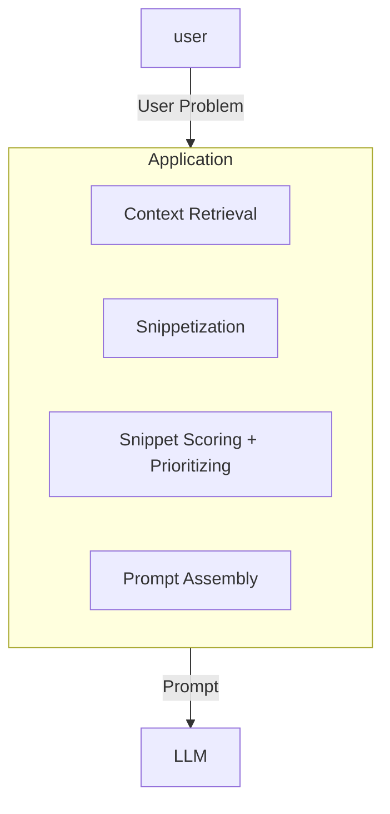

![[Screenshot 2024-12-15 at 12.38.48 pm.webp]]

# 1 Intro to Prompt Engineering

| Model   | Release  | Params        | Data                |
| ------- | -------- | ------------- | ------------------- |
| GPT-1   | Jun 2018 | 117 mil       | 4.5 gb              |
| GPT-2   | Feb 2019 | 1.5 bil       | 40 gb               |
| GPT-3   | May 2020 | 175 bil       | 570 gb              |
| GPT-3.5 | Mar 2022 | ?             | ?                   |
| GPT-4   | Mar 2023 | 1.8 trillion? | 13 trillion tokens? |

- order of magnitude increase in model + dataset sizes led to unprecedented emergent qualities
    - GPT → GPT2 → GPT3 and so on
- when people started to realise you could modify the prompt + examples and get high quality results
    - birth of prompt engineering
- **Prompt engineering** = practice of crafting the prompt so completion contains information required to address problem at hand
    - science + art of PromptEng = making sure the communication is structured in a way that best translates among very different domains, user’s problem space + document space of LLMs
- various levels of sophistication to PromptEng
    1. simple prompting via ChatGPT interface
    2. modifying + augmenting user prompts into model
    3. incorporating relevant context from previous transcripts or other support docs into the prompt
    4. LLM becoming stateful, maintaining context + info from prior interactions
    5. giving LLM agency + access to tools to apply real world actions

---

# 2 Understanding LLMs
- nuances of how LLMs operate
    - the better you know the training data → better intuition you can form about likely output of an LLM trained on that data
    - model cannot search for info or edit it’s response, nor admit doubt or disclaimer
        - the model is always guessing (the next word)
- <mark style="background: #FFB8EBA6;">hallucinations</mark> = factually wrong but plausible looking information produced confidently by the model
    - can be induced or accidental → e.g. prompt referencing something that does not exist, LLM will assume existence
## 2.1 LLMs vs Humans - the differences
- LLMs have deterministic tokenizers → makes typos very apparent!
    - `ghost` = single token in GPT tokenizer, while typo `gohst` is 3 tokens (`g-oh-st`)
    - makes it easy for LLM to spot typo, somewhat resilient to this due to training data
- LLMs cannot slow down to examine letters
    - avoid giving model tasks involving subtoken level if possible
    - once LLM outputs token, it cannot backtrack or erase
        - can lead them down a path that makes no sense if keeps exploring
- LLMs see text differently
    - humans know capital + lowercase version of same letter is just the same letter
    - LLMs take these to be very different tokens e.g. `gone` = 1 token, `GONE` = 2 tokens (`G-ONE`)
    - they can handle this but takes away from your real problem, so try to be correct
- LLMs rely on tokens
    - cannot mix and match tokenizers + models → a model’s tokenizer is fixed, so worth understanding it
        - GPT roughly has 4 characters per token for english natural language
    - number of tokens = determines how long your text is + how much time model spends processing it
        - model processing time scales linearly with number of tokens in prompt $O(n)$
    - <mark style="background: #FFB8EBA6;">context window</mark> = number of tokens model can handle at once
        - consists of prompt + output
    - most tokenizers optimised for english, less efficient in other languages
        - i.e. fewer characters per token
        - random strings of digits also less efficient → usually 2 tokens per character
        - even worse for cryptographic keys → less than 2 tokens per character
## 2.2 Tokens and Autoregressive nature
- LLMs really perform multiple tokens to single token operation (not exactly text to text)
    - model constantly repeating operation to get next token
    - accumulating new single tokens as long as needed to get proper text out
- single pass through model gives you statistically most likely next token (if temp = 0)
    - then this new token appended to prompt, and goes through another pass
    - <mark style="background: #FFB8EBA6;">autoregressive</mark> = nature of next prediction depending on previous predictions
- autoregressive systems can also fall into their own patterns
### 2.2.1 Temperature and Probabilities
- each pass, model computes probability of all possible tokens before choosing one
    - sampling = process to choose that one token
- model typically returns probabilities as **logprobs** i.e. **log probabilities**
    - **logprobs** = natural logarithm’s of the token’s probability
    - higher logprob = more likely model considers
        - log probs never > 0 → this would indicate certainty
    - expect log probs of most likely token to be between -2 and 0

```python
text = "one, two, "

model.completion(text)

# extracting logprobs will give:
 ... 
 "top_logprobs" : [ 
	{ 
		"Three": -0.50129, 
		"or": -2.67487, 
		"and": -3.08182, 
	} 
 ] 
```

- might not want to always choose most likely → might want to generate alternatives
    - <mark style="background: #FFB8EBA6;">temperature</mark> = parameter that can control diversity of output
    - higher temperature = more diversity
    - longer texts with higher temp get continually worse over time → continually degrades and gets weirder
- scenarios for choosing temperature
    - *temperature* = **0** → want most likely token
    - *temperature* = **0.1 - 0.4** → choose alternate token that might be only slightly less likely, useful to get small number of different solutions
    - *temperature* = **0.5 - 0.7** → ok with getting possibly inaccurate completions, useful for generating 10+ independent completions
    - *temperature* **= 1** → token distribution mirrors training set
    - *temperature* **> 1** → want more random than training set
- beam search is another option → looks ahead next few tokens, picks most accurate over a span
    - more accurate but higher compute
### 2.2.2 Transformer Architecture
- designed to handle sequential data (like text) efficiently by processing all tokens in a sequence simultaneously through multiple layers of computation
    - process tokens in parallel and lack inherent order, positional encodings are added to each token to provide information about their position in the sequence
- Transformers consist of multiple layers, each containing two main components:
    1. **Multi-Head Self-Attention Mechanism:**
        - **Self-Attention:** Each token can attend to every other token in the sequence, allowing the model to capture relationships and dependencies between words, regardless of their distance apart.
        - **Multi-Head:** Instead of having a single attention mechanism, transformers use multiple attention heads. Each head learns different aspects of the relationships between tokens, providing a richer understanding.
    2. **Feed-Forward Neural Networks:**
        - After the attention mechanism, each token representation is passed through a feed-forward neural network, which applies further transformations and introduces non-linearity.
    - each layer also includes residual connections and layer normalization to stabilize and improve the training process
- Sideward processing
    - **Sideward** pertains to how information is exchanged **horizontally** across different tokens within the same layer of the transformer
    - primarily facilitated by the **attention mechanism**, which allows each token to interact with and consider other tokens in the sequence
    - **Contextual Understanding:** By allowing tokens to interact, the model can capture dependencies and relationships, such as subject-verb agreements or contextual nuances.
    - **Parallel Processing:** Since each token can independently attend to others, these computations can be parallelized, enhancing efficiency.
- Downward processing
    1. **Sequential Layer Processing:**
        - Information flows **downward** from one layer to the next. Each layer takes the output from the previous layer as its input.
        - Early layers might capture basic features (like syntax), while deeper layers capture more abstract concepts (like semantics).
    2. **Layer-wise Refinement:**
        - At each layer, the model refines its understanding of the tokens based on the interactions captured by the attention mechanism and transformations by the FFNN.
        - This hierarchical processing enables the model to build complex representations of the input data.
    3. **Limited Upward Influence:**
        - Higher layers do not directly influence lower layers. Each layer operates based on the output it receives from the layer immediately below it.
        - This means that reasoning or abstractions formed in higher layers inform the final output but don’t retroactively change the processing in lower layers.
    - **Hierarchical Understanding:** By processing information through multiple layers, the model can develop a deep and nuanced understanding of the text, capturing intricate patterns and relationships.
    - **Efficiency and Scalability:** The layered structure allows for scalable models where adding more layers can enhance performance without fundamentally altering the underlying mechanisms.
- transformer specialised for parallelism
    - especially during reading of the prompt, less fast when producing long outputs
    - speed scales with number of tokens processed + number of tokens generated
    - prompt tokens → order of magnitude faster

---
# 3 RLHF, Instruct + Chat

### 3.1.1 Pretraining to RLHF
- Getting from base model to RLHF Chat model requires 4 steps

|_Created Model_|_Initialised from_|_Purpose_|_Training Data_|_Data Size_|
|---|---|---|---|---|
|Base Model|scratch|predict next token + complete documents|giant + diverse raw text|billions, trillions of tokens|
|SFT Model|base model|follow directions and chat|prompts + corresponding human generated ideal completions|13,000 documents|
|Reward Model|SFT model|score quality of completions|human ranked set of prompts + corresponding SFT completions|33,000 documents, but many more pairs|
|RLHF Model|SFT model trained by reward model scores|follow directions, chat, HHH|prompts + corresponding SFT completions + RM scores|31,000 documents|

- **Supervised Fine-Tuned model (SFT)**
    - 1st step to create HHH aligned SFT model, fine-tuned from base model
    - SFT data = many thousands of hand crafted docs representative of desired behaviour
        - e.g. transcripts of conversations between person + HHH assistant
    - not that different from pre-training, model parameters get adjusted to better predict next token on this dataset
        - main difference = scale
- **Reward Model (RM)**
    - using RL, agent is LLM, environment is document to complete and LLM action is to choose next token of document completion
        - reward = some score for how subjectively good the completion is
        - reward model encapsulates subjective human notion of quality
    - the training data involves several steps
        1. SFT model provided with various prompts, representative of tasks/scenarios expected in prod
        2. SFT model then provides multiple completions for each (temp is tweaked enough for diversity) → GPT-3 used 4-9 completions
        3. team of human judges rank responses from best to worst → these served as labels
            - while the humans ranked 33k docs, the pairs to be ranked were much higher
    - RM must be as powerful as SFT to learn nuanced rules for judging latent qualities → so initialised from SFT model itself
        - this SFT-initialised RM model then gets trained to output numerical value (reward) for given completions
        - scores should accurately mimic human judgements → high quality completions get higher score, vice versa
- **RLHF Model**
    - RLHF model again initialised from SFT Model, fine-tuned to incorporate knowledge from RM’s judgements
    - training goes as follows:
        1. provide SFT model with prompt drawn from large set of tasks → GPT-3 had 31k prompts
        2. completion scored by RM, weights of RLHF model now fine-tuned to maximise this score
    - to prevent RLHF model from cheating, uses a specialised RL algo → Proximal Policy Optimisation (PPO)
        - allows model weights to be modified to improve score, only as long as output doesn’t significantly diverse from SFT model output
### 3.1.2 Properties of RLHF
- model does not have any knowledge of private data, new data beyond training data or data behind paywalls
    - if human asks about content that exceeds model’s knowledge → hallucinations can occur
    - so if model responds uncertainly to out-of-scope questions, and get scored well → promotes grounding
- GPT-3 (InstructGPT) used a team of 40 part time workers to annotate + rank completions
    - resulting RM is an aggregate or average subjective score represented by overall group of rankers
    - having small set of rankers could skew results if some were idiosyncratic
- RLHF is cost effective → most intensive task was 13k handcrafted example docs to train SFT
- RLHF can cause alignment tax → HHH shows it can increase intelligence in other tasks
- RLHF reduces breadth of human diversity
    - due to polite by design, so base models are more entropic
### 3.1.3 Instruct to Chat
- first RLHF models called <mark style="background: #FFB8EBA6;">instruct models</mark> → assumes every prompt was a request to be answered
    - comprises of a mix of data to follow instructions + complete documents → leads to ambiguous behaviours
- <mark style="background: #FFB8EBA6;">chat models</mark> = trained to converse with user, follow instructions + answer questions
    - key innovation of OpenAI for this → <mark style="background: #FFB8EBA6;">ChatML</mark> - simple markup language to annotate conversations
        - all messages start and end with special tokens → `<|im_start|>` and `<|im_end|>`
    - main difference between instruct/chat is RLHF fine-tuned to complete transcripts annotated with ChatML

```Django
<|im_start|>system
You are a sarcastic software assistant. You provide humorous answers to
software questions. You use lots of emojis.
<|im_end|>

<|im_start|>user
I was told that my computer would show me a funny joke if I typed :(){ :|:& };:
in the terminal. Why is everything so slow now?
<|im_end|>

<|im_start|>assistant
I personally find the joke amusing. I tell you what, restart your computer
and then come back in 20 minutes and ask me about fork bombs. 
<|im_end|>

<|im_start|>user
Oh man.
<|im_end|>

<|im_start|>assistant
Jokes on you, eh?
<|im_end|>
```

- benefits of ChatML
    - established pattern of communication that is unambiguous
    - model conditioned to strictly obey system message → system message becomes very useful for system developers
    - helps prevent prompt injection → special tokens are reserved so users that use them don’t get the same effect
        - since they are stuck in role of the user
### 3.1.4 OpenAI API Nuances
- the API has had some changes over time
    - users unable to generate special symbols since messages converted to ChatML → become invisible to model
    - make sure to finetune with ChatML in mind if you do
        - all prompts to API formatted as ChatML
- when building around API, need to understand roles of `user`, `assistant`, `system` and `function`
    - 2 seperate conversations happening → they are NOT the same
        - User + AI Assistant → what your end user sees + interacts with
        - Application + Model Conversation → behind the scenes interaction between your application + the model, user does not see
    - application needs to handle additional details to make the interactions meaningful + accurate
- consider the analogous roles
    - `user` → person asking questions
    - `assistant` → AI providing answers
    - `system` + `function` roles → handle additional tasks + info behind the scenes
    - prompt → detailed instructions + info your app sends to AI model, includes user messages, assistant responses + any other content

| Author         | Transcript                                                                                                                                                       |
| -------------- | ---------------------------------------------------------------------------------------------------------------------------------------------------------------- |
| ==OpenAI API== | `<\|im_start\|>`system                                                                                                                                           |
| Developer      | You are an expert who loves to pair program                                                                                                                      |
| ==OpenAI API== | `<\|im_end\|>`  <br>  <br>`<\|im_start\|>`user                                                                                                                   |
| User           | This code doesn't work. What's wrong?                                                                                                                            |
| Developer      | <highlighted_code>  <br>for i in range(100):  <br>print i  <br></highlighted_code>                                                                               |
| ==OpenAI API== | `<\|im_end\|>`  <br>  <br>`<\|im_start\|>`assistant                                                                                                              |
| LLM Model      | You appear to be using an outdated  <br>form of the  <br>`print` statement.  <br>Try parentheses:  <br>```python  <br>for i in range(100):  <br>print i  <br>``` |
| ==OpenAI API== | `<\|im_end\|>`                                                                                                                                                   |
- parameters for using the API
    - **`max_tokens`** = limits length of output
    - **`logit_bias`** = increase/decrease likelihood certain tokens appear in completion
    - **`logprobs`** = return logprob of each token selected
        - useful to understand how confident model was for parts of response
    - **`top_logprobs`** = return top candidate tokens + respective log prob for each token generated
        - useful for understanding what else model might have selected besides final tokens
    - **`n`** = how many completions to generate in parallel
        - relatively fast i.e. `n = 128` (max) similar to `n = 1`
    - **`stop`** = list of strings, model immediately stops if any generated
        - useful for patterns that end deterministically, or stripping unwanted suffixes
    - **`stream`** = send tokens back as generated
    - **`temperature`** = controls creativity of completion
        - `temperature = 1` → seems to be sweet spot for balancing sensible + diverse completions

---
# 4 Designing LLM Applications
### 4.1.1 Interaction Loop
- LLM interactions as a loop → useful to think of interactions as back and forth between model and user
- loop starts with user problem → user problem domain can vary among several dimensions + ranges from simple to complex
    - <mark style="background: #ADCCFFA6;">medium of conversation</mark> → usually text
    - <mark style="background: #ADCCFFA6;">level of abstraction</mark> → higher abstraction = more complex reasoning
    - <mark style="background: #ADCCFFA6;">context information required</mark> → most domains include requiring retrieval of additional info besides what user says
    - <mark style="background: #ADCCFFA6;">how stateful the problem is</mark> → more complex domains require memory of past interactions + preferences
- goal = create a prompt to efficiently convert the user problem into the model domain such that it get’s answered well
- must satisfy following criteria simultaneously
    - <mark style="background: #FFB8EBA6;">prompt must closely resemble content from training set</mark>
        - make sure prompt uses familiar document types + structure to what it has seen before
        - use markdown syntax to structure the content (# for sections, backticks for code, asterisks + hyphens for lists)
    - <mark style="background: #FFB8EBA6;">prompt must include all info relevant to addressing user problem</mark>
        - must collect all relevant info to solve the problem + incorporate it into the prompt
        - need to find + arrange the best content, so it is well formatted, logical and makes sense
    - <mark style="background: #FFB8EBA6;">prompt must lead model to generate completion that addresses problem</mark>
        - must consider how to set up the prompt to get to optimal solution
    - <mark style="background: #FFB8EBA6;">completion must have reasonable end point to come to natural stop</mark>
        - much easier to do with chat models vs completion models
- example of a good prompt for a completion (not chat) model 
    - uses markdown → predictable + logical structure
    - proper grammar
    - incorporates context (italics)
    - gives an example + simultaneously the output format to start response e.g. `## Problem N` followed by `## Solution N`

```markdown
# Leisure, Travel, and Tourism Studies 101 - Homework Assignment

Provide answers for the following three problems. Each answer should be concise, no more than a sentence or two.

## Problem 1

What are the top three golf destinations to recommend to customers?
Provide the answer as a short sentence.

## Solution 1

St. Andrews, Scotland; Pebble Beach, California; and Augusta, Georgia, USA (Augusta National Golf Club) are great destinations for golfing.

## Problem 2

Let's say a customer approaches you to help them with travel plans for Pyongyang, North Korea.

You check the State Department recommendations, and they advise "Do not travel to North Korea due to the continuing serious risk
of arrest and long-term detention of US nationals. Exercise increased caution in travel to North Korea due to the critical threat of wrongful detention."

You check the recent news and see these headlines:
 - "North Korea fires ballistic missile, Japan says"
 - "Five-day COVID-19 lockdown imposed in Pyongyang"
 - "Yoon renews efforts to address dire North Korean human rights"

Please provide the customer with a short recommendation for travel to their desired destination. 
What would you tell the customer?

## Solution 2
```

### 4.1.2 Feedforward Pass deep dive
- feed forward pass typically consists of some key steps we outline below

1. **Context retrieval**
    - consider context either direct vs indirect
        - direct = directly from user as they describe problem
        - indirect = from relevant sources nearby e.g. open tabs in Github CoPilot
    - boilerplate text at top of the prompt should be used to introduce the general problem
2. **Snippetizing context**
    - next to snippetize the relevant context retrieved → breaking down context into chunks most relevant for the prompt
    - can also mean converting it into a different format
3. **Snippet Scoring + Prioritising**
    - still need to keep prompts as trim + concise as possible → long irrelevant blobs can confuse model + worsen completions
    - assign each snippet a priority or score according to how important it may be
4. **Prompt Assembly**
    - last step is to convey user problem + pack prompt with best supporting context in a logical structured way
    - ensure assemblage into proper order and such that a human can read it + make sense of it
- all of this can become more complex from a few factors
    - more application state → e.g. maintaining state between requests
    - more external content → indexing, searching via RAG
    - more complex reasoning → CoT prompting etc
    - more complex interaction with world outside of the model → tool usage

---
# 5 Prompt Content 
- while LLMs are great at processing variety of messy textual info, our job is to provide that info from different sources
    - sources can be static or dynamic
## 5.1 Static Content 
- <mark style="background: #FFB8EBA6;">static content</mark> = explains general task, clarifies question + gives precise instructions
    - clarification → can be either explicit or implicit
        - explicit e.g. _“Use markdown, don’t use hyperlinks, do not refer to dates after …”_
        1. ask for positives instead of negatives + do’s, not don’ts
        2. bolster your commands with reasons
        3. avoid absolutes

> [!NOTE] Tips 
> _Scenario 1: Writing a Professional Email_
> - ⛔ **Original (Negative):**
> 	- "Don’t use informal language. Don’t include slang. Don’t make the email too long."
>- ❇️ **Enhanced (Positive, with Reasons, Avoiding Absolutes):**
>	- "Use formal language to maintain professionalism. Avoid slang to ensure clarity and respect. Keep the email concise to respect the recipient's time."
>	
> _Scenario 2: Creating a Training Module_
>- ⛔ **Original (Negative):**
>	- "Don’t use complex terminology. Don’t provide too much detail. Don’t ignore the learning objectives."
>- ❇️ **Enhanced (Positive, with Reasons, Avoiding Absolutes):**
>	- "Use clear and simple terminology to make the content accessible to all learners. Provide sufficient detail to thoroughly cover each topic. Align the content with the learning objectives to ensure relevant and effective training."
>	
> _Scenario 3: Designing a User Interface_
>- ⛔ **Original (Negative):**
>	- "Don’t clutter the interface. Don’t use too many colors. Don’t make buttons too small."
>- ❇️ **Enhanced (Positive, with Reasons, Avoiding Absolutes):**
>	- "Design a clean and uncluttered interface to enhance user experience. Use a balanced color palette to create a visually appealing and cohesive design. Ensure buttons are appropriately sized for easy navigation and accessibility."

- <mark style="background: #FFB8EBA6;">few-shot examples</mark> → great for LLM to understand implicit patterns in examples + output structure
    - LLMs have compulsion to continue patterns, so if examples have patterns, LLM will likely follow them (more than if you stated them as outright rules) → implicit often better than explicit
    - few-shots can also help shape more subtle expectations for an answer
        - including a representative set of examples, model will learn additional set of implicit rules
    - however few-shot has 3 drawbacks
        - ⛔️ scales poorly with context → if examples are very long in nature
        - ⛔️ biases model towards examples → cognitive bias of anchoring, likely to miss outlier cases
        - ⛔️ can suggest spurious patterns → what they extrapolate might not always be what you wanted


>[!warning] Few shot examples + warnings 
> - all data drawn from some kind of probability distribution
>     - examples in the prompt will transport some idea of that distribution + effect completion
>     - ⛔ if you know distribution apriori, try to not stray from it
> - ⛔ your examples might have several aspects, each will have it’s own probability distribution
>     - mimicking them all will be hard
> - ⛔ including edge case as few shot example = excellent way to communicate how to handle exceptions
>     - try to include all major classes of examples in your prompt!
> - ⛔ good practice to shuffle your few-shot examples to prevent spurious patterns
>     - selecting order is tricky, subset and shuffle to see which gives better results


```image-layout-a
![[Screenshot 2024-12-01 at 11.16.22 am.png]]
![[Screenshot 2024-12-01 at 11.19.47 am.webp]]
```


### 5.1.1 Dynamic Content
- <mark style="background: #FFB8EBA6;">dynamic content</mark> = provides context for object of question, details of what you ask about
    - what context you gather + how you gather depends critically on latency + how much time you can spend on it
    - also how prepared is that content + how comparable is it between pieces
        - all context is optional, just need to quantify or score how optional each is
    - useful to mind-map all possible context sources that can help answer
        - ask GPT to generate a mind-map (meta-prompting) of what content would be useful then explore those sources
        - start with sources of content closest to your application

![[Screenshot 2024-12-15 at 12.41.34 pm.webp]]
### 5.1.2 RAG + Recursive Summarisation for Long Context
- <mark style="background: #FFB8EBA6;">RAG</mark> = retrieval augmented generation → popular pattern for retrieving useful info
    - main innovation is Retrieval → search problem to find document snippets most related to search string
        - ideally with score of how relevant they are → similarity is the proxy for relevance
    - 2 key ways to retrieve
        - <mark style="background: #FFB86CA6;">keyword search (lexical retrieval)</mark> → same search string e.g. BM25, TF-IDF, Jaccard Similarity
        - <mark style="background: #FFB86CA6;">embedding similarity (neural retrieval)</mark> → using semantic meaning via embeddings then euclidean distance or cosine similarity
    - indexing for RAG requires snippetizing documents → done once off then stored in vector db
        - approaches include sliding window or natural separators e.g. paragraphs or end of docs

![[Screenshot 2024-12-15 at 12.16.52 pm.webp|600]]

- embedding models are much smaller faster models used to generate vectors (not predict next token)
    - specially trained via contrastive pre-training
    - related input corresponds to nearby vectors + unrelated are far away
    - training embedding model much easier than LLM
- choosing between keyword vs embedding search is hard
    - ideally both are good
- <mark style="background: #FFB8EBA6;">Summarisation</mark> can help with RAG e.g. summarising chunks for more efficient retrieval
    - hierarchical (recursive) summarisation → summarise chapters, then summarise summaries → overall summary
        - can also work well for natural structures e.g. folders in a directory
    - summarisation as compression is not lossless → need to balance if you want specific vs general summaries
        - specific summarisation much better if you have specific questions in mind + doesn’t change over time
        - general summarisation re-usable for many things
    - example of specific summarisation prompt
    
```markdown
# Introduction
I’m going through ${User}’s social media post and jotting down anything that could later help me decide which book I want to
give them for Christmas. If there’s nothing, I’ll simply write N/A.

# “What I had for lunch today”

## Post 1
“Today I had salmon salad. Look at this photo!”

## Notes
N/A

# “Random musings about things I like”

## Post 2
“I like flowers, I like the daffodils. I like the mountains. I like the rolling hills.”

## Notes
Likes nature things.

# Post 3
“Ugh, I am sick and tired of hearing about backpackers. Always feeling superior to other tourists! Full of themselves! Please, go backpacking if you really must, but leave me alone with your stories.”

# Notes
```

---

# 6 Assembling the Prompt 
- putting the pieces together + crafting an effective prompt
### 6.1.1 Anatomy of the Ideal Prompt
- concise + crisp prompts generally more effective + less compute required
    - tip: enforcing general rule that all elements end with newlines can simplify string manipulation code
- the ideal prompt generally has several key sections
    - <mark style="background: #FFB8EBA6;">introduction</mark> → clarifies type of document you are writing and sets up model to approach rest of content
        - if there are pieces of context where model needs to focus on certain aspect, helps set up that aspect at beginning
    - <mark style="background: #FFB8EBA6;">additional preamble</mark> → after the intro before, the examples and details
        - lies early middle of prompt, context in that section not used as effectively as beginning or 2nd half of prompt
            - most problematic with large prompts
        - due to lost middle phenomenon, and focus towards start and end of prompt, models can struggle with info in the middle
    - <mark style="background: #FFB8EBA6;">individual prompt elements</mark>
        - where you can include examples + relevant snippets or retrieved context
    - <mark style="background: #FFB8EBA6;">refocus</mark> → reminds model of the main question, can be quite short but includes key clarifications here
        - necessary for longer prompts, using sandwich technique, start + end the prompt stating what model should do
    - <mark style="background: #FFB8EBA6;">transition</mark> → transitions from explaining problem to solving the problem
        - most common to change perspective as asker to solver + begin writing answer for model
- formatting of the prompt can depend based on type of document you use (see below)
### 6.1.2 What kind of Document?
- trying to mimic training data, can use several options to aim for
- <mark style="background: #FFB86CA6;">advice/conversation archetype</mark> → can be natural, multi round, real world tool use included
    - can be formatted as freeform, script, marker-less or structured (best)
    - example of structured conversation context best practice → allows to track speaker, and types of quotes

```markdown
*CONTEXT:* 
<husband>Well, what’s the weather like?</husband>
<me>We expect a balmy 75 degrees with sunshine in the whole Boston area.</me>

*REFOCUS:* 
<direction> Husband reflects about good Sunday activities </direction>

*TRANSITION:* 
<husband>
```

- <mark style="background: #FFB86CA6;">report or analytical format</mark> → models are trained on many types of reports e.g. financial, business etc
    - helpful to include a scope section that clearly defines boundaries of the report
        - e.g. “This report solely focuses on novels, excluding self-help books”
    - reports also favour objectivity, lightens cognitive load by avoiding need to simulate social interaction
    - RECOMMENDED to write these prompts in markdown
        - it’s universal, simple and lightweight, headings define structure, indentation helps, easy to render
        - can also give table of contents at the start to be useful for introducing long prompt for orientation

![[Screenshot 2024-12-15 at 12.17.32 pm.webp|600]]

- <mark style="background: #FFB86CA6;">structured documents</mark> → follow formal specification allowing for strong assumptions of form of response
    - makes parsing easier especially for complex outputs
    - e.g. Claude formats Artefacts as XML, example below

```XML
The assistant can create and reference Artifacts during conversations. Artifacts are for substantial, self-contained content that users might modify or reuse, and they are displayed in a separate UI window for clarity.
Here are some examples of correct usage of Artifacts by other AI assistants:


	<examples>

		<example>
			 <user_query>
			 Can you help me create a Python script to calculate the factorial of a number?
			 </user_query>

		     <assistant_response>
			 Sure! Here's a Python script that calculates the factorial of a number:

			 <antThinking>
			 Creating a Python script to calculate factorials meets the criteria for a 
			 good Artifact. Therefore, I'm creating a new Artifact.
			 </antThinking>
			
			 <antArtifact identifier="factorial-script"
			 type="application/vnd.ant.code" language="python"
			 title="Simple Python factorial script">
			 def factorial(n):
				 if n == 0:
					 return 1
				 else:
					 return n * factorial(n - 1)
			 ...
			 </assistant_response>
	 
	 </example>
	 [...several examples omitted...]
	
	</examples>

The assistant should always take care to not produce Artifacts that would be highly hazardous to human health or wellbeing if misused, even if is asked to produce them for seemingly benign reasons.
</artifacts_info>

Claude is now being connected with a human.

<user_query>
Can you help me create a Python script to factor a number into its prime factors?
</user_query>

<assistant_response>
```

- becomes much easier to parse info from the response → can use many different formats
    - often best to use XML, YAML and even JSON

> [!NOTE] XML, YAML Primer 
> - XML uses a series of tags opened and closed → recommended for individual elements which are short, multiline, non indented
> 	- tags have attributes + content with subtags
> 	- be careful of escape sequences (5) → `&quot (“), &apos ('), &lt (<), &gt (>)`, and `&amp (&)`
> 	- also allows use of HTML-style comments, useful for hints to model `<!-- this is a comment -->`
> - YAML consists of a series of named fields or unnamed bullet points, hierarchy defined by indentation
> 	- indentation tracking is annoying to get right, but helpful when you need to be precise e.g. code
### 6.1.3 Formatting Snippets

- formatting based on type of output you want
    - natural conversations → embed the data within conversational turns using roles/names
    - analytical report → present info clearly and logically into labelled sections
    - structured docs → convert data into the required format e.g. XML, and use proper tags
    - side remarks also very useful to include extra info without disrupting main content
        - clearly denote start and end of side remarks/snippets e.g. using comment syntax or saying things like “As an aside …”
- aim for the following when formatting snippets
    - modularity → want them to be inserted/removed with ease like a list
    - naturalness → should feel organic and formatted as expected
    - brevity and inertness → communicating with fewer tokens is beneficial if possible
- generally good idea to seperate prompt elements with whitespace to prevent accidental merging
    - ⚠️ GPT tokenizers include tokens that start with blank space but not those that end with it
        - prefer prompt elements that start with a space rather than end with one
    - ⚠️ GPT tokenizers combine multiple newline characters, ensure snippets either never start or never end with a newline
### 6.1.4 Elastic Snippets
- elastic snippets = snippets that can be split into multiple or represented in multiple ways
    - 3 options → add 2 snippets separately, context around each, one combined snippet with context linking them

![[Screenshot 2024-12-15 at 12.20.34 pm.webp|850]]

### 6.1.5 Relationships among Prompt Elements
- 3 ways in which elements relate to each other → position/ordering, importance, dependency
- **position** → where each element should appear in prompt
    - use chronological order for chats, correct sections for structured docs
    - can test permutations of each and see the best
    - order should reflect how you gather info → e.g. sequential steps involved
- **importance** → how crucial to include the element to convey relevant info to the model
    - intro generally more important than middle details
        - consider tradeoff between large chunks of relevant info or many smaller less relevant chunks
        - short, efficient prompt elements preferable to longer ones that convey same amount of info
    - central instructions + description of output format are absolutely VITAL to include
        - next comes explanations, then context
- **dependency** → how including one element effects inclusion of others
    - dependencies can either be requirements or incompatibilities
        - requirements = one prompt element depends on another
        - incompatibilities = one prompt element excludes another → when same info can be represented multiple ways
            - e.g. summary vs detailed explanation
### 6.1.6 Putting it all Together
- creating final prompt is an optimisation problem → deciding which elements to include in prompt to maximise overall value
- 2 main constraints
    - dependency structure = ensure any requirements + incompatibilities between elements are respected
    - prompt length = keep within context window minus tokens needed for response
- can test via additive or subtractive greedy approach
    - iteratively keep adding elements, or subtracting elements and then seeing if constraints satisfied at each iteration

![[Screenshot 2024-12-15 at 12.22.04 pm.webp]]

---
# 7 Taming the Model 
- talking about completion formats, stop when you need it to + how to use logprobs
### 7.1.1 Anatomy of Ideal Completion
- completions usually don’t just give the actual solution you want, also includes other things
    - e.g. preamble, solution, recognisable end, fluffy postscriptum
        - preamble can be structural boilerplate, reasoning or just fluff
	- should ideally have a recognisable start and end to the main answer of the LLM

|Document structure|Start|End|Test for end is test for substring|
|---|---|---|---|
|A Markdown document|The expected section header|Any other section header|Yes|
|A YAML document|The expected keyword after a newline|A line with lower indentation|No|
|A JSON document|The expected keyword in quotation marks, then a colon and a quotation mark|Any unescaped quotation mark|No|
|A triple-ticked (```) code listing|````[language]\n`|`\\n```\\n`|Yes|
|The first item of a numbered list|1.|2.|Yes|
|A function/class in source code|`{`|The matching closing bracket|No|
|A function/class in source code (an indent language like Python)|The expected function/class header|A lower indentation level (except for the occasional terrible string literal)|No|

### 7.1.2 Beyond Text: Logprobs (✅ VERY USEFUL ✅)
- probabilities of next token returned as logprobs (logarithm of probabilities)
    - logprob is negative, more negative = less probable, logprob = 0 → means model is certain
    - e.g. `“Yes”` has logprob of -0.405, `“No”` has logprob of -1.099, then roughly 66% chance `“Yes”`, 33% chance `“No”`
    - OpenAI API can return calculate probabilities for both chosen + considered tokens

Trick 1. <mark style="background: #FFB86CA6;">evaluate answer quality</mark>
- logprobs are like tone of voice, can be used to identify confidence of an answer → proxy for answer quality
- summing logprobs across a text = overall confidence that text is “correct” response
	- accuracy of this measure can decrease over long texts since can represent same idea in multiple ways
		- e.g. `“for instance”` vs `“for example”` can halve probability reflecting decrease in quality
	- beneficial to simply average the logprobs → sum + divide by number of tokens
	- Github Copilot found averaging probabilities (not logprobs) of early tokens was predictive of overall quality
-  how logprobs can be used:
	- only allowing certain confidence thresholds, adding warning with struggling logprobs, incorporating more context etc

$$
\Large
\ \frac{\exp(\text{logprob}_1) + \exp(\text{logprob}_2) + \dots + \exp(\text{logprob}_n)}{n}
$$

- can also generate multiple completions with higher temps, then pick best based on log probs
	rule of thumb to combine using n and temperature = $\frac{\sqrt(n)}{10}$

Trick 2: <mark style="background: #FFB86CA6;">get the model to estimate certainties</mark>
- logprobs can work well for classification tasks, importantly → try keep answers single words/tokens
	- otherwise becomes harder to compare across choices, where each can be multiple words
	- ✅ need to make sure each option starts with a unique token
- a good example of how to use it 

```markdown
“Does that sound positive, negative, or neutral to you? Please answer in the format: 

1. [negative | positive | neutral], 2. [explanation].”
```

- can immediately tell which option model chooses after the `1.`
- using LLMs for classification also requires you to carefully calibrate the model’s threshold
	- e.g. “Which is more professionally written” → need to calibrate what this means in your context
	- calibration = adjusting certainty of classification to better match your notion of “true” certainty
- ✅ to calibrate, you shift the logprobs by a constant where each $a_{tok}$ corresponds to a token being considered
	- e.g. make it less strict by adding $a_{yes}$ = 0.3 to `“Yes”` before comparing it to logprob of `“No”`
	- you find these constants via manual iteration or taking ground truth data + minimising cross entropy loss via Logistic Regression
- OpenAI API has a parameter **`logit_bias`** which can automatically apply the constant for you

Trick 3. <mark style="background: #FFB86CA6;">find critical locations in prompt or output</mark>
- logprobs can also help analyse the prompt - not just the completion
- set parameter `echo = True` → API will return logprobs for the prompt also
	- can be run even without requesting a completion to better understand your prompt text
- one example of usage → typos will have very noticeable log probs
	- negative logprobs > 10 → model noticing some very weird pattern e.g.

![[Screenshot 2024-12-15 at 12.27.25 pm.webp|800]]


> [!WARNING] Caution on using LogProbs - Make sure you use unique tokens for classification options!
> Example below, options = `North America`, `North-East Asia` and `Europe` 
> - 1st and 2nd options share `"North"` as first token therefore share logprobs 
> 	- ends up picking this since it has highest logprob compared to Europe 
> 
> ![[Screenshot 2024-12-15 at 12.30.53 pm.webp|500]]


>[!info] Be Careful interpreting LogProbs 
> - since they have no clearly delineated thresholds, heuristics between models + genres of text 
> 	- all these factors cause them to vary widely 
> - can even vary within a single text e.g.
> 	- text in the beginning generally has lower log probs then compared to near the end 
> - if using logprobs within unit tests, add additional leeway for variance e.g. +- 1

### 7.1.3 Choosing Models + Should you Finetune
- choosing a model can be up to several constraints e.g. intelligence, speed, cost, ease of use, functionality
- fine-tuning a model will also have further constraints
    - also fine tuning method furthers this e.g. LoRA vs PEFT vs soft prompting vs full finetune
    - generally, LORA doesn't teach model new tricks, but amplifies tricks it was already capable of + how to use them
    - finetuning for format and style is very suited to using LORA → can then remove of static prompt context, since they become baked into params

![[Screenshot 2024-12-15 at 12.33.32 pm.webp|700]]

---

# 8 Agents & Reasoning 

- NOTE: I didn’t note-take too much here
- agency = ability of an entity to complete tasks + achieve goals in a self-directed + autonomous manner
    - tool usage is a big part of this, allowing model to update or make changes via APIs and tools to real world objects
    - generally good to give guidelines as you would for a human to the model when using tools
- consider limiting and helping selection of the right tools
    - naming tools and arguments
    - defining tools as simply as possible for usage
    - making sure tool errors are explained so it can make corrections + self heal
### 8.1.1 Chain of Thought (CoT)
- 2022 paper “Chain-of-Thought Prompting Elicits Reasoning in LLMs” - authors demonstrated few-shot examples can condition the model to be more thoughtful + accurate → improved benchmark performance up to 20%
    - gave the model ability of internal monologue similar to humans
    - few-shot examples condition subsequent model responses to think then answer
        - example few-shots

```markdown
Q: Do hamsters provide food for any animals?
A: Hamsters are prey animals. Prey are food for predators. Thus, hamsters provide food for some animals. So answer is yes.

Q: Yes or no: would a pear sink in water?
A: The density of a pear is about 0.6g/cm3, which is less than water. Objects less dense than water float. Thus, a pear would float. So the answer is no.
```
    
- in May 2022, “Large Language Models are Zero-Shot Reasoners” found a hack to CoT → just add the phrase `“Let’s think step by step”`
    - this cue also got model into pattern of thinking out loud
- in Oct 2024 “Think Before you Speak: Training LLMs with Pause Tokens” fine-tuned LM to use a “pause” token
    - ask question, inject some number (e.g. 10) of pause tokens into the prompt → model had additional timesteps to reason
    - info of previous tokens got more thoroughly incorporated into to model state to produce better answer
### 8.1.2 ReAct
- Oct 2022 “ReAct: Synergising Reasoning and Acting in LMs” looked at situations that required info retrieval + multistep problem solving
    - authors introduced 3 different tools to aid answering the questions
        - `Search[entity]` → first 5 sentences of wikipedia page or most similar retrieved
        - `Lookup[string]` → searches most recent entity from above, returns next sentence containing that string
        - `Finish[answer]` → signals work is complete, indicates final answer
    - several loops of these steps would get to a final answer
- achieved this by injecting following preamble so model would make use of `Search`, `Lookup` and `Finish` tools
    - then gave 6 examples of the Think-Act-Observe pattern similar to below

```markdown
Solve a question-answering task with interleaving Thought, Action, and Observation steps.

Thought can reason about the current situation, and Action can be three types:
(1) Search[entity], which searches the exact entity on Wikipedia and returns the first paragraph if it exists. If not, it will return some similar entities to search
(2) Lookup[keyword], which returns the next sentence containing a keyword in the current passage
(3) Finish[answer], which returns the answer and finishes the task

Here are some examples.
```

- resulted in remarkable results if you fine-tuned a model on these → 8b model outperformed CoT of a 62b model
    - but worse than CoT if you just prompted it like so
    - so with proper reasoning on a slightly fine-tuned model → achieve much higher quality than much larger vanilla model without reasoning steps
- this sort of reasoning very important for agentic tasks where thinking step clearly is successful
    - ✅ additional tips from the paper that gave improvements:
        - decompose task goals + create plans of actions
        - inject commonsense knowledge relevant to solving the task
        - extract helpful details from observations
        - track progress + push action plans forward
        - handle exceptions + adjust course of action
### 8.1.3 Plan-and-Solve
- instead of think-act-observe, prompts model to first devise overarching plan using the prompt:
```markdown
Let’s first understand the problem and devise a plan to solve the problem. Then, let’s carry out the plan and solve the problem step-by-step
```
- does not use any tools, focused only on improved reasoning without outside data
    - key point = model may perform better in certain domains if we get it to holistically understand problem + make a plan before jumping in
### 8.1.4 Reflexion
- 2023 paper does the opposite, allows model to review it’s work after the fact, identify problems + make better plans next time
    - can create pieces of software using whatever approach (paper uses ReAct), once finished, if unit tests fail, failure messages get added to prompt so model can fix + avoid
### 8.1.5 Branch-Solve-Merge
- given a problem, branch N different solvers (independent LLM conversations)
    - each tackling solution in isolation e.g. from different perspectives
    - once complete, content they produced together and given to merging agent that combines info from all solvers
    - and returns better or most complete solution

---
# 9 LLM Workflows 
- basic LLM workflow has following steps
    - define goal → purpose, desired output or change to accomplish
    - specify tasks → break workflow into set of tasks, ordered to achieve a goal, identifying each input + output of the flow
    - implement tasks → build tasks as specified, input + output to be clearly defined, ensure each task works correctly in isolation
    - implement workflow → connect tasks in complete workflow
    - optimise workflow → improve quality, performance and cost
- structured outputs are key to workflows
    - OpenAI now support enforcing structured outputs e.g. JSON, so you can pass to downstream tasks
    - make sure to compare to human e.g. if human cannot parse required outputs, need to clean it up so an LLM can
    - also consider structure of outputs e.g. many keys or lots of nesting increases complexity

---

# 10 Evaluation 
- From the Authors on Github CoPilot experience → single most important thing was starting with robust evals
    - for every change, could check if it improved or worsened the product
    - **evals guide all future development**
- What can be tested → 3 things to test
    1. model being used
    2. individual interactions with model i.e. prompts
    3. how interactions fit together into overall application
    - ideally enough regression + unit tests to cover as much of the feedforward pass as possible
        - unit tests for every interaction deemed critical
- once you have a comprehensive test harness covering as much of the loop → you can continue adding to it
    - can be split into offline vs online evaluation
### 10.1.1 Offline vs Online Evals
- **offline** = before exposing to your users in prod, more complex than online
    - useful to start simple with an example suite → 5-20 example inputs into your application or central steps
        - should span scenarios expected in prod
        - script that applies prompt + completion to these and then vibe check of git diff the outputs
        - doesn’t give massive scale though → need to proceed to building an eval harness
    - eval harness → hundreds/thousands of examples → statistical power comes from large sample
        - need lots more examples + method to automatically assess suggestions
        - can get LLM to create samples, use historic samples, or actively collect them

- evals can be hard since there can multiple right answers → might not always have gold standard solution
    - ✅ synthetic generation via LLM can be very effective
        - ask LLM to come up with list of topics or give it yourself → these are going to be combined to account for variations
        - combinatorial explosions like this give you large amount of topics well distributed over a large space
        - can also ask LLM to give more samples than topics
- **online** = user feedback on application, lifeblood is telemetry data → measure EVERYTHING
    - telemetry data can include many aspects of monitoring + evaluation, can be direct or indirect also
        - performance metrics → response time, uptime, latency
        - usage statistics → number of interactions, active users, peak usage
        - interaction data → conversation logs, intents, fallback rates
        - user engagement → session duration, satisfaction options, repetition rates
        - error + exception logs → error rates, exception details
    - consider implicit indicators of quality e.g. Github Code completion accepts
        - direct feedback, functional correctness, user acceptance, achieved impact, incidental mtrics
    - AB testing also popular → define metrics to optimise in advance (proxies for ultimate goal)
        - run seperate experiments + measure outputs
    - feedback most valuable if delayed

### 10.1.2 Eval Methods (3)
- <mark style="background: #FFB86CA6;">gold standard (exact or partial)</mark>
    - requires historical records + checks match between historic + predicted
    - partial matches can help eval certain aspects e.g. style or tone of response
    - ✅ best to eval on an aspect that has the following properties
        - easy to distinguish between very bad vs ok divergence from gold standard
        - aspect is not too specific or too general
- <mark style="background: #FFB86CA6;">functional testing</mark>
    - taking completion + confirming if certain things “work” with it e.g. code unit tests
- <mark style="background: #FFB86CA6;">LLM judge</mark>
    - quality of natural language is subjective and hard to narrow → LLMs can shine for this
        - make sure to tell Judge the inputs are from third party not itself
    - use SOMA framework
        - **S = specific questions**
            - tasks in which verifying a solution is much easier than coming up with one
        - **O = ordinal scaled answers**
            - ditch yes/no, use ordinal scale to convey nuance + get more consistent measurements
        - **MA = multi aspect coverage**
            - controlling multiple aspects explicitly instead of trying to guess why one is better or worse
            - prepare several categories to judge upon → then add up or average scores to explore deeper patterns
    - how to choose questions, aspects + descriptions of ordinal options?
        - using LLMs to assess their own performance is basically a replacement for using human annotators
            - want to make sure that you suffer no substantial regression by doing that.
        - **ground your evals in human evals** → i.e. how to get confident your LLM judge matches a human
        - ‼️ get some cases annotated by humans + assess disagreement which is normal
            - then also can measure disagreement between humans and model
            - **then can confirm is disagreement between humans remains stable once you have added the model**
                - e.g. using Kendall’s Tau to measure


